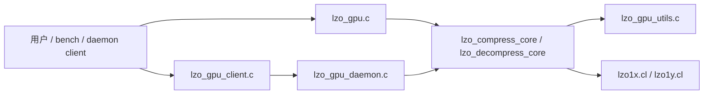

# LZO GPU 主线架构分析

更新时间：2026-04-17
适用目录：`/root/lzo-2.10/lzo_gpu`
范围：本文只分析当前标准主线：`lzo_gpu.c`、`lzo_gpu_core.c`、`lzo_gpu_utils.c`、`lzo1x.cl`、`lzo1y.cl`、daemon/client 路径，以及当前 hash/dict 的实际实现。

---

## 1. 先回答当前最关键的三个问题

### 1.1 `global_size` / `pool_size` 不是“先按硬件 CU 数硬凑出来”的

压缩主线在 `lzo_gpu_core.c::lzo_compress_core()` 中的调度顺序是：

$$
\begin{aligned}
&nblk = \left\lceil \frac{in\_sz}{blk} \right\rceil \\
&target\_items = \max(1, nblk) \\
&occ\_cap = \max(1024, CU \times LZO\_OCC\_FACTOR\_DEFAULT) \\
&mem\_cap = \frac{\min(global\_mem / 6,\ 0.9 \times max\_alloc)}{dict\_per\_block} \\
&target\_items = \min(target\_items, occ\_cap, mem\_cap) \\
&global\_size = \left\lceil \frac{target\_items}{local\_size} \right\rceil \times local\_size \\
&pool\_size = global\_size
\end{aligned}
$$

关键点：

- 第一驱动量是 `nblk`，不是固定的 CU 倍数；
- `CU * LZO_OCC_FACTOR_DEFAULT` 只是 host 侧 occupancy 上限；
- `pool_size` 不是“硬件上真的有这么多执行实体”，而是“为逻辑活跃 work-item 预留多少个状态槽位”。

在默认 `local_size = 1` 时，如果 `nblk` 本身不大，常见情况就是：

- `target_items = nblk`
- `global_size = nblk`
- `pool_size = nblk`

所以真正值得讨论的，不是“为什么它永远大于 block 数”，而是：**为什么当前 owner 粒度是 active work-item，而不是更粗的 state owner。**

### 1.2 当前不是“每个 block 一张新表”，而是“每个 active WI 一块 dict 切片，靠 epoch 复用”

标准压缩 kernel 的入口是：

- `lzo1x_block_compress()`
- `lzo1y_block_compress()`

它们都会做同一件事：

- 取 `wi = get_global_id(0)`
- 取 `dict = dict_pool + wi * dict_elems`
- 用 `for (b = wi; b < total_blocks; b += total_wi)` 轮转处理 block

这意味着：

- **物理字典切片是按 active WI 分配的；**
- 同一个 WI 处理多个 block 时，会重用同一块物理 dict；
- 但每个 block 又有自己唯一的 `epoch = epoch_base + b + 1`；
- `dict_load32()` 只有在 entry 的 epoch 与当前 block epoch 一致时，才把该槽位视作有效。

结论：

- 当前实现不是每个 block 都 `memset` 一张新表；
- 它是“按 WI 持有 dict 存储，再按 block 用 epoch 逻辑清空”。

### 1.3 “每个 CU 一张表”不能直接替换成一个常量

用户关心的本质问题是对的：当前 state owner 太细，显存和 cache locality 都不理想。
但“改成每个 CU 一张表”并不是把 `pool_size` 改成 `CU` 就完事，因为当前正确性边界是：

- 一个逻辑 WI 串行压缩自己负责的 block 序列；
- 这个 WI 独占自己的 dict 切片；
- 不与其他 WI 协调，不共享 dict，不需要锁。

一旦改成“每个 CU 一张表”，马上会遇到三个硬问题：

1. OpenCL 并不稳定暴露“当前 WI 正在哪个物理 CU 上执行”；
2. 多个 work-group 可以在同一 CU 上轮转，同一 CU 的 owner 绑定并不稳定；
3. 只要两个并发执行体共享一张 dict，就必须重新定义 reset、切换、并发写冲突和 block 归属。

所以，**per-CU 是方向，但不是当前实现可以直接参数化出来的形态。** 真正可落地的是更一般的 `state-owner` 重构，后文会展开。

---

## 2. 当前主线由哪些组件组成

### 2.1 组件清单

| 组件 | 关键文件 | 职责 |
| --- | --- | --- |
| CLI / standalone / bench | `lzo_gpu.c` | 参数解析、OpenCL 初始化、内核加载、调用 core |
| 核心运行时 | `lzo_gpu_core.c` | block 切分、buffer/workspace 复用、kernel 提交、容器读写 |
| 工具层 | `lzo_gpu_utils.c` / `lzo_gpu_utils.h` | 文件查找、kernel 编译/加载、block-size heuristic、通用辅助函数 |
| workspace / 参数结构 | `lzo_gpu_core.h` | `lzo_gpu_workspace_t` 与压缩参数对象 |
| daemon | `lzo_gpu_daemon.c` | 常驻 context、worker queue、socket 服务 |
| client | `lzo_gpu_client.c` | 协议打包、向 daemon 发请求 |
| 协议定义 | `lzo_gpu_protocol.h` | `request_t` / `response_t` |
| 标准压缩/解压 kernel | `lzo1x.cl` / `lzo1y.cl` | 主线压缩与解压语义 |

### 2.2 路径汇聚关系

四条路径最终都汇聚到两个核心后端：

- `lzo_compress_core()`
- `lzo_decompress_core()`

差异只在于：

- OpenCL context 是否常驻；
- workspace 是否跨请求复用；
- 输入数据是文件直读、bench 预热、还是 daemon socket 请求。

---

## 3. 压缩容器格式

压缩输出不是裸 payload，而是 `lzo_write_compressed_file()` 生成的容器：

1. `magic`：2 字节，固定 `0x4C5A`
2. `orig_size`：4 字节
3. `blk_size`：4 字节
4. `nblk`：4 字节
5. `alg_id`：4 字节，`0=lzo1x`，`1=lzo1y`
6. `len[nblk]`：每个 block 的压缩长度
7. payload：各 block 的压缩数据，按 block 顺序拼接

这个头部的作用非常重要：

- 解压主机端不必重新猜 block 边界；
- kernel 只需要 `off_arr` 与 `comp_lens` 就能定位每个 block 的压缩流；
- `alg_id` 决定解压选 `lzo1x_block_decompress` 还是 `lzo1y_block_decompress`。

---

## 4. 主机端压缩路径：从输入文件到 kernel NDRange

### 4.1 入口层做什么

`lzo_gpu.c::do_compress_mode()` 的顺序非常直白：

1. `ocl_init()` 建立 context / queue / device；
2. `lzo_load_comp_kernel()` 选择 `lzo1x` 或 `lzo1y` 压缩 kernel；
3. 解析 `LZO_STANDARD_COPY`，决定上传/回读走标准 copy 还是 mapped 路径；
4. 初始化 `lzo_gpu_workspace_t`；
5. 组装 `lzo_compress_params_t`；
6. 调用 `lzo_compress_core()`。

`run_lzo_bench()` 与 standalone 的区别主要在复用：

- 预读输入；
- 预热 OpenCL；
- 复用 kernel / workspace / device buffer；
- 每轮都做压缩、解压、校验，避免“只跑快不跑对”。

### 4.2 `lzo_compress_core()` 的主机阶段拆解

可以把 `lzo_compress_core()` 拆成九步：

1. **输入探测**：`stat()` 获取原文件大小；
2. **输入上传**：
   - standard-copy：host buffer + `clEnqueueWriteBuffer()`；
   - mapped：映射 `d_in`，直接把文件读进映射区；
3. **block 切分**：调用 `lzo_choose_blocking_adaptive()` 得到 `blk` 和 `nblk`；
4. **输出上界计算**：`worst_blk` 与 `out_needed` 决定输出 staging 大小；
5. **调度与 dict 池计算**：算 `target_items / global_size / pool_size`；
6. **epoch 管理**：必要时整体清零 dict，避免 12-bit epoch 回卷污染旧 entry；
7. **kernel 参数设置**：输入、输出、长度、block 配置、dict 池、`epoch_base`；
8. **执行与回读**：先读 `d_len` 求总压缩长度，再读压缩 payload；
9. **写容器**：`lzo_write_compressed_file()` 把 header 和 payload 写到磁盘。

### 4.3 `block_size` 如何选出来

`lzo_choose_blocking_adaptive()` 是主机侧压缩并行度的第一层入口。

来源有两种：

- 用户显式 `-B/--block-size`
- 自动 heuristic

自动 heuristic 会结合：

- 输入大小；
- 设备 CU 数；
- 可选的熵估计；
- 最小/最大 block 限制；
- 对齐粒度。

block size 的效果不是只有 I/O 粒度变化，它会直接改变：

- `nblk`
- 后续 `target_items`
- dict 池所需显存
- kernel 中每个 block 的压缩搜索窗口长度

### 4.4 调度参数如何传给 kernel

最终提交给压缩 kernel 的关键参数是：

- `in_sz`
- `blk_size`
- `worst_blk`
- `dict_pool`
- `dict_pool_size`
- `epoch_base`

主线标准压缩 kernel 的入口签名都一样：

- `lzo1x_block_compress(...)`
- `lzo1y_block_compress(...)`

host 端的核心契约是：

- `dict_pool_size == global_size`
- 每个 `wi` 只访问自己那片 dict
- 每个 block 有唯一 epoch

这就是当前“逻辑 WI = state owner”的精确定义。

---

## 5. 压缩 kernel：按算法阶段拆开看

下面只讨论标准主线的 `lzo1x.cl` / `lzo1y.cl`。

### 5.1 阶段 0：block 分发与 owner 绑定

kernel 外层先做 block 分发：

- `wi = get_global_id(0)`
- `total_wi = get_global_size(0)`
- `dict = dict_pool + wi * dict_elems`
- `for (b = wi; b < total_blocks; b += total_wi)`

含义是：

- 一个 WI 可以处理多个 block；
- 多个 block 之间不共享逻辑状态，只共享同一块物理 dict 存储；
- block 重置由 epoch 保证，而不是靠 `memset(dict)`。

### 5.2 阶段 1：初始化扫描指针

压缩核心 `lzo1x_compress_core()` / `lzo1y_compress_core()` 中有几组关键指针：

- `ip`：当前搜索位置
- `ii`：当前 literal run 起点
- `op`：输出写指针
- `in_end` / `ip_end`：输入边界

进入主循环前：

- `ip = in`
- `ii = ip`
- `ip += ti < 4 ? 4 - ti : 0`

其中 `ti` 是“前缀/尾部未决 literal 长度”的携带变量；在主线 block 压缩入口中，初始传入是 `0`。

### 5.3 阶段 2：候选生成（candidate generation）

这是当前标准 kernel 的第一个性能热点。

#### 快路径：四位置批处理

当 `ip + 8 < ip_end` 时，kernel 进入快路径：

1. 用 `UA_GET_LE64(ip)` 一次读 8 字节；
2. 取其中 4 个相邻 32-bit 窗口，形成 `uint4 dvs_a`；
3. 对四个 32-bit 窗口分别做 hash；
4. 得到 4 个 hash index：`idx_a.s0..s3`。

也就是说，当前标准主线不是“一次只试一个位置”，而是：

- 一次装载一段 8-byte 视图；
- 在这段视图上并行生成 4 个候选位置；
- 尽量把读写组织成“先批量读 dict，再判断，再批量写 dict”。

#### 慢路径：单位置扫描

当接近 block 尾部，快路径不再安全时，转为慢路径：

- `dv = UA_GET_LE32(ip)`
- `dindex = DINDEX(dv, ip)`
- 只检查当前位置一个候选。

### 5.4 阶段 3：hash 查表与候选合法性过滤

dict 是单槽 hash table，没有链表，也没有二次探测。

字典 entry 是 32-bit packed 结构：

- 高 12 bit：epoch
- 低 20 bit：offset

即：

$$
entry = (epoch \ll 20) \; | \; offset
$$

候选要通过四层过滤：

1. `valid == 1`：epoch 命中当前 block；
2. `off != 0`：不是空位；
3. `ip_off > off`：只允许回看，不允许前看；
4. `(ip_off - off) <= M4_MAX_OFFSET`：距离必须在编码可表示范围内。

只有这些都满足后，才会继续做真正的 4-byte 前缀比较：

- `dv == UA_GET_LE32(m_pos)`

也就是说，**hash 只是候选生成器，不是命中判决器；真正命中仍然由原始字节比较决定。**

### 5.5 阶段 4：dict 更新策略

当前 dict 更新策略有两个特点：

1. **读写分离**：快路径先把 4 个旧 entry 读出来，再集中写回；
2. **命中前也会更新扫描过的位置**：
   - 如果在第 2、3、4 个位置才命中，前面的已扫描位置也会先写回 dict；
   - 如果完全不命中，4 个位置全部写回。

这比“命中后只写当前项”的策略更接近 CPU 版滑动扫描的更新节奏，避免快路径自己把自己饿死。

### 5.6 阶段 5：literal run 处理

一旦 `match_found`，先处理从 `ii` 到 `ip` 的未编码字面量区间。

设：

$$
t = ip - ii
$$

分两类：

- `t <= 3`：把 literal 个数塞进前一个 token 的低位；
- `t > 3`：显式输出 literal-length token；若长度超过短编码上限，再输出 extension bytes。

随后：

- 小字面量用逐字节拷贝；
- 较大字面量用 `LZO_MEMOPS_COPYN_FAST()`，即向量化拷贝。

这一段本质上做的是：**先把还没归属到任何 match 的原文片段结算掉。**

### 5.7 阶段 6：match 扩展（match extension）

当前实现命中后先假设最短匹配长度为 4：

- `m_len = 4`

然后继续向后扩展，直到第一个不同字节。

扩展顺序是：

1. 64-bit 比较
2. 继续 64-bit 展开循环
3. 32-bit 比较
4. 最后逐字节扫尾

关键技巧是：

- `diff = ip_chunk ^ m_pos_chunk`
- 用 `ctz(diff) >> 3` 直接得到第一个不同字节的位置

因此这一步不是逐字节 `while (*a == *b)` 的朴素实现，而是“粗粒度探测 + 低位零计数定位”的向量化版本。

### 5.8 阶段 7：token 选择与编码

这一步就是把 `(match_len, match_off)` 映射到 LZO token 语义。

#### `lzo1x` 的分支

`lzo1x` 分成三类：

- **M2**：`m_len <= 8` 且 `m_off <= 0x0800`
- **M3**：`m_off <= 0x4000`
- **M4**：更大 offset，但仍在允许范围内

不同分支会写入不同的 marker、长度编码和 offset 编码。

#### `lzo1y` 的分支

`lzo1y` 仍然是 M2 / M3 / M4 三类，但阈值不同：

- `M2_MAX_OFFSET = 0x0400`
- `M2_MAX_LEN = 14`

所以：

- `lzo1y` 对小偏移短匹配更“积极”；
- 小 offset 但较长的匹配会直接走 M3 路径。

### 5.9 阶段 8：尾部 literal 与块终止

主循环退出后，`lzo1x_compress_core()` / `lzo1y_compress_core()` 返回最后一段未决 literal 长度，随后由 terminate helper 处理：

- `lzo1x_compress_terminate()`
- `lzo1y_compress_terminate()`

共同职责：

1. 把块尾剩余字面量补写完；
2. 写入 3-byte end marker。

`lzo1y` 还有一个特例：

- 如果整个 block 从头开始就是一段 literal run，且足够短，会优先走它自己的首段短 literal 编码形式。

---

## 6. `lzo1x` 与 `lzo1y` 的主要差异

两者的总体执行骨架几乎相同：

- 同样的 dict 结构；
- 同样的 hash 组织；
- 同样的快路径四候选探测；
- 同样的 epoch 复用；
- 同样的 block-to-WI 轮转模型。

主要差异集中在 token 语义：

| 维度 | `lzo1x` | `lzo1y` |
| --- | --- | --- |
| 小 match 最大 offset | `0x0800` | `0x0400` |
| 小 match 最大长度 | `8` | `14` |
| 首段 literal 终止优化 | 无特殊首段分支 | 有首段短 literal 特例 |
| 解压中 `t >= 64` 的解释 | `((t >> 2) & 7)` / `(*ip << 3)` | `((t >> 2) & 3)` / `(*ip << 2)` |

因此这两个 kernel 的“搜索过程”高度一致，但“最终 token 语法”并不完全相同。

---

## 7. 主机端解压路径：header、metadata、payload 如何落到 kernel

### 7.1 `lzo_decompress_core()` 的主机阶段

解压主机路径在 `lzo_gpu_core.c::lzo_decompress_core()`，顺序是：

1. 打开压缩文件；
2. 检查 `magic`；
3. 读取 `orig_sz / blk_sz / nblk / alg_id`；
4. 读取 `len_arr[nblk]`；
5. 根据 `len_arr` 计算每个 block 的压缩流偏移 `off_arr`；
6. 准备 `d_comp` / `d_off` / `d_comp_lens` / `d_out`；
7. 设置解压 kernel 参数；
8. 提交 `nblk` 个 work-item；
9. 回读 `orig_sz` 大小的输出；
10. 写出原文件。

### 7.2 `off_arr` 是怎么来的

主机端不会单独在 host 上构造一份长期 `off_arr` 再上传；它直接 map 了 `d_off` 与 `d_comp_lens`：

- `off_dev[i] = prefix_sum(len_arr[0..i-1])`
- `lens_dev[i] = len_arr[i]`

于是 kernel 收到的是：

- `in_buf`：整段压缩 payload
- `off_arr[i]`：第 `i` 个 block 的 payload 起点
- `comp_lens[i]`：第 `i` 个 block 的压缩长度

这样 `gid` 只要知道自己的 block 编号，就能直接定位输入流。

### 7.3 解压调度比压缩简单得多

解压 kernel 的调度几乎是“一块一个 WI”：

- `gid = get_global_id(0)`
- 若 `gid >= nblk` 直接返回
- 否则只处理第 `gid` 个 block

解压没有 dict pool，也没有 owner 轮转模型。这是压缩和解压在执行模型上的最大差异。

---

## 8. 解压 kernel：按过程拆开看

下面的阶段适用于 `lzo1x_decompress()` 与 `lzo1y_decompress()`；两者骨架相同，差异主要在 token 解释细节。

### 8.1 阶段 0：定位 block 输入输出区间

block 解压 kernel 先算：

- `in_off = off_arr[gid]`
- `in_len = comp_lens[gid]`
- `out_off = gid * blk_sz`
- `out_len = min(blk_sz, orig_sz - out_off)`

然后把这一段压缩流交给 `lzo1x_decompress()` 或 `lzo1y_decompress()`。

### 8.2 阶段 1：首 token / 首段 literal 处理

解压函数开头先看 `*ip`：

- 若 `*ip > 17`，说明流以首段 literal run 开始；
- 先拷贝这段 literal；
- 再跳到后续匹配逻辑。

这一步的作用是处理“块头就是原文直拷”的情况。

### 8.3 阶段 2：读取 token 并分派路径

主循环先读：

- `t = *ip++`

然后按 `t` 的范围分派：

- `t < 16`：literal-run 路径
- `t >= 16`：match 路径

这就是解压的总控制中心。

### 8.4 阶段 3：literal run 展开

当 `t < 16` 时：

1. 如果 `t == 0`，继续吃 extension bytes；
2. 得到最终 literal 长度；
3. 调 `UA_COPYN(op, ip, copy_len)` 把原文直接拷贝到输出；
4. 更新 `op` 和 `ip`。

随后会进入 `first_literal_run` / `match_done` 的衔接逻辑，把字面量之后的短 match 接上。

### 8.5 阶段 4：短 match 与普通 match 解析

match 分支再按 token 范围细分：

- `t >= 64`
- `t >= 32`
- `t >= 16`
- 其余短形式

不同分支负责从 token 与后续字节中恢复：

- `m_pos`：match 源位置
- `mlen`：match 长度

`lzo1x` 与 `lzo1y` 的差别主要就出在这里：

- 同样的 token 区间，`m_pos` 与 `mlen` 的解码公式略有不同；
- 这是两种格式保持兼容但语法不同的根源。

### 8.6 阶段 5：`COPY_MATCH()` 回放 match

这一步是解压的主要热点之一。

`COPY_MATCH()` 做了多层特化：

1. **`offset >= len`**：无重叠，直接整段向量复制；
2. **`offset == 1`**：重复单字节，构造常量向量批量铺开；
3. **`offset == 2`**：重复 2-byte pattern；
4. **`offset == 4`**：重复 4-byte pattern；
5. **更大 offset**：按 64 / 32 / 16 / 8 / 4 byte 分层向量复制；
6. **尾部不足**：逐字节补齐。

这说明当前解压并不是朴素的“`while (len--) *op++ = *m_pos++`”。它对常见小 offset 回放做了专门优化。

### 8.7 阶段 6：literal 尾巴拼接

每个 match 完成后，解压并不会立刻回到循环起点，而是先看：

- `t = ip[-2] & 3`

这相当于读取“前一个 token 里携带的 literal 尾数”。

若 `t != 0`：

- 说明 match 之后还跟着 1~3 个原文字节；
- 这些字节会立刻从 `ip` 复制到 `op`；
- 然后再读下一个 token。

所以解压主循环实际上在交替做两件事：

- 回放 match
- 消化嵌在 token 尾部的短 literal

### 8.8 阶段 7：终止条件

当解析到特殊 end marker 时，分支会落到：

- `goto eof_found`

此时：

- `*out_len = op - out`
- 返回 `LZO_E_OK`

因此 block 级解压的结束不是由输入耗尽隐式判断，而是由格式里的终止语义显式判断。

---

## 9. hash / dict 当前现状

### 9.1 当前 dict 结构

标准压缩主线的 dict 不是链表，也不是多路 probe，而是：

- 单槽 hash table
- 每槽 32 bit
- 布局：`epoch_12 | offset_20`

优点：

- 占用小；
- 访存规则简单；
- 适合 GPU 上大规模随机查表。

代价：

- 每个 hash 只有一个候选位置；
- 没有链式回溯；
- 匹配质量高度依赖当前位置最近一次写入该槽的 offset。

### 9.2 hash 过程

当前 hash 函数都是：

1. `dv ^= dv >> 7`
2. `dv ^= dv >> 3`
3. `dv *= 0x9e3779b1u`
4. `dv ^= dv >> 16`
5. 取高 `D_BITS` 位作为索引

`lzo1x` 与 `lzo1y` 在主线里用的混合流程基本一样。

### 9.3 epoch 复用策略

host 端维护 `ws->comp_epoch_base`：

- 每个 block 用 `epoch_base + b + 1`；
- 当 12-bit epoch 快回卷时，host 会整体清零 `d_dict`；
- 然后把 `comp_epoch_base` 重置到 1。

这套策略的意义是：

- 避免每个 block 都清空整张 dict；
- 又能保证 block 之间没有历史污染。

### 9.4 当前 hash/dict 方案的优缺点

优点：

- 结构简单；
- block 独立性强；
- 与当前“一 WI 串行处理多个 block”的执行模型天然兼容；
- 只靠 epoch 就能完成逻辑 reset。

缺点：

- state owner 太细，dict 总显存开销跟 `pool_size` 线性增长；
- 没有链式搜索，匹配深度有限；
- fast path 虽然一次试 4 个相邻位置，但本质仍然是单槽命中模型；
- 当 `global_size` 为了占用或对齐增大时，会同步拉高 dict 池上界。

---