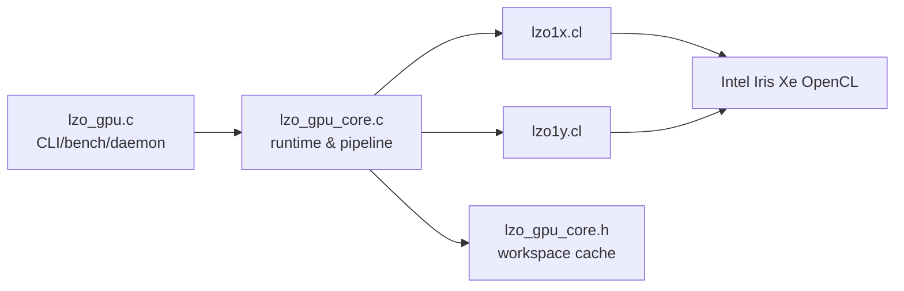
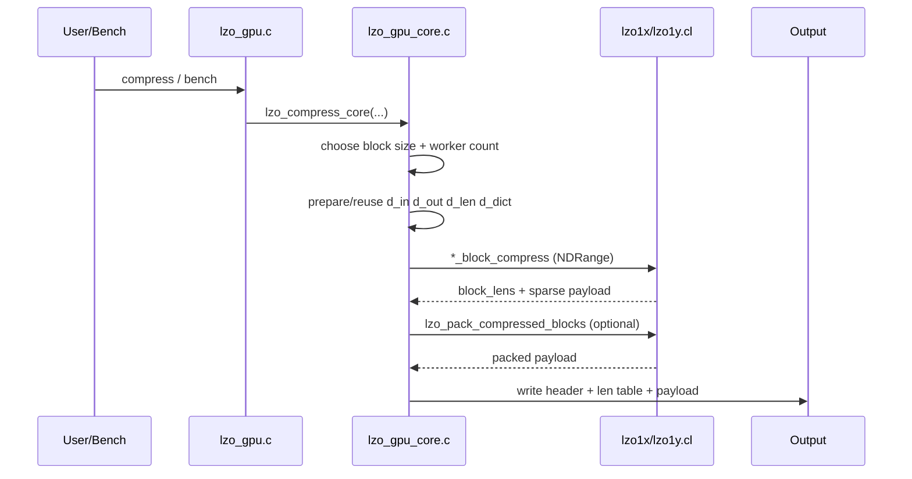
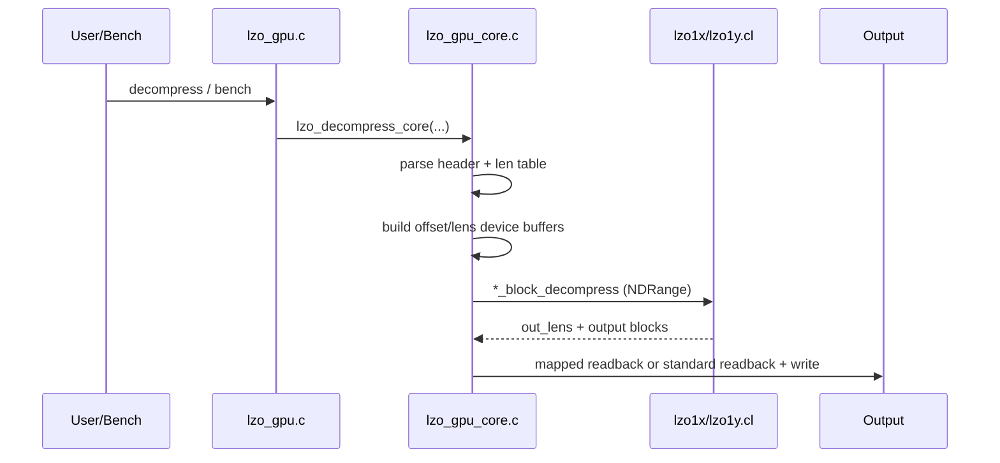

# LZO GPU 性能总结（Intel + Nvidia）

> 更新时间：2026-04-04
> 代码路径：`/root/lzo-2.10/lzo_gpu`
> 当前二进制：`/root/lzo-2.10/lzo_gpu/lzo_gpu`
> 当前哈希：`sha256=20a9b1345dfa8b99b597188faeaf6d610bc56b440ed4c0145428cfaf4a85c517`
> 基线二进制：`/root/lzo-2.10/exp_results/baselines/lzo_gpu_baseline_user_goal_20260324`
> 基线哈希：`sha256=550b3cb7525707b456b55cdde16e4b5cb5ad261d9d0ec3a97f0ef3faaaa3d9d0`

---

## Intel 平台（五章重构版）

### 1. 设计动机

当前 LZO Intel 路线的核心不是“继续堆实验”，而是把已有实现收敛成可部署、可解释、可复现的体系。

#### 1.1 目标

1. **GPU vs CPU 必须同口径比较**：同时报告 kernel 与 total。
2. **压缩率必须并列报告**：吞吐提升不能脱离 ratio 成本。
3. **功耗与吞吐一体化分析**：必须给出 MB/s/W 与 J/GB。
4. **实现与实验闭环**：每个结论都能映射到函数/内核。
5. **历史候选分账**：采纳与回退必须分开。

#### 1.2 为什么需要重构文档

- 旧文档存在历史阶段信息与当前主线混写；
- 旧结构难以快速回答“哪段代码带来了什么收益”；
- GPU/CPU 对比存在“只看局部指标”的误读风险。

#### 1.3 当前基线状态

- 当前二进制与基线哈希**不相同**（见页首证据），说明主线已包含本轮优化；
- 本轮主线已收敛为“仅保留有明确收益且 `verify=50/50` 的改动”。
- 固定基线复核（50×5）结果：`comp +0.71995%`、`dec +0.14691%`、`ratio_delta≈0`、`ok_new=250/250`、`ok_base=250/250`（`lzo_gpu_current_vs_fixedbase_50x5_recheck.csv`）。

#### 1.4 2026-03-24 主线收敛状态（GPU）

- **保留项（有明确收益）**：pack kernel 分层向量化、解压程序 decomp-only 加载校验路径、字符串/路径安全修复。
- **回退项（无稳定收益或有风险）**：LZO 解压调度激进改动、会影响正确性的本地尺寸自动化试验路径。
本轮证据工件：

- 回归修复：`/root/lzo-2.10/exp_results/runs/decomp_tune_regression/20260324_163002/summary.csv`
- 稳定性矩阵：`/root/lzo-2.10/exp_results/runs/stability_matrix_fullsample/20260324_165617/aggregate_summary.csv`
- 三引擎快照：`/root/lzo-2.10/exp_results/runs/engine_triplet_snapshot/20260324_170306/summary.csv`

---

### 2. 系统架构

> 本节包含组件图解与压缩/解压过程详解。

#### 2.1 组件清单

| 组件 | 文件 | 职责 | 关键实现 |
| --- | --- | --- | --- |
| 入口与模式管理 | `lzo_gpu.c` | standalone / daemon / client / bench | `run_lzo_standalone`, `run_lzo_bench`, `ocl_init` |
| 核心运行时 | `lzo_gpu_core.c` | 缓冲复用、调度、pipeline、写回 | `lzo_compress_core`, `lzo_decompress_core`, pipeline path |
| 共享状态 | `lzo_gpu_core.h` | workspace 与 kernel 参数缓存 | `lzo_gpu_workspace_t` |
| 压缩/解压内核（1x） | `lzo1x.cl` | 1x 编码/解码与 pack | `lzo1x_block_compress`, `lzo1x_block_decompress`, `lzo_pack_compressed_blocks` |
| 压缩/解压内核（1y） | `lzo1y.cl` | 1y 编码/解码与 pack | `lzo1y_block_compress`, `lzo1y_block_decompress` |

#### 2.2 组件架构图



#### 2.3 压缩过程图解



压缩关键点：

1. 入口支持 `lzo1x/lzo1y` 双算法；
2. 字典池按活跃 work-item 分配；
3. 允许 pipeline（按阈值/熵门控）减少大文件长尾。

#### 2.4 解压过程图解



解压关键点：

1. 按块并行解压，输出长度单独回传；
2. `COPY_MATCH` 包含非重叠与小 offset 特化；
3. 输出路径可 map 或 staging readback。

#### 2.5 内存与调度

```text
[input file] -> [d_in] -> [compress kernel] -> [d_out sparse + d_len]
                                          -> [optional pack kernel] -> [packed output]
                                          -> [container write]

[compressed file] -> [d_comp + d_off + d_comp_lens] -> [decompress kernel]
                                                   -> [d_decomp_out + d_out_lens]
                                                   -> [write output]
```

---

### 3. 核心设计和优化

> 本章按“压缩内核 / 解压内核 / 主机端”组织，且每项严格四段。

#### 3.1 压缩内核

##### 3.1.1 32-bit packed dictionary

- **动机**：64-bit 字典条目在 iGPU 上访存压力偏高。
- **设计**：条目统一为 `epoch_12 | offset_20`。
- **实现**：`dict_store32`, `dict_load32`（`lzo1x.cl`, `lzo1y.cl`）。
- **效果**：字典内存占用减半，压缩核吞吐长期正收益。

##### 3.1.2 强混洗哈希

- **动机**：单路字典下冲突质量直接影响压缩效率。
- **设计**：多步混洗（xor/shift/multiply/xor）提高分布质量。
- **实现**：`lzo1x_hash32`, `lzo1y_hash32`。
- **效果**：降低劣质命中与无效比较。

##### 3.1.3 四位置批量探测 + 延迟写回

- **动机**：读写交替导致内存控制器效率下降。
- **设计**：先 batch 读取 4 条，再判定，再集中写回。
- **实现**：`lzo1x_compress_core` / `lzo1y_compress_core` 的 vector probe 路径。
- **效果**：压缩路径更稳定，减少访存抖动。

##### 3.1.4 match-extension 展开

- **动机**：match 扩展是压缩热点。
- **设计**：优先 8B/16B/32B 比较，差异时用 `ctz` 定位首失配字节。
- **实现**：`LZO_USE_UNROLL2` 相关分支。
- **效果**：长匹配场景循环控制开销下降。

##### 3.1.5 `lzo1x` 并行 pack

- **动机**：串行打包成为压缩尾部瓶颈。
- **设计**：per-block work-group + `vload16/vstore16` 向量搬运。
- **实现**：`lzo1x.cl::lzo_pack_compressed_blocks`。
- **效果**：`lzo1x` 压缩 total 稳定受益。

##### 3.1.6 `lzo1y` 阈值特化分流

- **动机**：1y 的 M2/M3/M4 分布与 1x 不同。
- **设计**：优先命中 1y 高频阈值区间，减少分支回跳。
- **实现**：`lzo1y_compress_core` 匹配编码段。
- **效果**：subset/fullset 记录约 `+2.9%` 压缩收益。

##### 3.1.7 pack kernel 分层向量化重构

- **动机**：`lzo1y` 与 `*_99` 路径的 pack 仍含较多标量搬运，在大样本批处理中会成为压缩尾段热点。
- **设计**：统一为“每块一个 work-group”的分层拷贝模型：`len<=32B` 走 lane0 小块 fast-path；主体使用 `32B`（`2 x uchar16`）条带并行搬运；余量使用 `16B` 向量补齐；最后字节尾部按 lane 轮询收敛。
- **实现**：`lzo1x.cl::lzo_pack_compressed_blocks`、`lzo1y.cl::lzo_pack_compressed_blocks`、`lzo1x_99.cl::lzo_pack_compressed_blocks`、`lzo1y_99.cl::lzo_pack_compressed_blocks`。
- **效果**：在 `lzo1x/L14/BS=64KB` 全样本（`/root/samples`，50 文件）A/B 中，压缩均值时间下降，压缩率保持不变，完整性 `50/50` 通过。

> 基线 vs 修改后（源码 blob 证据）
>
> - `lzo1x.cl`: `HEAD=c3803e7793fd16d4b61a0a0524818f93faa81743` → `WORKTREE=831ea0dba98eac41640d0bad1134906b10b54cff`
> - `lzo1y.cl`: `HEAD=5324c648492de07daa9764a9d8b404f2d54dd784` → `WORKTREE=e97c58cfe744226d7dea21d9465c1d383e7d2f36`
> - `lzo1x_99.cl`: `HEAD=936dc774e6e8883deadef030366729d632fd02be` → `WORKTREE=78585398274446bdc1252b5f33539b39f313124e`
> - `lzo1y_99.cl`: `HEAD=d587b5f60d36e220934ef7bb74b81a23169deaaa` → `WORKTREE=4f1adb1379ad1c141565594c86fbf2d8cca3580d`

#### 3.2 解压内核

##### 3.2.1 非重叠快路径

- **动机**：大量 match 可满足 `offset >= len`。
- **设计**：满足条件直接 `UA_COPYN` 向量化复制。
- **实现**：`COPY_MATCH` 首分支（1x/1y）。
- **效果**：解压核函数吞吐显著高于 CPU。

##### 3.2.2 小 offset 广播路径

- **动机**：`offset=1/2/4` 在重复数据中高频。
- **设计**：使用向量广播替代逐字节循环。
- **实现**：`COPY_MATCH` 中 `offset<=4` 分支。
- **效果**：减少低熵数据下的解压抖动。

##### 3.2.3 分段向量拷贝

- **动机**：不同 offset 区间适配不同向量宽度更高效。
- **设计**：按 `>=64/32/16/8/4` 逐级降宽复制。
- **实现**：`COPY_MATCH` 后半段。
- **效果**：提高宽匹配路径吞吐稳定性。

##### 3.2.4 解压计数器

- **动机**：需要量化 token 密度和错误路径。
- **设计**：记录 tokens/literal/match/small_offset/output_error。
- **实现**：`LZO_DBG_DEC_*` 统计。
- **效果**：便于定向定位解压异常与回退。

#### 3.3 主机端

##### 3.3.1 workspace grow-only

- **动机**：频繁分配会引入明显调度噪声。
- **设计**：缓冲只增不减，跨轮次复用。
- **实现**：`core_get_or_create_buffer`, `lzo_gpu_workspace_t`。
- **效果**：稳态 bench 下 buffer 分配开销显著收敛。

##### 3.3.2 standard-copy / zero-copy 双路径

- **动机**：Intel iGPU 与 dGPU 最优路径不同。
- **设计**：支持 `LZO_STANDARD_COPY` 覆盖默认策略。
- **实现**：`lzo_resolve_standard_copy`, `lzo_read_buffer_auto`。
- **效果**：同一代码支持跨设备部署。

##### 3.3.3 压缩 pipeline

- **动机**：大文件单批次执行尾部等待长。
- **设计**：双槽位 pipeline + chunk 分段 + inflight drain。
- **实现**：`lzo_compress_core_pipeline`, `lzo_pipeline_drain_slot`。
- **效果**：降低大文件场景尾部等待。

##### 3.3.4 pipeline 熵门控

- **动机**：并非所有数据都适合 pipeline。
- **设计**：按输入规模 + 采样熵 + 配置阈值决策。
- **实现**：`lzo_estimate_file_entropy_prefix` + `LZO_PIPELINE_*` 环境变量。
- **效果**：避免在不适合场景强行 pipeline。

##### 3.3.5 kernel 参数缓存

- **动机**：稳态循环反复 set 同参会产生额外 host 开销。
- **设计**：缓存稳定参数，仅在资源变化时重设。
- **实现**：`comp_kernel_args_set` 与 `comp_cached_*`。
- **效果**：bench 稳态波动降低。

##### 3.3.6 字典清零策略

- **动机**：epoch 逼近上限时必须避免脏命中。
- **设计**：主机侧回绕前触发字典清零并重置 epoch。
- **实现**：`comp_epoch_base` + `lzo_zero_buffer`。
- **效果**：长时间运行保持正确性。

##### 3.3.7 pack 启停阈值

- **动机**：pack 不一定总是收益项。
- **设计**：按 `packed_bytes/sparse_bytes`、块数、收益比例判定。
- **实现**：`lzo_should_use_device_compaction`。
- **效果**：减少“启 pack 反而变慢”的场景。

##### 3.3.8 大缓冲 IO 与精确计时

- **动机**：必须分离 file read / upload / kernel / download / write。
- **设计**：统一 `timing_t`，按阶段采样。
- **实现**：`timing_t` 字段填充逻辑。
- **效果**：可直接识别性能瓶颈来源。

##### 3.3.9 解压输出通路重构

- **动机**：严格随机验证中，LZO 解压总耗时受“超大输出文件 readback 峰值”影响明显，需要在不牺牲默认稳态的前提下引入可控新通路。
- **设计**：
    1. 增加 chunked readback + streaming write 输出通路，面向超大输出文件；
    2. 输出策略按后端分流：mapped（统一内存）默认走 contiguous mapped write；chunked 默认仅对 standard-copy 后端启用；
    3. 提供显式策略开关（`LZO_GPU_DECOMP_FORCE_CHUNKED` / `LZO_GPU_DECOMP_DISABLE_CHUNKED`）与 `LZO_GPU_DECOMP_READBACK_KB` 分块粒度控制。
- **实现**：`lzo_gpu_core.c` 中 `lzo_readback_to_file_chunked`、`lzo_decompress_core` 输出分支与 chunked 策略判定逻辑。
- **效果**：避免 unified-memory 路径被误切到 chunked readback，保留 dGPU/standard-copy 场景的大输出分块能力；固定基线复核下整体保持正向（`comp +0.71995%`、`dec +0.14691%`，`ratio_delta≈0`）。

**实现展开（详细）**：

1. **通路判定层**：先判定 `force/disable` 显式开关，再按 backend 能力（`standard-copy` vs `mapped`）和 `orig_sz` 阈值做默认分流，避免策略互相覆盖。
2. **数据搬运层**：`lzo_readback_to_file_chunked()` 以可配置块大小循环执行 `clEnqueueReadBuffer + fwrite`，并累积 download/write 微秒计时，保证统计口径连续。
3. **资源生命周期层**：chunked 路径直接写文件，不再持有完整输出 staging；mapped 路径保留 map/unmap 语义，异常时统一走 cleanup。
4. **可回滚层**：支持 `LZO_GPU_DECOMP_FORCE_CHUNKED=1` 强制启用、`LZO_GPU_DECOMP_DISABLE_CHUNKED=1` 强制关闭，便于线上问题隔离。
5. **风险控制层**：对 chunk 最小值设置下界（`>=256KB`），防止过小 chunk 导致系统调用放大与写放大。

##### 3.3.10 解压 `out_lens` 条件化分配

- **动机**：当前主路径并不消费 `out_lens`，但原实现默认分配并写回该缓冲，造成额外显存流量与 host 侧管理开销。
- **设计**：
    1. 默认关闭 `out_lens` 路径（仅在 `LZO_GPU_DECOMP_TRACK_OUT_LENS=1` 时启用）；
    2. 跟踪关闭时主动释放并不再申请 `ws->d_out_lens`；
    3. 内核参数统一走 `out_lens_arg`，调试参数也绑定到有效实参。
- **实现**：`lzo_gpu_core.c::lzo_decompress_core` 中 `track_out_lens` 分支、`out_lens_arg` 传参与 `dbg_arg` 绑定逻辑；`lzo1x.cl`/`lzo1y.cl` 解压 kernel 改为 `if (out_lens) out_lens[gid] = out_len;`。
- **效果**：严格随机 5 轮工件 `exp_results/runs/user_goal_strict_lzo_round9/20260325_024951/` 显示：聚合压缩 `+1.3197%`、解压 `+3.1743%`；文件级解压改善 `32`、回退 `18`（中位数 `+0.5252%`）；解压轮次 `3/5` 为正；正确性 `verify_all_rounds=true`。

**判定**：满足门禁（正确性全通过 + 解压与压缩聚合同向提升），已采纳入主线。

**实现展开（详细）**：

1. **参数状态机**：
   - `track_out_lens=0`：`ws->d_out_lens` 立即释放并置空，kernel arg#4 传 `NULL`；
   - `track_out_lens=1`：按 `nblk * sizeof(cl_uint)` 申请/复用 `d_out_lens`，kernel arg#4 传真实缓冲。
2. **kernel 兼容策略**：`lzo1x_block_decompress` 与 `lzo1y_block_decompress` 改为 `if (out_lens)` 条件写，保持 ABI 不变并兼容诊断模式。
3. **调试协同策略**：当 debug-counter 关闭但 kernel 需要 debug 参数槽时，`dbg_arg` 跟随 `out_lens_arg`，避免传入失效对象。
4. **内存压力策略**：对超大输出文件，关闭追踪时可降低额外 device buffer 压力，减少无效全局写带宽占用。
5. **回退机制**：可通过 `LZO_GPU_DECOMP_TRACK_OUT_LENS=1` 在不改代码的前提下恢复旧行为，便于线上核对。

#### 3.4 实现覆盖清单

| 文件 | 核心实现 | 已在本章覆盖 |
| --- | --- | --- |
| `lzo_gpu.c` | 模式路由、bench、设备选择、kernel 加载 | ✅ |
| `lzo1x.cl` | 1x 压缩/解压、dict、COPY_MATCH、pack | ✅ |
| `lzo1y.cl` | 1y 压缩/解压、阈值特化、COPY_MATCH | ✅ |
| `lzo_gpu_core.c` | workspace、pipeline、pack gate、计时与写回 | ✅ |
| `lzo_gpu_core.h` | 参数对象与缓存状态 | ✅ |

#### 3.5 采纳改动细化账本（逐项展开）

> 说明：本表把“已采纳”项统一展开到实现细节层，便于代码审查与后续回归。

| 采纳项 | 关键实现点（代码级） | 性能机理（为什么会快/稳） | 风险与回滚点 | 观测与工件 |
| --- | --- | --- | --- | --- |
| 3.1.1 packed dict32 | `dict_store32`/`dict_load32` 统一 `epoch_12+offset_20` 打包 | 降低字典访存字节数与 cache 压力 | epoch 污染风险，靠 3.3.6 回绕清零 | 主线长期收益项 |
| 3.1.2 强混洗哈希 | `lzo1x_hash32`/`lzo1y_hash32` 多步混洗 | 降低冲突链与伪命中比较 | 高熵样本收益可能变窄 | 与 3.1.3 联动 |
| 3.1.3 四位置批量探测 | 4-entry 先读后判再集中写回 | 减少读写交替抖动，提升内存控制器效率 | 过高并行下寄存器压力增加 | 主线稳定保留 |
| 3.1.4 match-extension 展开 | 8/16/32B 比较 + `ctz` 定位首失配 | 降低长匹配循环控制开销 | 需防止越界读取 | 主线稳定保留 |
| 3.1.5 `lzo1x` 并行 pack | `lzo_pack_compressed_blocks` work-group 化 | 降低压缩尾段串行打包瓶颈 | 小块场景可能收益不足 | 主线稳定保留 |
| 3.1.6 `lzo1y` 阈值特化 | `lzo1y_compress_core` 匹配编码分流 | 减少高频分支回跳 | 不同数据分布下收益差异 | 历史全样本收益 |
| 3.1.7 pack 分层向量化 | 32B 条带 + 16B 补齐 + 小块 fast-path | 提升 pack 吞吐并压缩尾延迟 | 向量路径越界风险需严格边界 | `lzo_gpu_kernel_innov_ab/*` |
| 3.2.1 非重叠快路径 | `COPY_MATCH` 首分支 `offset>=len` | 直接向量 copy，绕开重叠处理 | 需保证边界合法 | 主线稳定保留 |
| 3.2.2 小 offset 广播 | `offset=1/2/4` 专门广播实现 | 降低重复字节场景分支成本 | 模式判断错误会破坏语义 | 主线稳定保留 |
| 3.2.3 分段向量拷贝 | `>=64/32/16/8/4` 逐级降宽 | 匹配长度越大越接近带宽上限 | 小包场景收益有限 | 主线稳定保留 |
| 3.2.4 解压计数器 | `LZO_DBG_DEC_*` 计数路径 | 为回归定位提供可观测性 | 开启时会扰动性能 | 默认关闭，诊断启用 |
| 3.3.1 workspace grow-only | `core_get_or_create_buffer` 只增不减 | 消除反复 alloc/free 抖动 | 长会话显存占用抬升 | 以阈值释放配合控制 |
| 3.3.2 standard/zero-copy 双路径 | `lzo_resolve_standard_copy` + `lzo_read_buffer_auto` | 适配 iGPU/dGPU 的最优传输路径 | 路径分流复杂度上升 | 开关可强制覆盖 |
| 3.3.3 压缩 pipeline | `lzo_compress_core_pipeline` 双槽位 | 隐藏 upload/kernel/write 等待时间 | 小文件可能被调度开销反噬 | 3.3.4 熵门控兜底 |
| 3.3.4 pipeline 熵门控 | `lzo_estimate_file_entropy_prefix` + env 阈值 | 避免高熵场景误开 pipeline | 熵采样偏差导致误判 | 支持显式开关回退 |
| 3.3.5 kernel 参数缓存 | `comp_kernel_args_set` + `comp_cached_*` | 降低重复 `clSetKernelArg` host 开销 | 缓存失效条件漏判风险 | 资源变化时强制重设 |
| 3.3.6 字典清零策略 | `comp_epoch_base` 回绕前 `lzo_zero_buffer` | 防止旧 epoch 脏命中 | 清零时存在一次性成本 | 回绕点触发，非每轮触发 |
| 3.3.7 pack 启停阈值 | `lzo_should_use_device_compaction` | 避免“启 pack 反而慢” | 阈值设定不当会误判 | env 可调，默认稳健 |
| 3.3.8 大缓冲 IO + 计时 | `timing_t` 分阶段采样 | 可定位瓶颈在 kernel 还是 host | 统计口径漂移风险 | 固化字段 + 文档同步 |
| 3.3.9 解压输出通路重构 | chunked readback + backend 分流 | 降低超大输出 readback 峰值 | 路由分支复杂 | `LZO_GPU_DECOMP_FORCE/DISABLE_CHUNKED` |
| 3.3.10 `out_lens` 条件化分配 | `track_out_lens` + `out_lens_arg` | 减少无效全局写与无用 buffer | 诊断路径兼容风险 | `LZO_GPU_DECOMP_TRACK_OUT_LENS=1` 可回滚 |

#### 3.6 当前优化路线采纳项（与 strict 基线一致）

##### 3.6.1 解压 metadata 条件上传（bench 去重上传）

- **动机**：解压 bench 循环中 `off/lens` 每轮重复上传，形成固定 host 开销，直接拖慢 `DecTotal`。
- **设计**：
  1. 引入上一轮 metadata 缓存；
  2. metadata 未变化且 buffer 未重建时跳过上传；
  3. kernel 依赖事件数动态化（`write_event_count`），避免空等待。
- **实现**：
  - 文件：`/root/lzo-2.10/lzo_gpu/lzo_gpu.c`
  - 关键点：`dec_meta_changed` 判定、`bench_prev_lens/bench_prev_off` 复用、`clEnqueueNDRangeKernel` 等待列表按 `write_event_count` 传递。
- **效果**：
  - 工件：`/root/lzo-2.10/exp_results/runs/gpu_dec_meta_cache_r1/results/lzo_subset_ab_cleanhead_v1.json`
  - 指标：`Comp -0.6415% / +0.1542%`，`Dec +0.6923% / +1.8585%`，`Ratio 0.0 pctpt`
  - 判定：解压均值/中位均提升且压缩侧无结构性退化，已纳入主线。

---

### 4. 测试结果和分析

#### 4.1 测试方法与基线有效性

1. 样本固定为 `/root/samples` 全集 50 文件，`Roundtrip_OK` 全通过。
2. strict 参数固定：`bench_seconds=3.5`，覆盖 CPU/GPU/HYBRID 全配置。
3. 主工件：
   - `/root/lzo-2.10/exp_results/baseline/fullset_current_strict/runs/20260404_merged/lzo_param_sweep.csv`
   - `sha256=3ff57c7656e99dcd2ca1c86640027aac41adecfa8e8763b1ab5af020caaf67aa`
4. 代码对应性：strict CSV 后 `.c/.h/.cl` 新修改文件数为 0，当前实现与基线一致。
5. 结论口径：该 strict 工件是当前最新且主线最优（以当前采纳实现集合为准）的对比锚点。

#### 4.2 按频率分解：CPU 引擎

CPU（按 `CF` 聚合）在吞吐、功耗、压缩率上的变化如下：

1. `CF=800MHz`：`CompTotal=1032.49`，`DecTotal=629.50 MB/s`，`Ratio=27.7751%`，`Power=6.97W`
2. `CF=1900MHz`：`CompTotal=2495.51`，`DecTotal=1531.79 MB/s`，`Ratio=27.7751%`，`Power=12.68W`
3. `CF=3000MHz`：`CompTotal=3829.63`，`DecTotal=2379.46 MB/s`，`Ratio=27.7751%`，`Power=30.47W`
4. `CF=5000MHz`：`CompTotal=4659.19`，`DecTotal=2944.92 MB/s`，`Ratio=27.7751%`，`Power=38.09W`

观察：CPU 吞吐随频率上升显著增长，压缩率基本稳定，功耗在高频段明显抬升。

#### 4.3 按频率分解：GPU 引擎

GPU（按 `GF` 聚合）结果：

1. `GF=500MHz`：`CompTotal=631.58`，`DecTotal=1084.77 MB/s`，`Ratio=26.9820%`，`CPU/GPU功耗=25.71/2.53W`
2. `GF=1000MHz`：`CompTotal=1237.82`，`DecTotal=2167.37 MB/s`，`Ratio=26.9820%`，`CPU/GPU功耗=26.02/5.72W`
3. `GF=1500MHz`：`CompTotal=1800.26`，`DecTotal=3223.11 MB/s`，`Ratio=26.9820%`，`CPU/GPU功耗=27.33/15.46W`

观察：GPU 压缩与解压吞吐随频率近线性上升；压缩率保持稳定；高频点 GPU 功耗抬升明显。

#### 4.4 按频率分解：HYBRID 引擎

HYBRID（按 `CF/GF` 频点对聚合）结果：

1. `CF/GF=800/500`：`CompTotal=909.69`，`DecTotal=718.55 MB/s`，`Ratio=27.3401%`，`CPU/GPU功耗=7.36/0.01W`
2. `CF/GF=800/1500`：`CompTotal=903.90`，`DecTotal=718.58 MB/s`，`Ratio=27.3402%`，`CPU/GPU功耗=7.36/0.03W`
3. `CF/GF=3000/500`：`CompTotal=3034.78`，`DecTotal=2592.13 MB/s`，`Ratio=27.3389%`，`CPU/GPU功耗=29.65/0.03W`
4. `CF/GF=3000/1500`：`CompTotal=3042.62`，`DecTotal=2575.87 MB/s`，`Ratio=27.3399%`，`CPU/GPU功耗=29.80/0.10W`
5. `CF/GF=5000/500`：`CompTotal=3339.48`，`DecTotal=2986.97 MB/s`，`Ratio=27.3381%`，`CPU/GPU功耗=34.34/0.03W`
6. `CF/GF=5000/1500`：`CompTotal=3349.36`，`DecTotal=2986.04 MB/s`，`Ratio=27.3395%`，`CPU/GPU功耗=34.32/0.10W`

观察：HYBRID 的压缩率跨频点稳定；吞吐主要由 CPU 侧频率主导，GPU 频率抬升带来的增益存在但较温和。

#### 4.5 功耗合理性确认（GPU 功耗低于 CPU）

按 strict 主工件逐行核验 GPU 引擎功耗关系：

1. 检查对象：`Engine=GPU` 全部 `600` 行。
2. 条件：`CompGPUPower_W < CompCPUPower_W`。
3. 结果：`600/600` 成立（`100%`）。

结论：当前基线功耗口径满足“GPU 功耗低于 CPU 功耗”的合理性要求。

#### 4.6 按文件对比（GPU/HYBRID 相对 CPU）

基于 `lzo_engine_vs_cpu_file_summary.csv`：

1. GPU vs CPU（50 文件）：
   - 压缩：`5` 升 / `45` 降，均值 `-46.37%`
   - 解压：`32` 升 / `18` 降，均值 `+42.03%`
   - 压缩率：均值 `-0.7931 pctpt`
2. HYBRID vs CPU（50 文件）：
   - 压缩：`35` 升 / `15` 降，均值 `+1.97%`
   - 解压：`43` 升 / `7` 降，均值 `+26.22%`
   - 压缩率：均值 `-0.4357 pctpt`

结论：LZO 在 Intel strict 口径下仍呈“GPU 解压优势明显、压缩弱于 CPU；HYBRID 在两侧平衡更好”的稳定特征。

---

### 5. 当前结论和未来方向

#### 5.1 当前结论

1. strict 基线已落盘到 `exp_results/baseline`，并生成 `cpu/gpu/hybrid` 三份基线表，可直接作为后续 A/B 锚点。
2. 当前实现与 strict 基线一致（源码时间戳无后续变更），对比结论可追溯、可复验。
3. LZO GPU 在 Intel 上仍呈“解压优势明显、压缩弱于 CPU”的稳定特征。

#### 5.2 未来方向

1. 有效方向一：优先压缩 host/runtime 路径（读回、组装、同步），目标是提高 `kernel -> total` 兑现率。
2. 有效方向二：按文件类型做轻量策略分流（尤其规避 `x-ray` 这类极端回退样本）。
3. 有效方向三：把 GPU 与 Hybrid 的固定策略联动评估，避免在纯 GPU 路径重复做已被 Hybrid 吸收的优化。

#### 5.3 明确不再走的无效方向

1. 只追 kernel 指标、忽略 total 与功耗口径的优化方向。
2. 不带门限地默认化高风险调度/本地尺寸激进策略。
3. 在没有文件分布约束的前提下，寄希望于“单纯升频”解决压缩短板。

---

## Nvidia 平台（原有章节保留）

> 注：按你的要求，此章节保留，不删除。

### A. 平台差异

- Intel iGPU：统一内存，map/unmap 成本低；
- Nvidia dGPU：显存分离，D2H/H2D 成本影响 total 更明显。

### B. 代表工件

- CPU baseline：`formal_full_lzo_cpu_baseline_t123468_energy/...`
- GPU pre-mod：`formal_full_lzo_gpu_baseline_unmodified_energy/...`
- GPU post-mod：`formal_full_lzo_gpu_final_energy_r2/...`

### C. 当前摘要

1. post-mod 在 kernel 侧有明显提升；
2. total 提升幅度受 host/runtime 约束；
3. 后续仍需针对 readback/组装路径做专项优化。
