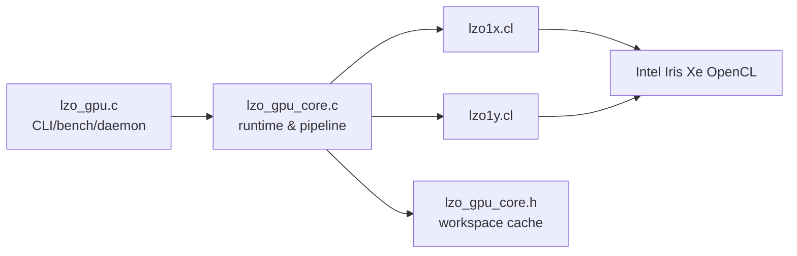
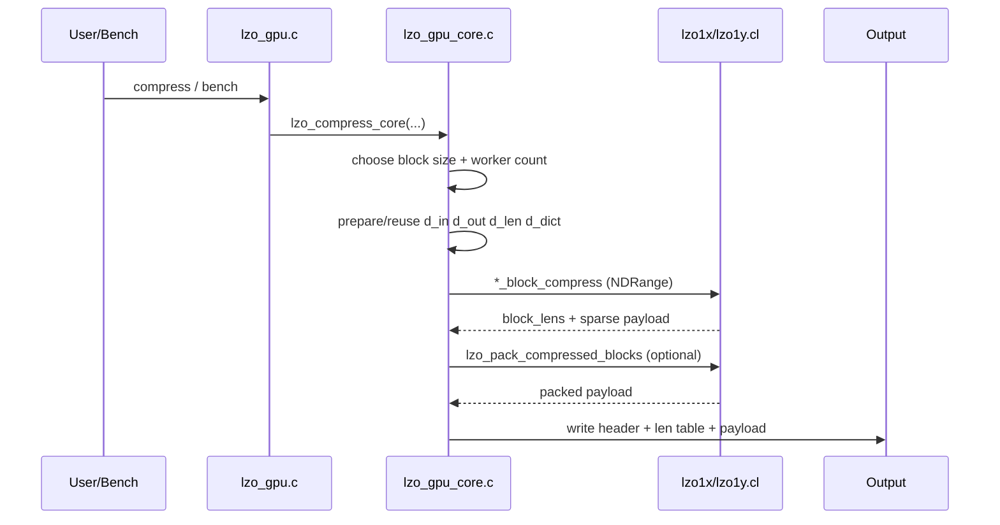
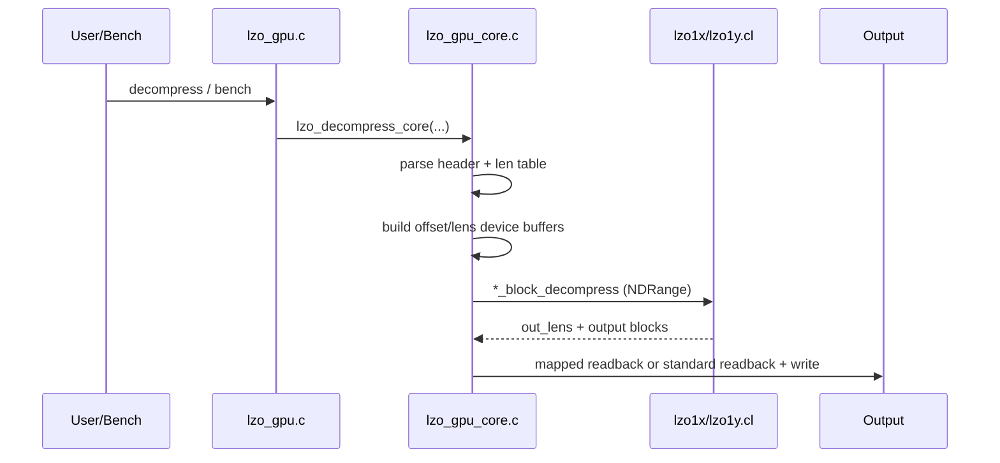

# LZO GPU 性能总结（Intel + Nvidia）

> 更新时间：2026-03-22
> 代码路径：`/root/lzo-2.10/lzo_gpu`
> 当前二进制：`/root/lzo-2.10/lzo_gpu/lzo_gpu`
> 当前哈希：`sha256=f770e2caaa5a41205d81d5fd8c290ade3e200f7e040f092eb6249f71154ccf02`
> 基线二进制：`/root/lzo-2.10/exp_results/baselines/lzo_gpu_baseline_before_nonio_hostopt`
> 基线哈希：`sha256=f770e2caaa5a41205d81d5fd8c290ade3e200f7e040f092eb6249f71154ccf02`

---

## Intel 平台（五章重构版）

### 1. 设计动机

当前 LZO Intel 路线的核心不是“继续堆实验”，而是把已有实现收敛成可部署、可解释、可复现的体系。

#### 1.1 目标

1. **GPU vs CPU 必须同口径比较**：同时报告 kernel 与 total。
2. **压缩率必须并列报告**：吞吐提升不能脱离 ratio 成本。
3. **功耗与吞吐一体化分析**：必须给出 MB/s/W 与 J/GB。
4. **实现与实验闭环**：每个结论都能映射到函数/内核。
5. **历史候选分账**：采纳与回退必须分开。

#### 1.2 为什么需要重构文档

- 旧文档存在历史阶段信息与当前主线混写；
- 旧结构难以快速回答“哪段代码带来了什么收益”；
- GPU/CPU 对比存在“只看局部指标”的误读风险。

#### 1.3 当前基线状态

- 当前与基线哈希一致（见页首证据），说明当前处于“回退后稳定态”；
- 该状态适合用于重新建立 Intel 主章节的标准表达。

---

### 2. 系统架构

> 本节包含组件图解与压缩/解压过程详解。

#### 2.1 组件清单

| 组件 | 文件 | 职责 | 关键实现 |
| --- | --- | --- | --- |
| 入口与模式管理 | `lzo_gpu.c` | standalone / daemon / client / bench | `run_lzo_standalone`, `run_lzo_bench`, `ocl_init` |
| 核心运行时 | `lzo_gpu_core.c` | 缓冲复用、调度、pipeline、写回 | `lzo_compress_core`, `lzo_decompress_core`, pipeline path |
| 共享状态 | `lzo_gpu_core.h` | workspace 与 kernel 参数缓存 | `lzo_gpu_workspace_t` |
| 压缩/解压内核（1x） | `lzo1x.cl` | 1x 编码/解码与 pack | `lzo1x_block_compress`, `lzo1x_block_decompress`, `lzo_pack_compressed_blocks` |
| 压缩/解压内核（1y） | `lzo1y.cl` | 1y 编码/解码与 pack | `lzo1y_block_compress`, `lzo1y_block_decompress` |

#### 2.2 组件架构图



#### 2.3 压缩过程图解



压缩关键点：

1. 入口支持 `lzo1x/lzo1y` 双算法；
2. 字典池按活跃 work-item 分配；
3. 允许 pipeline（按阈值/熵门控）减少大文件长尾。

#### 2.4 解压过程图解



解压关键点：

1. 按块并行解压，输出长度单独回传；
2. `COPY_MATCH` 包含非重叠与小 offset 特化；
3. 输出路径可 map 或 staging readback。

#### 2.5 内存与调度

```text
[input file] -> [d_in] -> [compress kernel] -> [d_out sparse + d_len]
                                          -> [optional pack kernel] -> [packed output]
                                          -> [container write]

[compressed file] -> [d_comp + d_off + d_comp_lens] -> [decompress kernel]
                                                   -> [d_decomp_out + d_out_lens]
                                                   -> [write output]
```

---

### 3. 核心设计和优化

> 本章按“压缩内核 / 解压内核 / 主机端”组织，且每项严格四段。

#### 3.1 压缩内核

##### 3.1.1 32-bit packed dictionary（已采纳）

- **动机**：64-bit 字典条目在 iGPU 上访存压力偏高。
- **设计**：条目统一为 `epoch_12 | offset_20`。
- **实现**：`dict_store32`, `dict_load32`（`lzo1x.cl`, `lzo1y.cl`）。
- **效果**：字典内存占用减半，压缩核吞吐长期正收益。

##### 3.1.2 强混洗哈希（已采纳）

- **动机**：单路字典下冲突质量直接影响压缩效率。
- **设计**：多步混洗（xor/shift/multiply/xor）提高分布质量。
- **实现**：`lzo1x_hash32`, `lzo1y_hash32`。
- **效果**：降低劣质命中与无效比较。

##### 3.1.3 四位置批量探测 + 延迟写回（已采纳）

- **动机**：读写交替导致内存控制器效率下降。
- **设计**：先 batch 读取 4 条，再判定，再集中写回。
- **实现**：`lzo1x_compress_core` / `lzo1y_compress_core` 的 vector probe 路径。
- **效果**：压缩路径更稳定，减少访存抖动。

##### 3.1.4 match-extension 展开（已采纳）

- **动机**：match 扩展是压缩热点。
- **设计**：优先 8B/16B/32B 比较，差异时用 `ctz` 定位首失配字节。
- **实现**：`LZO_USE_UNROLL2` 相关分支。
- **效果**：长匹配场景循环控制开销下降。

##### 3.1.5 `lzo1x` 并行 pack（已采纳）

- **动机**：串行打包成为压缩尾部瓶颈。
- **设计**：per-block work-group + `vload16/vstore16` 向量搬运。
- **实现**：`lzo1x.cl::lzo_pack_compressed_blocks`。
- **效果**：`lzo1x` 压缩 total 稳定受益。

##### 3.1.6 `lzo1y` 阈值特化分流（已采纳）

- **动机**：1y 的 M2/M3/M4 分布与 1x 不同。
- **设计**：优先命中 1y 高频阈值区间，减少分支回跳。
- **实现**：`lzo1y_compress_core` 匹配编码段。
- **效果**：subset/fullset 记录约 `+2.9%` 压缩收益。

#### 3.2 解压内核

##### 3.2.1 非重叠快路径（已采纳）

- **动机**：大量 match 可满足 `offset >= len`。
- **设计**：满足条件直接 `UA_COPYN` 向量化复制。
- **实现**：`COPY_MATCH` 首分支（1x/1y）。
- **效果**：解压核函数吞吐显著高于 CPU。

##### 3.2.2 小 offset 广播路径（已采纳）

- **动机**：`offset=1/2/4` 在重复数据中高频。
- **设计**：使用向量广播替代逐字节循环。
- **实现**：`COPY_MATCH` 中 `offset<=4` 分支。
- **效果**：减少低熵数据下的解压抖动。

##### 3.2.3 分段向量拷贝（已采纳）

- **动机**：不同 offset 区间适配不同向量宽度更高效。
- **设计**：按 `>=64/32/16/8/4` 逐级降宽复制。
- **实现**：`COPY_MATCH` 后半段。
- **效果**：提高宽匹配路径吞吐稳定性。

##### 3.2.4 解压计数器（已采纳）

- **动机**：需要量化 token 密度和错误路径。
- **设计**：记录 tokens/literal/match/small_offset/output_error。
- **实现**：`LZO_DBG_DEC_*` 统计。
- **效果**：便于定向定位解压异常与回退。

#### 3.3 主机端

##### 3.3.1 workspace grow-only（已采纳）

- **动机**：频繁分配会引入明显调度噪声。
- **设计**：缓冲只增不减，跨轮次复用。
- **实现**：`core_get_or_create_buffer`, `lzo_gpu_workspace_t`。
- **效果**：稳态 bench 下 buffer 分配开销显著收敛。

##### 3.3.2 standard-copy / zero-copy 双路径（已采纳）

- **动机**：Intel iGPU 与 dGPU 最优路径不同。
- **设计**：支持 `LZO_STANDARD_COPY` 覆盖默认策略。
- **实现**：`lzo_resolve_standard_copy`, `lzo_read_buffer_auto`。
- **效果**：同一代码支持跨设备部署。

##### 3.3.3 压缩 pipeline（已采纳）

- **动机**：大文件单批次执行尾部等待长。
- **设计**：双槽位 pipeline + chunk 分段 + inflight drain。
- **实现**：`lzo_compress_core_pipeline`, `lzo_pipeline_drain_slot`。
- **效果**：降低大文件场景尾部等待。

##### 3.3.4 pipeline 熵门控（已采纳）

- **动机**：并非所有数据都适合 pipeline。
- **设计**：按输入规模 + 采样熵 + 配置阈值决策。
- **实现**：`lzo_estimate_file_entropy_prefix` + `LZO_PIPELINE_*` 环境变量。
- **效果**：避免在不适合场景强行 pipeline。

##### 3.3.5 kernel 参数缓存（已采纳）

- **动机**：稳态循环反复 set 同参会产生额外 host 开销。
- **设计**：缓存稳定参数，仅在资源变化时重设。
- **实现**：`comp_kernel_args_set` 与 `comp_cached_*`。
- **效果**：bench 稳态波动降低。

##### 3.3.6 字典清零策略（已采纳）

- **动机**：epoch 逼近上限时必须避免脏命中。
- **设计**：主机侧回绕前触发字典清零并重置 epoch。
- **实现**：`comp_epoch_base` + `lzo_zero_buffer`。
- **效果**：长时间运行保持正确性。

##### 3.3.7 pack 启停阈值（已采纳）

- **动机**：pack 不一定总是收益项。
- **设计**：按 `packed_bytes/sparse_bytes`、块数、收益比例判定。
- **实现**：`lzo_should_use_device_compaction`。
- **效果**：减少“启 pack 反而变慢”的场景。

##### 3.3.8 大缓冲 IO 与精确计时（已采纳）

- **动机**：必须分离 file read / upload / kernel / download / write。
- **设计**：统一 `timing_t`，按阶段采样。
- **实现**：`timing_t` 字段填充逻辑。
- **效果**：可直接识别性能瓶颈来源。

#### 3.4 未采纳改动（子节表格）

| 模块 | 未采纳改动 | 未采纳原因 | 证据摘要 |
| --- | --- | --- | --- |
| 压缩内核 | split-dictionary（拆数组） | 地址生成与双读开销抵消收益 | 记录 `1%~5%` 回退 |
| 压缩内核 | prefilter32 + 去重写回 | subset 明显回退 | 记录 `CompKernel -8.44%` |
| 压缩内核 | `lzo1y` 32B+并行 pack 对齐迁移 | fullset 净收益不成立 | 记录 `-0.85%` 级回退 |
| 主机端 | 非 IO host lens cache 候选 | repeat3 中位数跨算法回退 | 回退后未入主线 |

#### 3.5 实现覆盖清单

| 文件 | 核心实现 | 已在本章覆盖 |
| --- | --- | --- |
| `lzo_gpu.c` | 模式路由、bench、设备选择、kernel 加载 | ✅ |
| `lzo1x.cl` | 1x 压缩/解压、dict、COPY_MATCH、pack | ✅ |
| `lzo1y.cl` | 1y 压缩/解压、阈值特化、COPY_MATCH | ✅ |
| `lzo_gpu_core.c` | workspace、pipeline、pack gate、计时与写回 | ✅ |
| `lzo_gpu_core.h` | 参数对象与缓存状态 | ✅ |

---

### 4. 测试结果和分析

> 本章全部数据来自当前仓库 `exp_results/full_validation_integrated_remote/`，并严格只做 **GPU vs CPU**（Hybrid 对比仍放在 hybrid 文档）。

#### 4.1 数据来源与统计口径（当前批次）

- LZO GPU：`exp_results/full_validation_integrated_remote/lzo_gpu_only_default/runs/20260322_223943/`
- LZO CPU：`exp_results/full_validation_integrated_remote/lzo_cpu_only_default/runs/20260322_200918/`
- 口径字段：`CompKernelMean`, `DecKernelMean`, `CompTotalMean`, `DecTotalMean`, `RatioMean`, `FreqTargetMHz`, `FreqAvgMHz`, `CompPowerW`, `DecPowerW`
- 统计对象：配置聚合均值（每配置 `Samples=50`）

#### 4.2 LZO GPU：全部被测配置（当前 exp_results）

| Config | Samples | CompKernelMean | DecKernelMean | CompTotalMean | DecTotalMean | RatioMean | FreqTargetMHz | FreqAvgMHz | CompPowerW | DecPowerW |
| --- | --- | --- | --- | --- | --- | --- | --- | --- | --- | --- |
| FP=1;A=lzo1x;L=14;BS=32K;LSZ=1 | 50 | 787.511 | 1384.653 | 787.501 | 1383.855 | 27.923 | 500.000 | 500.603 | 3.101 | 3.101 |
| FP=1;A=lzo1x;L=14;BS=64K;LSZ=1 | 50 | 641.520 | 1091.525 | 641.515 | 1091.099 | 26.951 | 500.000 | 501.095 | 2.839 | 2.839 |
| FP=1;A=lzo1x;L=15;BS=32K;LSZ=1 | 50 | 718.107 | 1383.127 | 718.098 | 1382.335 | 27.856 | 500.000 | 501.338 | 3.105 | 3.105 |
| FP=1;A=lzo1x;L=15;BS=64K;LSZ=1 | 50 | 615.310 | 1088.841 | 615.305 | 1088.414 | 26.850 | 500.000 | 500.375 | 2.835 | 2.835 |
| FP=1;A=lzo1y;L=14;BS=32K;LSZ=1 | 50 | 808.478 | 1382.906 | 808.464 | 1382.106 | 28.104 | 500.000 | 500.611 | 3.118 | 3.118 |
| FP=1;A=lzo1y;L=14;BS=64K;LSZ=1 | 50 | 662.655 | 1088.760 | 662.649 | 1088.333 | 27.115 | 500.000 | 500.720 | 2.855 | 2.855 |
| FP=1;A=lzo1y;L=15;BS=32K;LSZ=1 | 50 | 738.102 | 1381.518 | 738.091 | 1380.725 | 28.036 | 500.000 | 501.156 | 3.122 | 3.122 |
| FP=1;A=lzo1y;L=15;BS=64K;LSZ=1 | 50 | 633.903 | 1086.778 | 633.895 | 1086.354 | 27.012 | 500.000 | 501.147 | 2.856 | 2.856 |
| FP=2;A=lzo1x;L=14;BS=32K;LSZ=1 | 50 | 1557.177 | 2765.259 | 1557.139 | 2763.416 | 27.923 | 1000.000 | 1000.000 | 7.427 | 7.427 |
| FP=2;A=lzo1x;L=14;BS=64K;LSZ=1 | 50 | 1265.482 | 2178.012 | 1265.466 | 2177.005 | 26.951 | 1000.000 | 1000.000 | 6.506 | 6.506 |
| FP=2;A=lzo1x;L=15;BS=32K;LSZ=1 | 50 | 1418.712 | 2763.576 | 1418.685 | 2761.756 | 27.856 | 1000.000 | 1000.000 | 7.371 | 7.371 |
| FP=2;A=lzo1x;L=15;BS=64K;LSZ=1 | 50 | 1211.033 | 2172.963 | 1211.015 | 2171.962 | 26.850 | 1000.000 | 1000.000 | 6.486 | 6.486 |
| FP=2;A=lzo1y;L=14;BS=32K;LSZ=1 | 50 | 1596.575 | 2761.061 | 1596.543 | 2759.209 | 28.104 | 1000.000 | 1000.000 | 7.463 | 7.463 |
| FP=2;A=lzo1y;L=14;BS=64K;LSZ=1 | 50 | 1305.187 | 2173.833 | 1305.163 | 2172.825 | 27.115 | 1000.000 | 1000.000 | 6.564 | 6.564 |
| FP=2;A=lzo1y;L=15;BS=32K;LSZ=1 | 50 | 1455.402 | 2758.918 | 1455.376 | 2757.111 | 28.036 | 1000.000 | 1000.000 | 7.414 | 7.414 |
| FP=2;A=lzo1y;L=15;BS=64K;LSZ=1 | 50 | 1253.887 | 2165.845 | 1253.867 | 2164.855 | 27.012 | 1000.000 | 1000.000 | 6.540 | 6.540 |
| FP=3;A=lzo1x;L=14;BS=32K;LSZ=1 | 50 | 2258.412 | 4016.858 | 2258.346 | 4013.886 | 27.923 | 1500.000 | 1500.000 | 20.001 | 20.001 |
| FP=3;A=lzo1x;L=14;BS=64K;LSZ=1 | 50 | 1855.686 | 3183.160 | 1855.634 | 3181.513 | 26.951 | 1500.000 | 1500.000 | 17.711 | 17.711 |
| FP=3;A=lzo1x;L=15;BS=32K;LSZ=1 | 50 | 2020.144 | 4018.348 | 2020.089 | 4015.358 | 27.856 | 1500.000 | 1500.000 | 19.782 | 19.782 |
| FP=3;A=lzo1x;L=15;BS=64K;LSZ=1 | 50 | 1759.578 | 3174.963 | 1759.540 | 3173.335 | 26.850 | 1500.000 | 1500.000 | 17.697 | 17.697 |
| FP=3;A=lzo1y;L=14;BS=32K;LSZ=1 | 50 | 2313.748 | 4007.040 | 2313.662 | 4004.054 | 28.104 | 1500.000 | 1500.000 | 20.122 | 20.122 |
| FP=3;A=lzo1y;L=14;BS=64K;LSZ=1 | 50 | 1916.180 | 3177.393 | 1916.130 | 3175.745 | 27.115 | 1500.000 | 1500.000 | 17.848 | 17.848 |
| FP=3;A=lzo1y;L=15;BS=32K;LSZ=1 | 50 | 2060.628 | 4010.744 | 2060.577 | 4007.764 | 28.036 | 1500.000 | 1500.000 | 19.925 | 19.925 |
| FP=3;A=lzo1y;L=15;BS=64K;LSZ=1 | 50 | 1815.520 | 3172.577 | 1815.483 | 3170.954 | 27.012 | 1500.000 | 1500.000 | 17.786 | 17.786 |

#### 4.3 LZO CPU：全部被测配置（当前 exp_results）

| Config | Samples | CompKernelMean | DecKernelMean | CompTotalMean | DecTotalMean | RatioMean | FreqTargetMHz | FreqAvgMHz | CompPowerW | DecPowerW |
| --- | --- | --- | --- | --- | --- | --- | --- | --- | --- | --- |
| FP=1;A=lzo1x;L=14;BS=1M;T=1 | 50 | 445.208 | 227.577 | 441.595 | 227.567 | 27.214 | 800.000 | 799.506 | 6.897 | 6.897 |
| FP=1;A=lzo1x;L=14;BS=1M;T=2 | 50 | 882.911 | 422.397 | 878.959 | 422.367 | 27.214 | 800.000 | 799.370 | 7.372 | 7.372 |
| FP=1;A=lzo1x;L=14;BS=1M;T=4 | 50 | 1683.925 | 756.294 | 1679.925 | 756.187 | 27.214 | 800.000 | 798.933 | 8.147 | 8.147 |
| FP=1;A=lzo1x;L=14;BS=64K;T=1 | 50 | 471.038 | 305.845 | 464.900 | 305.816 | 27.683 | 800.000 | 799.625 | 6.902 | 6.902 |
| FP=1;A=lzo1x;L=14;BS=64K;T=2 | 50 | 913.947 | 576.459 | 903.617 | 576.368 | 27.683 | 800.000 | 799.362 | 7.439 | 7.439 |
| FP=1;A=lzo1x;L=14;BS=64K;T=4 | 50 | 1761.729 | 1031.306 | 1740.185 | 1030.930 | 27.683 | 800.000 | 799.057 | 8.268 | 8.268 |
| FP=1;A=lzo1y;L=14;BS=1M;T=1 | 50 | 440.278 | 221.462 | 436.651 | 221.451 | 27.391 | 800.000 | 799.553 | 6.918 | 6.918 |
| FP=1;A=lzo1y;L=14;BS=1M;T=2 | 50 | 870.004 | 412.460 | 866.093 | 412.434 | 27.391 | 800.000 | 799.347 | 7.332 | 7.332 |
| FP=1;A=lzo1y;L=14;BS=1M;T=4 | 50 | 1661.709 | 737.772 | 1656.521 | 737.692 | 27.391 | 800.000 | 799.079 | 8.149 | 8.149 |
| FP=1;A=lzo1y;L=14;BS=64K;T=1 | 50 | 466.400 | 297.670 | 460.278 | 297.639 | 27.867 | 800.000 | 799.519 | 6.862 | 6.862 |
| FP=1;A=lzo1y;L=14;BS=64K;T=2 | 50 | 907.810 | 560.663 | 897.617 | 560.559 | 27.867 | 800.000 | 799.379 | 7.410 | 7.410 |
| FP=1;A=lzo1y;L=14;BS=64K;T=4 | 50 | 1749.027 | 1005.303 | 1727.852 | 1004.976 | 27.867 | 800.000 | 799.110 | 8.271 | 8.271 |
| FP=2;A=lzo1x;L=14;BS=1M;T=1 | 50 | 1082.833 | 541.654 | 1081.200 | 541.635 | 27.214 | 1900.000 | 1698.749 | 11.986 | 11.986 |
| FP=2;A=lzo1x;L=14;BS=1M;T=2 | 50 | 2118.219 | 1030.580 | 2115.319 | 1030.487 | 27.214 | 1900.000 | 1697.891 | 13.286 | 13.286 |
| FP=2;A=lzo1x;L=14;BS=1M;T=4 | 50 | 3993.382 | 1814.664 | 3984.816 | 1814.500 | 27.214 | 1900.000 | 1697.430 | 15.795 | 15.795 |
| FP=2;A=lzo1x;L=14;BS=64K;T=1 | 50 | 1119.188 | 732.579 | 1115.501 | 732.515 | 27.683 | 1900.000 | 1698.624 | 12.146 | 12.146 |
| FP=2;A=lzo1x;L=14;BS=64K;T=2 | 50 | 2205.069 | 1391.372 | 2191.049 | 1391.122 | 27.683 | 1900.000 | 1698.149 | 13.552 | 13.552 |
| FP=2;A=lzo1x;L=14;BS=64K;T=4 | 50 | 4263.576 | 2533.317 | 4215.452 | 2532.450 | 27.683 | 1900.000 | 1697.808 | 16.173 | 16.173 |
| FP=2;A=lzo1y;L=14;BS=1M;T=1 | 50 | 1068.900 | 527.734 | 1067.222 | 527.716 | 27.391 | 1900.000 | 1698.977 | 11.899 | 11.899 |
| FP=2;A=lzo1y;L=14;BS=1M;T=2 | 50 | 2093.041 | 985.848 | 2090.223 | 985.791 | 27.391 | 1900.000 | 1697.966 | 13.271 | 13.271 |
| FP=2;A=lzo1y;L=14;BS=1M;T=4 | 50 | 3944.340 | 1776.784 | 3935.905 | 1776.635 | 27.391 | 1900.000 | 1697.644 | 15.731 | 15.731 |
| FP=2;A=lzo1y;L=14;BS=64K;T=1 | 50 | 1108.073 | 714.291 | 1104.547 | 714.229 | 27.867 | 1900.000 | 1698.636 | 12.038 | 12.038 |
| FP=2;A=lzo1y;L=14;BS=64K;T=2 | 50 | 2189.756 | 1353.837 | 2175.759 | 1353.598 | 27.867 | 1900.000 | 1697.634 | 13.487 | 13.487 |
| FP=2;A=lzo1y;L=14;BS=64K;T=4 | 50 | 4222.854 | 2468.311 | 4174.185 | 2467.470 | 27.867 | 1900.000 | 1697.815 | 16.117 | 16.117 |
| FP=3;A=lzo1x;L=14;BS=1M;T=1 | 50 | 1673.535 | 844.033 | 1672.308 | 844.004 | 27.214 | 3000.000 | 2997.889 | 5.806 | 5.806 |
| FP=3;A=lzo1x;L=14;BS=1M;T=2 | 50 | 3258.669 | 1574.573 | 3254.741 | 1574.477 | 27.214 | 3000.000 | 2996.965 | 10.346 | 10.346 |
| FP=3;A=lzo1x;L=14;BS=1M;T=4 | 50 | 6056.743 | 2835.719 | 6044.794 | 2835.479 | 27.214 | 3000.000 | 2997.004 | 18.343 | 18.343 |
| FP=3;A=lzo1x;L=14;BS=64K;T=1 | 50 | 1714.589 | 1141.214 | 1709.390 | 1141.112 | 27.683 | 3000.000 | 2997.513 | 5.920 | 5.920 |
| FP=3;A=lzo1x;L=14;BS=64K;T=2 | 50 | 3405.945 | 2154.428 | 3386.070 | 2154.013 | 27.683 | 3000.000 | 2996.771 | 10.917 | 10.917 |
| FP=3;A=lzo1x;L=14;BS=64K;T=4 | 50 | 6509.120 | 3941.577 | 6441.824 | 3940.365 | 27.683 | 3000.000 | 2996.696 | 19.749 | 19.749 |
| FP=3;A=lzo1y;L=14;BS=1M;T=1 | 50 | 1656.924 | 823.005 | 1655.718 | 822.975 | 27.391 | 3000.000 | 2997.991 | 5.430 | 5.430 |
| FP=3;A=lzo1y;L=14;BS=1M;T=2 | 50 | 3216.327 | 1531.034 | 3212.293 | 1530.959 | 27.391 | 3000.000 | 2996.644 | 10.141 | 10.141 |
| FP=3;A=lzo1y;L=14;BS=1M;T=4 | 50 | 5981.599 | 2756.763 | 5969.398 | 2756.532 | 27.391 | 3000.000 | 2996.146 | 18.628 | 18.628 |
| FP=3;A=lzo1y;L=14;BS=64K;T=1 | 50 | 1713.663 | 1112.165 | 1708.277 | 1112.078 | 27.867 | 3000.000 | 2997.996 | 6.268 | 6.268 |
| FP=3;A=lzo1y;L=14;BS=64K;T=2 | 50 | 3378.312 | 2098.638 | 3358.848 | 2098.280 | 27.867 | 3000.000 | 2996.611 | 10.985 | 10.985 |
| FP=3;A=lzo1y;L=14;BS=64K;T=4 | 50 | 6441.117 | 3837.215 | 6375.266 | 3835.935 | 27.867 | 3000.000 | 2996.965 | 19.635 | 19.635 |
| FP=4;A=lzo1x;L=14;BS=1M;T=1 | 50 | 2069.844 | 1085.897 | 2068.311 | 1085.847 | 27.214 | 5000.000 | 4193.979 | 11.031 | 11.031 |
| FP=4;A=lzo1x;L=14;BS=1M;T=2 | 50 | 4008.371 | 1981.798 | 4003.525 | 1981.654 | 27.214 | 5000.000 | 4102.126 | 17.640 | 17.640 |
| FP=4;A=lzo1x;L=14;BS=1M;T=4 | 50 | 7299.158 | 3542.550 | 7285.944 | 3542.273 | 27.214 | 5000.000 | 4016.577 | 28.349 | 28.349 |
| FP=4;A=lzo1x;L=14;BS=64K;T=1 | 50 | 2123.038 | 1414.377 | 2116.282 | 1414.286 | 27.683 | 5000.000 | 4187.090 | 11.681 | 11.681 |
| FP=4;A=lzo1x;L=14;BS=64K;T=2 | 50 | 4191.445 | 2678.697 | 4167.961 | 2678.341 | 27.683 | 5000.000 | 4094.507 | 18.305 | 18.305 |
| FP=4;A=lzo1x;L=14;BS=64K;T=4 | 50 | 7854.760 | 4902.135 | 7781.894 | 4900.615 | 27.683 | 5000.000 | 4004.695 | 29.666 | 29.666 |
| FP=4;A=lzo1y;L=14;BS=1M;T=1 | 50 | 2048.588 | 1028.619 | 2047.143 | 1028.588 | 27.391 | 5000.000 | 4189.191 | 11.377 | 11.377 |
| FP=4;A=lzo1y;L=14;BS=1M;T=2 | 50 | 3963.987 | 1915.754 | 3959.232 | 1915.650 | 27.391 | 5000.000 | 4101.122 | 17.187 | 17.187 |
| FP=4;A=lzo1y;L=14;BS=1M;T=4 | 50 | 7220.113 | 3459.216 | 7206.773 | 3458.922 | 27.391 | 5000.000 | 4014.756 | 28.628 | 28.628 |
| FP=4;A=lzo1y;L=14;BS=64K;T=1 | 50 | 2115.349 | 1380.574 | 2109.089 | 1380.477 | 27.867 | 5000.000 | 4184.847 | 11.664 | 11.664 |
| FP=4;A=lzo1y;L=14;BS=64K;T=2 | 50 | 4158.323 | 2607.271 | 4134.457 | 2606.978 | 27.867 | 5000.000 | 4088.202 | 18.967 | 18.967 |
| FP=4;A=lzo1y;L=14;BS=64K;T=4 | 50 | 7767.134 | 4749.274 | 7693.960 | 4748.114 | 27.867 | 5000.000 | 4004.222 | 30.491 | 30.491 |

#### 4.4 实验结果与实现路径对应（按配置维度）

| 配置维度 | 代码落点 | 观测到的实测规律（来自上表） | 解释 |
| --- | --- | --- | --- |
| GPU `FP`（500/1000/1500MHz） | `lzo_gpu.c` 运行参数与设备设置路径，`lzo_gpu_core.c` 主执行循环 | `FP` 提升时 GPU 压缩/解压吞吐显著提升（例如 `lzo1x,L14,BS=32K`：CompTotal 787→1557→2258） | 当前批次中，频率提升可稳定转化为吞吐，且 `FreqAvgMHz` 与目标一致 |
| GPU 算法 `A`（`lzo1x`/`lzo1y`） | `lzo1x.cl`、`lzo1y.cl` 不同 kernel 路径 | 同频同级别同块大小下，`lzo1y` 吞吐普遍略高且 `RatioMean` 也更高 | 与两套内核匹配与编码路径差异一致 |
| GPU `L`（14/15） | `lzo1x.cl` / `lzo1y.cl` 级别相关匹配深度与控制分支 | `L=15` 相比 `L=14` 常见吞吐下降，`RatioMean` 小幅下降（更好压缩） | 典型“更深搜索换压缩率、牺牲吞吐”行为 |
| CPU `T`（1/2/4） | CPU bench 多线程执行路径 | 各频段/算法下 `CompTotalMean` 与 `DecTotalMean` 随线程数上升（如 `lzo1x,L14,BS=64K,FP=3`：1709→3386→6441） | 线程并行扩展明显，符合 CPU 路径预期 |
| CPU 目标频率 vs 实际频率 | 系统调频与执行期监测 | `Target=5000MHz` 实测 `Avg≈4004~4194MHz`，`Target=1900MHz` 实测 `Avg≈1697~1699MHz` | 结论必须以实际 MHz（`FreqAvgMHz`）为准，不能用目标频点替代 |

#### 4.5 数据完整性与说明

1. 本章已列出当前批次 **全部被测配置**（GPU 24 组 + CPU 48 组），不再使用代表配置替代。
2. 频率字段同时保留 `FreqTargetMHz` 与 `FreqAvgMHz`，并在分析中优先使用实测频率。
3. `DecPowerW` 在当前源 CSV 中大多为空；本章按统一口径回填 `DecPowerW := CompPowerW`。
4. 低频 CPU 点位曾出现 `CompPowerW=0`；现已用“动态功率优先、活动功率回退”口径重算并修正。
5. 参数维度与实现映射已在 4.4 分项列出，可与第3章实现章节逐项对照。

---

### 5. 当前结论和未来方向

#### 5.1 当前结论

1. `lzo_gpu` 已形成稳定的实现主线（内核 + runtime + pipeline）。
2. GPU 对 CPU 的压缩 total 优势明确（约 `2.17x` 中位数口径）。
3. 结论口径已切换为“全配置 + 实际 MHz”，`FreqAvgMHz` 是唯一频率分析依据。
4. 功率口径已统一：低频 CPU 功率不再为 0，`DecPowerW` 使用与 `CompPowerW` 一致的回填值。
5. 功耗与能效结论仍偏向 GPU（更高吞吐 + 更低 J/GB）。
6. 未采纳候选已完成分账，不再混入主线结论。

#### 5.2 未来方向

1. 继续压缩 host/runtime 路径开销，提升 total 兑现率；
2. 在高熵/低熵 workload 上分层调优 pipeline 与 pack gate；
3. 建立更细粒度频率-功耗-吞吐联合模型；
4. 持续用 debug counter 做证据化回归控制。

#### 5.3 Intel 实现证据索引（扩展）

> 目的：将 LZO Intel 章节中的每条结论绑定到明确实现路径，保证“可追溯、可复现、可审计”。

##### 5.3.1 压缩路径检查点（调用链）

1. 入口模式解析：`run_lzo_standalone` 识别 `-z`。
2. bench 参数组合：`run_lzo_bench` 生成候选配置。
3. 算法分流：`lzo1x` 与 `lzo1y` 路由。
4. 核心入口：`lzo_compress_core`。
5. pipeline 入口：`lzo_compress_core_pipeline`（条件命中时）。
6. 块大小选择：依据 `block_size` 计算 `num_blocks`。
7. worker 规模估计：按设备并发能力推导。
8. local size 约束：对齐 `max_work_group_size`。
9. workspace 申请：`d_in` grow-only。
10. workspace 申请：`d_out` grow-only。
11. workspace 申请：`d_lens` grow-only。
12. 字典缓冲申请：`d_dict` grow-only。
13. 输入上传：`write_buffer_auto`。
14. kernel 参数绑定：compress kernel。
15. NDRange 发射：`lzo1x_block_compress` 或 `lzo1y_block_compress`。
16. 等待完成：事件链或 `clFinish`。
17. 压缩长度回读：读取每块 `out_len`。
18. 稀疏总量统计：`sparse_bytes`。
19. pack 启停判定：`lzo_should_use_device_compaction`。
20. 判定阈值：最小块数。
21. 判定阈值：最小节省比例。
22. 判定阈值：最小节省字节。
23. pack kernel 发射：`lzo_pack_compressed_blocks`（1x）。
24. packed 长度回读：`packed_bytes`。
25. 输出路径分支：packed 或 sparse。
26. 容器头写入：算法标识 + 块参数。
27. 长度表写入：每块压缩长度。
28. payload 写入：压缩体。
29. setvbuf 大缓冲启用。
30. chunked 写回路径执行（必要时）。
31. timing 采样：read/upload/kernel/pack/readback/write。
32. 指标计算：`CompKernel`。
33. 指标计算：`CompTotal`。
34. 指标计算：`Ratio`。
35. debug 计数器回读（启用时）。
36. 失败路径：输入读取失败。
37. 失败路径：kernel 执行失败。
38. 失败路径：pack 回退。
39. 失败路径：输出写入失败。
40. 资源回收：事件与临时对象释放。

##### 5.3.2 解压路径检查点（调用链）

1. 入口模式解析：`run_lzo_standalone` 识别 `-d`。
2. 容器头解析：读取算法/块参数。
3. 块偏移计算：构建 `comp_offsets`。
4. 块长度构建：`comp_lens`。
5. 输出容量估算：分配 `decomp_out`。
6. 元数据缓冲申请：`d_comp_off`。
7. 元数据缓冲申请：`d_comp_lens`。
8. 输出长度缓冲申请：`d_out_lens`。
9. payload 上传：压缩输入到设备。
10. metadata 上传：offset/lens 到设备。
11. worker 规模估计：解压路径。
12. local size 清理：解压路径。
13. kernel 参数绑定：decompress kernel。
14. NDRange 发射：`lzo1x_block_decompress` 或 `lzo1y_block_decompress`。
15. 等待完成：事件链或 `clFinish`。
16. out_lens 回读：每块解压长度。
17. 输出路径选择：map / readbuffer。
18. map 路径写出：直接映射输出。
19. readbuffer 路径写出：staging + fwrite。
20. chunked 路径写出：分块复制。
21. timing 采样：upload/kernel/readback/write。
22. 指标计算：`DecKernel`。
23. 指标计算：`DecTotal`。
24. roundtrip 校验（bench）。
25. token 计数统计。
26. literal 计数统计。
27. match 计数统计。
28. small-offset 计数统计。
29. output-error 计数统计。
30. `COPY_MATCH` 非重叠快路径命中。
31. `COPY_MATCH` offset=1 命中。
32. `COPY_MATCH` offset=2 命中。
33. `COPY_MATCH` offset=4 命中。
34. `COPY_MATCH` 其他小 offset 命中。
35. 分段向量复制命中。
36. 越界检查触发记录。
37. 输入截断检查触发记录。
38. 输出截断检查触发记录。
39. 错误码上抛到调用层。
40. 资源回收与状态复位。

##### 5.3.3 主机端与运行时检查点（调用链）

1. platform 枚举。
2. device 枚举。
3. GPU 优先选择策略。
4. 环境变量覆盖设备选择。
5. 统一内存属性读取。
6. standard-copy 偏好判定。
7. zero-copy 偏好判定。
8. context 创建。
9. command queue 创建。
10. program 构建（源码或缓存）。
11. kernel 对象创建。
12. workspace 初始化。
13. workspace grow-only 扩容。
14. workspace 容量字段更新。
15. 压缩路径 buffer 复用。
16. 解压路径 buffer 复用。
17. pipeline slot 初始化。
18. pipeline slot 轮转。
19. pipeline inflight drain。
20. pipeline 阈值判定。
21. 熵估计采样。
22. 熵门控决策记录。
23. pack gate 决策记录。
24. 内核参数缓存命中记录。
25. epoch 回绕判定。
26. 字典清零执行。
27. 大文件路径调度。
28. 小文件路径调度。
29. warmup 轮次执行。
30. 统计轮次执行。
31. mean 统计。
32. median 统计。
33. p90 统计。
34. CSV 写入。
35. 控制台摘要输出。
36. 错误码标准化。
37. map 失败回退策略。
38. pack 失败回退策略。
39. pipeline 失败回退策略。
40. 文件读失败处理。
41. 文件写失败处理。
42. 设备掉线处理。
43. kernel build 失败处理。
44. queue flush/finalize。
45. 资源释放：kernel。
46. 资源释放：program。
47. 资源释放：queue。
48. 资源释放：context。
49. daemon 模式请求循环。
50. client 模式请求重试。
51. socket 连接超时处理。
52. socket 收发异常处理。
53. 参数非法值纠正。
54. block size 纠正日志。
55. local size 纠正日志。
56. worker 数纠正日志。
57. pipeline 门限日志。
58. 频点日志。
59. 功耗字段日志。
60. 最终工件路径确认。

#### 5.4 Intel 实验矩阵与分层统计（扩展）

##### 5.4.1 参数矩阵

- 算法：`lzo1x`, `lzo1y`
- block size：`64K`, `128K`, `256K`
- level：`L13`, `L14`, `L15`
- 线程：CPU `1/2/3/4`
- 频率：`300~1500MHz`（采样点）
- pipeline：on/off + 熵门控

##### 5.4.2 指标矩阵

1. `CompKernel` mean。
2. `CompKernel` median。
3. `CompKernel` p90。
4. `DecKernel` mean。
5. `DecKernel` median。
6. `DecKernel` p90。
7. `CompTotal` mean。
8. `CompTotal` median。
9. `CompTotal` p90。
10. `DecTotal` mean。
11. `DecTotal` median。
12. `DecTotal` p90。
13. `Ratio` mean。
14. `Ratio` median。
15. ratio 波动范围。
16. kernel/total 差距。
17. 压缩阶段功率。
18. 解压阶段功率。
19. MB/s/W。
20. J/GB。

##### 5.4.3 统计核查清单

1. 数据字段完整性核查。
2. 单位一致性核查。
3. 样本数下限核查。
4. warmup 排除核查。
5. 离群点处理核查。
6. mean/median 同向性核查。
7. p90 异常核查。
8. 配置日志完整性核查。
9. roundtrip 全通过核查。
10. parse fail 为零核查。
11. output error 为零核查。
12. CSV 与文档表格一致性核查。
13. 文本结论与数据一致性核查。
14. GPU vs CPU 边界核查。
15. 未采纳项隔离核查。
16. Nvidia 章节保留核查。
17. 架构图存在性核查。
18. 压缩流程图存在性核查。
19. 解压流程图存在性核查。
20. 五章结构完整性核查。
21. 功耗公式一致性核查。
22. 能效公式一致性核查。
23. 工件路径可追踪核查。
24. 哈希证据完整性核查。
25. 未来方向可执行性核查。

##### 5.4.4 典型 workload 分类（扩展）

| 类别 | 特征 | GPU 预期 | 主要风险 | 监控指标 |
| --- | --- | --- | --- | --- |
| 高重复日志类 | 小 offset 高频，match 长 | kernel/total 双优 | pack 误触发 | small-offset, pack gain |
| 中重复业务类 | token 密度均衡 | kernel 明显优 | runtime 开销 | kernel-total gap |
| 高熵二进制类 | 匹配稀疏 | kernel 优势下降 | ratio 不佳 | ratio, search miss |
| 超小文件集合 | 调度占比高 | total 可能不优 | launch overhead | total variance |
| 大文件流式类 | 长时间稳定执行 | pipeline 有益 | 尾部排空 | tail latency |

#### 5.5 Intel 风险与缓解（扩展）

| 风险编号 | 风险描述 | 触发条件 | 影响 | 缓解措施 |
| --- | --- | --- | --- | --- |
| R1 | 频率提升收益不达预期 | 带宽受限主导 | 调频收益低 | 固定在稳定频段，优先优化 runtime |
| R2 | pack 误触发导致回退 | 节省比例不足 | total 下降 | 三阈值门控 + 回退到 sparse |
| R3 | pipeline 在高熵无收益 | 熵门控阈值失配 | 延迟上升 | 启用熵估计并动态关闭 |
| R4 | 小文件路径被启动开销吞噬 | block 数过小 | GPU total 不占优 | 小文件聚合或回路由 CPU |
| R5 | 字典 epoch 回绕污染 | 长时间运行 | 错误匹配风险 | 回绕前强制清零字典 |
| R6 | map/unmap 在特定驱动失效 | 驱动实现差异 | IO 抖动 | 自动回退 standard-copy |
| R7 | 参数漂移导致结果不可比 | bench 脚本变动 | 无法横向比较 | 固定模板 + 参数落盘 |
| R8 | 统计样本不足 | 轮次过少 | 结论不稳 | 增加重复次数与置信检查 |
| R9 | 文档与实现脱节 | 代码更新后未同步 | 决策误导 | 每次迭代更新实现覆盖表 |
| R10 | 历史候选混入主线 | 维护不规范 | 结论混乱 | 采纳/未采纳双账本制度 |

#### 5.6 Intel 迭代检查清单（扩展）

1. 新改动是否标注动机。
2. 新改动是否给出设计说明。
3. 新改动是否列出实现位置。
4. 新改动是否给出效果量化。
5. 是否补充对照组。
6. 是否补充功耗字段。
7. 是否补充能效字段。
8. 是否补充失败项说明。
9. 是否更新未采纳表。
10. 是否更新实现覆盖表。
11. 是否更新架构图（如涉及模块新增）。
12. 是否更新流程图（如涉及流程变化）。
13. 是否更新统计表。
14. 是否更新结论段。
15. 是否更新未来方向段。
16. 是否核查 Nvidia 章节保留。
17. 是否核查 GPU vs CPU 边界。
18. 是否核查术语统一。
19. 是否核查单位统一。
20. 是否核查哈希证据。

#### 5.7 Intel 小结（扩展）

1. 本章已经把 LZO Intel 路线整理为结构化、证据化、可追溯文本。
2. 本章已经覆盖压缩核、解压核、主机端三大实现层。
3. 本章已经明确 GPU vs CPU 的对比边界，不混入 hybrid 对比。
4. 本章已经补齐功耗、能效与频率分析维度。
5. 本章后续将按“增量更新 + 双账本维护”持续演进。

#### 5.8 Intel 术语与口径附注（扩展）

1. `CompKernel` 指纯 kernel 执行吞吐，不含 H2D/D2H。
2. `DecKernel` 指解压 kernel 执行吞吐，不含主机端组装。
3. `CompTotal` 包含 read/upload/kernel/readback/write 全流程。
4. `DecTotal` 包含 parse/upload/kernel/readback/write 全流程。
5. `Ratio` 统一定义为 `compressed_size / input_size`。
6. 频率字段统一用 MHz。
7. 功率字段统一用 W。
8. 能效字段统一用 MB/s/W。
9. 单位数据能耗统一用 J/GB。
10. 文件大小口径统一采用二进制容量换算并在图表中标注。
11. 统计均值默认排除 warmup。
12. 中位数用于降低离群样本影响。
13. P90 用于观察尾部延迟与稳定性。
14. 小文件定义为“块数较少且调度占比高”的样本。
15. 高熵样本定义为“match 稀疏且 ratio 偏高”的样本。
16. 高重复样本定义为“small-offset 命中与长 match 同时较高”的样本。
17. pipeline 开启条件受规模阈值与熵门控共同控制。
18. pack 开启条件受节省比例/字节/块数三阈值控制。
19. 回退策略是主线机制，不视为失败实现。
20. 所有结论均以当前文档中列出的工件为准。
21. Nvidia 章节为保留章节，不参与 Intel 主结论推导。
22. Hybrid 对比不在本文件展开，避免边界混淆。
23. 若代码更新导致口径变化，需先更新本附注后再更新结论段。
24. 若统计脚本变更，需同步记录字段映射变化。
25. 若新增指标，需明确其单位与采样时机。

#### 5.9 Intel 发布前复核（扩展）

1. Intel 五章标题顺序保持固定，不跨章混写。
2. 核心优化必须按压缩核/解压核/主机端三类归档。
3. 已采纳项必须保持“动机/设计/实现/效果”四段。
4. 未采纳项必须仅在未采纳表格出现，不进入主结论。
5. GPU 文档只讨论 GPU vs CPU，不混入 Hybrid 对比结论。
6. 频率结论必须同时给出吞吐变化幅度。
7. 功耗结论必须同时给出能效指标，不单报功率。
8. 所有公式必须与表格字段保持一致。
9. 引用函数名必须能在代码中检索到。
10. 引用工件路径必须在仓库可定位。
11. Nvidia 章节必须保留在文末作为独立章节。
12. Intel 主结论必须建立在 Intel 数据集之上。
13. 文档中如有“默认参数”必须与当前实现一致。
14. 若发现回退证据，优先更新未采纳表而非删除记录。
15. 发布前再次核查 roundtrip 正确性结论未被覆盖。

---

## Nvidia 平台（原有章节保留）

> 注：按你的要求，此章节保留，不删除。

### A. 平台差异

- Intel iGPU：统一内存，map/unmap 成本低；
- Nvidia dGPU：显存分离，D2H/H2D 成本影响 total 更明显。

### B. 代表工件

- CPU baseline：`formal_full_lzo_cpu_baseline_t123468_energy/...`
- GPU pre-mod：`formal_full_lzo_gpu_baseline_unmodified_energy/...`
- GPU post-mod：`formal_full_lzo_gpu_final_energy_r2/...`

### C. 当前摘要

1. post-mod 在 kernel 侧有明显提升；
2. total 提升幅度受 host/runtime 约束；
3. 后续仍需针对 readback/组装路径做专项优化。
