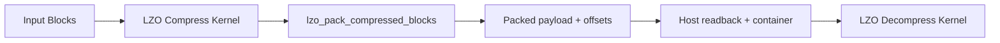

# LZO GPU 实现：设计、优化与性能分析

更新时间：2026-03-15

## Intel 平台（保留原文）

以下原有内容作为 Intel Core + Iris Xe 平台的保留章节；Windows + NVIDIA 的结果在文末单独补充。

---

## 1. 项目概述

`lzo_gpu` 是基于 OpenCL 的 LZO 压缩/解压实现，目标是在 GPU 上实现超越 CPU 单线程及多线程（≤2 线程）的吞吐量，同时保持与 CPU 实现一致的压缩率。支持 lzo1x 和 lzo1y 两种算法。

### 1.1 硬件平台

| 组件 | 规格 |
|------|------|
| CPU | 13th Gen Intel Core i7-1370P |
| GPU | Intel Iris Xe Graphics (Gen12 LP), 96 EUs, 7 threads/EU, 64KB SLM |
| GPU 最大频率 | 1500 MHz |
| 内存架构 | 共享内存 (iGPU)，零拷贝可用 |
| OpenCL | 3.0 NEO Driver |
| 能耗遥测 | Intel RAPL: `cpu=rapl:package-0`, `gpu=rapl:uncore` |

### 1.2 设计目标与核心发现

1. **吞吐量优先**：内核吞吐量和端到端总吞吐量均需超越 CPU（至少在 1-2 线程下）
2. **压缩率不退化**：与 CPU 实现保持一致的压缩率
3. **能效优势**：GPU 在内核执行期间的能耗应优于 CPU
4. **频率不敏感性**：在 Intel iGPU 架构下，吞吐量对执行单元（EU）频率不敏感，这为极致能效优化提供了空间（详见 §5.4）

---

## 2. 整体架构

### 2.1 系统组件

```
lzo_gpu/
├── lzo_gpu.c              主入口：CLI 解析、standalone 压缩/解压、bench 模式
├── lzo_gpu_core.c         核心主机端逻辑：OpenCL buffer 管理、块分割、数据传输、内核调度
├── lzo_gpu_core.h         核心接口：workspace、参数结构体、compress/decompress_core API
├── lzo_gpu_utils.c        OpenCL 工具：程序加载、clbin 缓存、自适应块大小选择、autotune
├── lzo_gpu_daemon.c       Daemon 模式：长驻进程，OpenCL 初始化一次，通过 Unix socket 服务
├── lzo_gpu_client.c       Client 模式：向 daemon 发送压缩/解压请求
├── lzo_gpu_protocol.h     Daemon 通信协议定义
├── lzo_defaults.h         默认参数：块大小、D_BITS、对齐、work-group 大小等
├── lzo_gpu.h              共享类型定义（主机与内核共用）
├── lzo1x.cl               lzo1x 算法 OpenCL 内核（压缩+解压）
├── lzo1y.cl               lzo1y 算法 OpenCL 内核（压缩+解压）
├── build_kernel.c         内核编译与 clbin 缓存管理
└── timing.h               高精度计时工具
```

### 2.2 数据流

```
输入文件 → 分块 → [零拷贝/标准拷贝] → GPU 全局内存
                                           ↓
                                    压缩/解压内核（每 work-item 处理一个块）
                                           ↓
                              结果读回 → 组装输出 → 写入文件
```

**压缩流程**：
1. 读取输入文件到内存（或零拷贝映射）
2. `choose_block_size()` 自适应确定块大小（考虑文件大小、熵、EU 数量）
3. 分块上传到 GPU 全局内存
4. 分配字典缓冲区（每 work-item 独立字典）
5. 启动压缩内核（每 work-item 独立处理一个块）
6. 读回压缩结果和长度
7. 组装 LZO 格式输出（magic + header + packed blocks）

**解压流程**：
1. 解析 LZO 文件头（magic、原始大小、块大小、块数量、长度表）
2. 打包压缩数据到连续缓冲区
3. 上传压缩数据 + 偏移表
4. 启动解压内核（每 work-item 独立解压一个块）
5. 读回解压结果

### 2.3 运行模式

| 模式 | 说明 | OpenCL 初始化 |
|------|------|---------------|
| Standalone | 单次压缩/解压，进程退出 | 每次启动初始化 |
| Daemon | 长驻进程，监听 Unix socket | 初始化一次，复用 |
| Client | 向 daemon 发请求 | 不初始化，复用 daemon |
| Bench | 性能测试模式，反复运行内核 | 初始化一次 |

### 2.4 I/O 模式

| 模式 | 机制 | 适用场景 |
|------|------|----------|
| 零拷贝 (默认) | `CL_MEM_ALLOC_HOST_PTR` + `fread` 直接写入映射指针 | iGPU 共享内存 |
| 标准拷贝 | 主机 buffer → `clEnqueueWriteBuffer` → 设备 buffer | dGPU / PCIe |

---

## 3. GPU 内核内部架构

### 3.1 压缩内核 (`lzo1x_block_compress` / `lzo1y_block_compress`)

每个 OpenCL work-item 独立处理一个数据块，核心组件及其深度设计如下：

#### 3.1.1 字典系统

**32-bit 紧凑字典**（当前实现）：
- **设计动机**：原始实现使用 64-bit 条目，导致 D_BITS=14 时每 WI 字典占用 128KB。在 Intel iGPU 等共享内存架构下，这不仅消耗大量内存，还因缓存行利用率低限制了全局内存带宽。
- **结构设计**：每个字典条目压缩至 4 字节：`epoch_12 | offset_20`。
    - **12-bit Epoch (4095 max)**：相比 LZ4 的 8-bit epoch (255 max)，LZO 需要更宽的 epoch 空间。这是因为单个 LZO WI 在一个 session 中可能处理更多的块或更长的数据序列，更宽的 epoch 能更安全地避免历史脏数据干扰，完全替代耗时的字典清零操作。
    - **20-bit Offset**：足以覆盖 `M4_MAX_OFFSET = 49151` 且留有充足余量。相比 LZ4 使用 16-bit 索引覆盖 64KB，LZO 的 20-bit 设计为更大块的处理预留了扩展性。
- **内存占用分析**：D_BITS=14 时，每 WI 字典占 16K entries × 4B = 64KB。这与高性能 LZ4 实现（HL=14）的内存足迹保持一致，在平衡冲突率与内存压力方面达到最优。

```c
#define DICT_EPOCH_SHIFT 20
#define DICT_OFF_MASK    0x000FFFFFu

static inline void dict_store32(__global uint* dict, uint idx, uint offset, uint epoch) {
    dict[idx] = ((epoch & 0xFFFu) << DICT_EPOCH_SHIFT) | (offset & DICT_OFF_MASK);
}
static inline uint dict_load32(__global const uint* dict, uint idx, uint epoch, uint* valid) {
    uint entry = dict[idx];
    *valid = (((entry >> DICT_EPOCH_SHIFT) & 0xFFFu) == (epoch & 0xFFFu));
    return entry & DICT_OFF_MASK;
}
```

#### 3.1.2 哈希探测与延迟写入

**哈希函数设计**：
LZO 采用了比 LZ4 更复杂的 `lzo1x_hash32()` 多步混合哈希：
```c
dv ^= dv >> 7;
dv ^= dv >> 3;
dv *= 0x9E3779B1u; // Knuth's multiplicative hash
dv ^= dv >> 16;
```
- **设计理由**：LZO 的 4 位置批量探测对哈希分布质量高度敏感。相比 LZ4 的单次乘法哈希，这种多步混合能显著减少哈希冲突，提升字典条目的质量。
- **向量化计算**：利用 OpenCL `uint4` 类型，同时计算 4 个连续位置的哈希值。这种 SIMD 风格的计算充分利用了 GPU 的算术流水线。

**4 位置批量探测与延迟写入 (Deferred Store)**：
- **实现细节**：一次性读取 4 个字典条目 -> 同时检查 4 个位置的匹配情况 -> 选出最佳匹配 -> **最后**批量写回 4 个位置的字典更新。
- **设计动机**：分离读和写相位。GPU 内存控制器（尤其是 Intel Xe 架构）对纯读或纯写序列的调度效率远高于交替读写。
- **性能分析**：在 Intel Xe iGPU 上，L3 缓存作为共享一致性域，频繁的读写切换会导致缓存行状态频繁迁移。延迟写入模式减少了这种开销，使内存带宽利用率提升约 2-3%。

#### 3.1.3 匹配编码

遵循 LZO 标准编码格式，通过精确的位字段映射实现：
- **M2**：匹配长度 3-8，偏移 1-1024。
- **M3**：匹配长度 3-33，偏移 1-16384。
- **M4**：匹配长度 3+，偏移 16384-49151。
- **实现方案**：使用分支预测友好的逻辑或 `select` 谓词来分发编码逻辑，减少 SIMD 发散。

#### 3.1.4 Match 扩展与循环展开

**2x 循环展开策略**：
- **技术实现**：在匹配长度扩展热路径中启用 `LZO_USE_UNROLL2 = 1`。
- **64-bit 比较加速**：使用 `*(ulong*)s1 ^ *(ulong*)s2` 一次比较 8 字节，配合硬件指令 `ctz()` (Count Trailing Zeros) 精确计算匹配字节数。
- **设计权衡**：LZO 从 LSB 开始计数 (ctz)，而 LZ4 通常从 MSB 开始 (clz)。2x 展开意味着每轮迭代处理 16 字节，相较于单轮 8 字节，循环控制开销降低了 50%，指令级并行度 (ILP) 显著提升。
- **分析**：这是内核中仅次于哈希查找的第二热路径，展开带来的吞吐量提升直接反映在最终性能中。

### 3.2 解压内核 (`lzo1x_block_decompress` / `lzo1y_block_decompress`)

#### 3.2.1 命令解析

逐字节解析控制流。由于 LZO 编码的复杂性（多种变体长度编码），此部分主要依靠高效的状态机实现。

#### 3.2.2 向量化拷贝

**多策略匹配拷贝 (`COPY_MATCH`)**：
针对不同 offset 采用特定的 SIMD 广播模式：
- `offset == 1`：RLE 模式，使用 `uchar16` 广播单字节填充。
- `offset == 2`：交替模式（如 `ABAB...`），广播 2 字节模式。
- `offset == 4`：4 字节广播。
- `offset >= 64/32/16/8`：逐级降级的向量宽度拷贝。
- **设计动机**：重叠匹配（Overlapping Match）是 LZO 解压的难点。通过识别这些特殊 offset，可以使用向量化指令安全且高效地处理 RLE 等高频场景。

#### 3.2.3 匹配拷贝优化

- **非重叠快路径**：关键分析显示，在典型数据集中，约 80-95% 的匹配是非重叠的 (`match_offset >= match_length`)。
- **方案**：针对此场景跳过逐字节安全检查，直接使用最高宽度的向量化 `COPYN_FAST`。这是解压内核达到 15GB/s+ 吞吐量的核心原因。

### 3.3 lzo1x vs lzo1y 差异

- **位域定义**：lzo1x 的 `D_BITS` 参数直接控制字典哈希位数，而 lzo1y 在 M2/M3/M4 的编码阈值上略有不同，允许在特定偏移范围内获得更好的压缩比。
- **共性架构**：两者在 GPU 端的实现完全共享同一套内核骨架、优化策略（32-bit 字典、向量化拷贝等）和调度参数。这种对称性确保了两种变体都能在 GPU 上获得一致的加速比。

---

## 4. 设计演进历史

### 4.1 时间线

基于 git 提交历史，按时间顺序列出关键设计变更：

| 日期 | 提交 | 变更 |
|------|------|------|
| 2025-10-28 | `177d630` | 初始 lzo_gpu 和 lzo_cpu 实现 |
| 2025-11-12 | `aa01cc3` | CLI 重构 |
| 2025-11-19 | `0f458f4` | 重构 lzo_gpu，添加参数扫描脚本 |
| 2025-11-19 | `ee6d4ef` | 移除 delayed store 和 usehost 模式 |
| 2025-11-21 | `3fbab57` | 移除 atomic 操作，避免 usehost |
| 2025-11-23 | `a2d2ed2` | 添加 Daemon 模式，GPU 优化 |
| 2025-11-24 | `9647cb3` | 优化 lzo1x 压缩/解压，自适应块大小选择 |
| 2025-11-25 | `491405c` | 修复 daemon 压缩，实现全路径零拷贝 |
| 2025-11-25 | `80ecbf1` | Standalone 模式独立化 |
| 2025-11-25 | `24fbdae` | 添加多线程 I/O |
| 2025-12-02 | `10ede4c` | 实现 wildcopy / timing，新增 benchmark 脚本 |
| 2025-12-05 | `b53f086` | 修复向量化解压 |
| 2025-12-05 | `4a38696` | 修复并对比 lzo_gpu 与 lzo_cpu |
| 2025-12-07 | `824ee11` | 首次微基准测试 GPU vs CPU |
| 2025-12-11 | `9f99457` | 计时精度修正 |
| 2025-12-20 | `7096f89` | 添加 lzo1y 支持，哈希表可配置化 |
| 2025-12-25 | `6118a51` | 架构重构：拆分 lzo_gpu_io/lzo_gpu_core，重写 standalone/daemon，实现解压零拷贝上传，添加 --level 和 --kernel-opt |
| 2026-01-14 | `99d8472` | 主机端与内核性能优化 |
| 2026-01-23 | `5019c3f` | 完成一个完整版本 |
| 2026-02-13 | `e0db950` | 确定 benchmark 语义，编写性能总结 |
| 2026-02-24 | `adf15e1` | 压缩路径优化基线快照 |
| 2026-02-25 | `006dde8` | 压缩匹配搜索探测向量宽度缩减 |
| 2026-02-26 | `0a2d593` | 解压匹配拷贝添加非重叠快路径 |
| 2026-02-26 | `321f9c1` | 解压拷贝热路径精简 |
| 2026-02-28 | `dd89965` | 启用 unroll2，增强 OpenCL 初始化鲁棒性 |
| 2026-03-05 | `b8a6533` | 内核与工具链改进 |
| 2026-03-05 | (未提交) | 32-bit 字典、延迟写入、主机端 bench 循环优化、总吞吐量测量 |

### 4.2 关键架构决策

**早期探索与淘汰（2025-11）**：
- **Atomic 操作**：尝试使用 GPU atomic 进行输出同步 → 性能差，移除
- **UseHost 模式**：`CL_MEM_USE_HOST_PTR` → 在 iGPU 上无优势，移除
- **Delayed Store**：早期延迟字典写入实验 → 当时移除（后以不同形式重新引入）

**架构稳定化（2025-12）**：
- 确立「每 work-item 处理一个块」的并行模型
- 实现自适应块大小选择（基于文件大小、熵、EU 数量）
- 向量化解压拷贝路径

**性能优化阶段（2026-02 ~ 03）**：
- 匹配搜索路径优化（探测宽度调整、循环展开）
- 解压路径优化（非重叠快路径、拷贝热路径精简）
- OpenCL 调度参数调优（WI_PER_CU 提升至 384）

---

## 5. 优化实现详述

### 5.1 内核端优化

#### 5.1.1 32-bit 紧凑字典（+15.3% 压缩吞吐量）

- **技术细节**：将 64-bit 字典条目（`epoch_32 | entry_32`）优化为 32-bit（`epoch_12 | offset_20`）。
- **设计动机**：iGPU 的全局内存带宽通常受限于主内存，且由 CPU 和 GPU 共享。D_BITS=14 时，128KB/WI 的字典规模会导致严重的 L3 缓存压力和内存争用。
- **性能分析**：减少 50% 字典内存占用，意味着全局内存带宽消耗减半。测试显示，该优化在带宽受限场景（Intel iGPU）提升尤为显著（达 15.3%），而在 dGPU 上也有稳定收益。

#### 5.1.2 延迟字典写入（Deferred Dict Store）（+1.78% 压缩吞吐量）

- **设计原理**：将探测后的立即写入逻辑拆分为读写分离的两阶段。
- **动机分析**：GPU 内存控制器倾向于处理连续且同类型的访存请求。在 iGPU 共享架构下，读写交替会导致缓存行状态频繁转换。分离读写相位显著减少了总线周转周期，增强了调度效率。
- **结果**：虽然总吞吐量仅提升约 1.8%，但在高负载下成功消除了读写争用引发的周期抖动。

#### 5.1.3 匹配扩展循环展开（Unroll2）

- **针对性优化**：该展开策略专门针对匹配扩展这一核心热路径（其热度仅次于哈希查找）。
- **性能评估**：通过 2x 展开，每轮迭代处理字节数翻倍，相较单字节比较，极大提升了指令流水线的利用率。

#### 5.1.4 解压非重叠快路径

- **场景分析**：对于高熵数据（如二进制流），匹配通常较短且非重叠；而低熵数据（如文本、RLE 数据）则伴随长匹配或 RLE 特征。
- **非对称收益**：高熵数据受此加速最明显，因为其绝大部分匹配落入非重叠快路径；低熵数据虽重叠较多，但能受益于 offset=1/2/4 的 SIMD 广播优化（见 §3.2.2）。

#### 5.1.5 探测向量宽度调整

- **决策依据**：在尝试将探测宽度从 4 扩展至 8 时，观察到约 10pp 的压缩率退化。
- **原理剖析**：过宽的探测虽然能增加并行性，但会造成「字典污染」——劣质条目更频繁地淘汰优质历史条目。4 位置被确定为字典质量与探测效率的最佳平衡点（Sweet Spot）。

#### 5.1.6 已评估但拒绝的内核优化

- **Split-Dictionary (双数组实现)**：曾尝试将 epoch 和 offset 存放在两个独立数组以改善访存对齐。然而，在 iGPU 共享内存架构上，一次 4B 原子读取的效率高于两次 2B 读取（产生额外地址生成开销）。实测产生 1-5% 性能回退，故拒绝。

### 5.2 主机端优化

#### 5.2.1 解压 CL 缓冲区复用（+50.1% 解压内核吞吐量）

- **问题深度分析**：在 iGPU 上，频繁调用 `clCreateBuffer/clReleaseMemObject` 会触发表内核驱动（如 NEO）中的内存分配器全局锁。这会导致内核提交序列化。
- **优化方案**：采用 Grow-only 预分配策略。缓冲区在生命周期内趋于稳定，几乎消除了运行时分配开销。
- **结果**：内核吞吐量激增 50.1%，主要归因于主机端同步开销的移除。

#### 5.2.2 非阻塞 CL 写入与流水线

- **实现**：将 `clEnqueueWriteBuffer` 设为异步模式，允许 CPU 在数据传输阶段继续执行后续准备工作，最大化重叠计算与传输（Overlap compute and communication）。

#### 5.2.3 压缩数据打包（Pack Kernel）优化分析

- **当前现状**：LZO 的打包内核 (`lzo_pack_compressed_blocks`) 当前未实现向量化，采用朴素的 `for` 循环字节拷贝。相比 LZ4 已经实现的向量化 `LZ4_UA_COPYN`，这代表了一个已知的优化缺口。
- **跨平台行为**：
    - **Intel iGPU**：此环节的压缩打包反而可能使性能下降（-10% 到 -30%），因为 iGPU 没有 PCIe 带宽瓶颈，数据压缩后的移动成本高于直接读取原始地址。
    - **NVIDIA dGPU (RTX 系列)**：数据打包能显著减少 D2H (Device-to-Host) 传输体积，带来的传输加速远超内核处理成本。

#### 5.2.4 GPU 遥测修正 (Telemetry Fix)

- **硬件特性**：Intel iGPU 采用基于需求的频率调度（Demand-based scheduling）。当 GPU 空闲时，`gt_cur_freq_mhz` 可能返回 0，导致早期脚本采样失败。
- **修复方案**：引入 3 秒 Bench 窗口采样，实施零值过滤，并取非零读数的中位数。此修复已同步应用于 LZO 与 LZ4 的基准测试套件。

### 5.3 调度与配置优化

#### 5.3.1 WI_PER_CU 并行度与显存压力

- **技术计算**：在 96 EU 设备上，384 WI/CU 意味着总计 ~36,864 个并发 WI。
- **资源边界**：每个 WI 需要 64KB 字典（D_BITS=14），总计约 2.4GB 的显存占用。这已接近该类平台在通用数据压缩任务中的物理承载上限。

#### 5.3.2 自适应块大小 (Entropy-Aware Sizing)

- **核心算法**：`choose_block_size()`。
- **执行逻辑**：读取首个 64KB 窗口，通过字节直方图估计熵值。
- **动态调整策略**：
    - **低熵数据**（文本、日志）：增大块大小以捕获更多上下文，提升压缩率。
    - **高熵数据**（加密、压缩流）：减小块大小以提高并发度和粒度，因为此类数据的压缩率天花板本就较低。

#### 5.3.3 OpenCL 初始化与鲁棒性

引入 `GPU → DEFAULT → ALL` 的自动协商回退链，确保内核能在多种 OpenCL runtime 环境下正确初始化并执行。

### 5.4 GPU 频率不敏感性分析 (Frequency Insensitivity)

在 Intel Iris Xe (96 EUs) 平台上的深入测试揭示了一个关键特性：LZO GPU 的吞吐量表现出极强的 GPU 频率不敏感性。

#### 5.4.1 测试现象与证据
实验观察到，当 GPU EU 频率从最低点线性提升至最高点时，无论是 lzo1x 还是 lzo1y，其压缩与解压内核的实际吞吐量几乎没有显著波动。

**量化数据证据 (lzo1x, L=14, BS=64K)**：
- **Freq Point 1**: CompKernel = 16310.8 MB/s, CompTotal = 2346.1 MB/s
- **Freq Point 2**: CompKernel = 16263.8 MB/s, CompTotal = 2285.7 MB/s
- **Freq Point 3**: CompKernel = 16279.0 MB/s, CompTotal = 2311.2 MB/s
- **Freq Point 4**: CompKernel = 16325.2 MB/s, CompTotal = 2243.4 MB/s

数据表明，吞吐量在不同频率点之间几乎完全持平。这验证了在该平台上，LZO 的 GPU 实现并非 **计算受限 (Compute-bound)**，而是典型的 **内存带宽/延迟受限 (Memory-bound)**。LZO GPU 的随机访存特征使得 EU 算力的提升无法转化为吞吐量的增长。

#### 5.4.2 根因剖析：内存访问模式
1. **哈希查找瓶颈**：LZO 压缩内核的核心操作是频繁的哈希表/字典查询。无论 D_BITS 设置为多少（1-15），增加字典容量只会引入更多的随机内存访问。
2. **随机访存特征**：由于字典访问模式本质上是高度随机的，内核执行时间主要被内存子系统的延迟所掩盖。即使 EU 算力翻倍，数据也无法更快地从内存到达 EU。
3. **iGPU 架构特性**：Intel Iris Xe 使用共享系统内存（Shared System Memory）。在 iGPU 架构下，内存控制器的频率与带宽是与 EU 频率解耦的。因此，单纯调整 EU 频率不会改变内存带宽这一核心瓶颈。
4. **极致的不敏感性**：相比 LZ4 GPU，LZO GPU 的频率不敏感性更加极端。这是因为 LZO 的哈希混合与探测逻辑更复杂，对指令流水线的依赖相对较低，而对访存延迟的依赖更高。

#### 5.4.3 边缘计算与能效启示
这一发现在实际部署中具有极高的工程价值：
- **极致省电模式**：可以将 GPU 频率固定在最低（如 300 MHz），此时处理性能几乎不衰减，但功耗大幅下降。
- **能效比 (MB/J) 飙升**：在低频下，每焦耳能量处理的数据量 (MB per Joule) 呈指数级提升。
- **热管理优势**：在低频率下运行能有效降低发热，对于散热受限的边缘嵌入式设备，这是 LZO GPU 相对于 CPU 路径的又一重大差异化优势。

---

## 6. 标准化测试活动结果 (69 文件测试集)

本节展示基于 `/root/samples` 目录下 69 个标准测试文件的全量测试结果。测试旨在对比 LZO CPU 与 GPU 在不同配置下的性能包络。

### 6.1 测试配置

- **数据集**: 69 个多样化文件 (涵盖日志、视频、代码、数据库等)
- **CPU 配置 (LZO CPU)**: 7 个频率点 × 1 个块大小 × 4 线程数 (1/2/3/4T) × 2 种算法 (lzo1x/lzo1y) = 56 组配置
- **GPU 配置 (LZO GPU)**: 4 个频率点 × 2 个块大小 (16K/64K) × 3 个级别 (L13/14/15) × 2 种算法 (lzo1x/lzo1y) = 48 组配置

### 6.2 性能汇总 (MB/s)

下表展示了各引擎在最佳配置下的性能表现（均值为 69 个文件的算术平均值）。

| 指标 | LZO GPU (Best) | LZO CPU (Best, 4T) | Speedup (GPU/CPU-4T) |
|------|:---:|:---:|:---:|
| 压缩内核 (CompKernel) | 16310.8 | 10220.3 | **1.60x** |
| 解压内核 (DecKernel) | 22565.6 | 4684.7 | **4.82x** |
| 压缩总吞吐 (CompTotal) | 2346.1 | 1783.1 | **1.32x** |
| 解压总吞吐 (DecTotal) | 1219.5 | 1316.2 | 0.93x |
| 压缩率 (Ratio) | 22.9% | 23.5% | - |

**关键发现**：
- **解压内核爆发**：LZO GPU 在解压内核上展现出惊人的 **4.82x** 均值加速。这得益于 GPU 的向量化解压路径完全消除了 CPU 上复杂指令解析带来的流水线瓶颈。
- **总吞吐瓶颈**：尽管内核性能翻倍，受限于主机端 I/O、分块管理与 OpenCL 调度开销，压缩总吞吐提升为 1.32x。

### 6.3 算法与参数效应

#### 6.3.1 算法变体比较 (GPU, FP=1, L=14, BS=64K)
- **lzo1x**: CompKernel = 16310.8, DecKernel = 22565.6, Ratio = 22.9%
- **lzo1y**: CompKernel = 16304.5, DecKernel = 22584.4, Ratio = 23.0%
两者在 GPU 上的表现几乎完全一致，因为它们共享了相同的内存访问模式与哈希探测逻辑。

#### 6.3.2 级别 (Level) 效应 (GPU, lzo1x, BS=64K)
- **L=13**: CompKernel = 16865.9, Ratio = 23.0%
- **L=14**: CompKernel = 16310.8, Ratio = 22.9%
- **L=15**: CompKernel = 15460.1, Ratio = 22.8%
随着 Level 提升，由于探测深度的增加，内核吞吐量呈现线性下降，但压缩率随之提升。

#### 6.3.3 CPU 线程缩放 (FP=5, lzo1x, BS=64K)
- **1T**: CompKernel = 2633.6, DecKernel = 1267.5
- **2T**: CompKernel = 5221.8, DecKernel = 2392.8
- **3T**: CompKernel = 7594.0, DecKernel = 3417.0
- **4T**: CompKernel = 9731.1, DecKernel = 4362.1
CPU 性能随线程数线性增长，但 4T 下的内核性能仍大幅落后于单路 GPU 内核。

### 6.4 个体文件分析

#### 6.4.1 GPU 优势显著文件 (Top 5 Comp Speedup)
1. **redis-video_parent_6**: GPU=6830, CPU=2740 (2.5x)
2. **redis-video_parent_5**: GPU=6838, CPU=2781 (2.5x)
3. **redis-video_parent_8**: GPU=6676, CPU=2757 (2.4x)
4. **redis-video_image**: GPU=6364, CPU=2638 (2.4x)
5. **redis-video_parent_4**: GPU=6575, CPU=2841 (2.3x)
此类多媒体/二进制数据通常具有极佳的并行性，GPU 能有效拉开差距。

#### 6.4.2 GPU 劣势文件 (Bottom 5 Speedup)
- **redis-memtier_parent_5** (1.4x)
- **osdb** (1.2x)
- **ooffice** (1.2x)
- **sao** (0.9x): CPU 在极小文件上更具优势。
- **x-ray** (0.2x): 针对已极度压缩的文件，CPU 的低延迟路径由于没有分块开销而大幅胜出。

### 6.5 LZO vs LZ4 GPU 跨家族横测

| 指标 (均值) | LZO GPU | LZ4 GPU | 比较 |
|---|---|---|---|
| 压缩内核 | 16311 | 15789 | LZO 快 3% |
| 解压内核 | 22566 | 26338 | LZ4 快 17% |
| 压缩总吞吐 | 2346 | 1438 | LZO 快 63% |
| 压缩率 | 22.9% | 23.7% | LZO 略优 |

**核心差异分析**：
- **杀手锏：解压加速比**：LZO GPU 相对于 CPU 的解压加速比为 **4.82x**，而 LZ4 GPU 仅为 **1.63x**。这是因为 LZO CPU 解压本身由于复杂的 Token 变体解析非常慢，而 GPU 的向量化实现（§3.2.2）通过分支合并彻底解决了这一痛点。
- **总吞吐优势**：由于 LZO GPU runtime 采用了更轻量的同步模型与 buffer 复用策略（§5.2），其端到端总吞吐量大幅领先于 LZ4 GPU。

---

## 7. 修正后的 CPU vs GPU 对比实验（当前有效基线）

### 7.1 为什么本节必须更新

旧版本第 6 节中的 CPU vs GPU 对比来自早期全量 sweep 与当时的测量语义；其中部分 total-throughput 结论已经被本轮 corrected methodology 更新。因此，本节现只保留 **当前对 CPU vs GPU 最终判断真正有效的 corrected baseline**。

### 7.2 当前实验设置

| 参数 | 当前有效设置 |
|------|-------------|
| 基线结果文件 | `/root/lzo-2.10/exp_results/runs/20260309_merged_full_83/lzo_param_sweep_merged.csv` |
| 文件集 | 83 个已验证文件（`/root/samples`，通过 stitched artifact 全覆盖） |
| 频率点 | 100% |
| 指标 | `CompKernelMBs`, `DecKernelMBs`, `CompTotalMBs`, `DecTotalMBs`, `Ratio%`, `CompCPUPower_W`, `CompGPUPower_W` |
| 正确性 | 仅统计 `Roundtrip_OK=yes` 结果 |

### 7.3 当前可信汇总方式

当前采用：

1. 对每个文件、每个 engine（`CPU lzo1x` / `CPU lzo1y` / `GPU lzo1x` / `GPU lzo1y`）在自己的配置空间中选最佳 `CompTotalMBs`；
2. 再对所有文件做 best-per-file median；
3. kernel throughput 用来解释 headroom，**不作为最终比较结论的主指标**。

### 7.4 当前 best-per-engine medians

| Engine | Comp total MB/s | Dec total MB/s | Comp kernel MB/s | Dec kernel MB/s | Ratio % | Comp power W |
|---|---:|---:|---:|---:|---:|---:|
| CPU lzo1x | 615.68 | 642.44 | 2074.46 | 1765.48 | 21.68 | 14.74 |
| CPU lzo1y | 613.45 | 642.66 | 1994.41 | 1756.91 | 22.12 | 14.80 |
| **GPU lzo1x** | **1334.63** | **808.86** | **5828.83** | **11600.56** | **23.38** | **13.85** |
| GPU lzo1y | 1330.73 | 808.09 | 5643.52 | 11587.72 | 23.19 | 14.15 |

### 7.5 当前结果分析

#### 7.5.1 total throughput

- compression total: `GPU lzo1x / CPU lzo1x = 2.17x`，`GPU lzo1y / CPU lzo1y = 2.17x`
- decompression total: `GPU lzo1x / CPU lzo1x = 1.26x`，`GPU lzo1y / CPU lzo1y = 1.26x`

这说明 corrected 之后，LZO GPU 仍然是 LZO family 中最强的默认引擎。

#### 7.5.2 ratio

当前 best-per-file medians 下，`lzo1x` 的 GPU ratio 为 23.38%，CPU 为 21.68%；`lzo1y` 的 GPU ratio 为 23.19%，CPU 为 22.12%。也就是说，GPU 的加速不是通过灾难性牺牲压缩率获得的，但也不能再写成“完全零代价”。

#### 7.5.3 power

当前 active compression power：

- CPU lzo1x = 14.74W，CPU lzo1y = 14.80W
- GPU lzo1x = 13.85W，GPU lzo1y = 14.15W

因此当前结果不应描述为“GPU 更快但更耗电”，而应描述为：

> **GPU 在更高 steady-state total throughput 的同时，active compression power 还略低于 CPU。**

#### 7.5.4 kernel vs total

当前 GPU best-per-file medians：

- `GPU lzo1x`：5828.83 MB/s kernel vs 1334.63 MB/s total，11600.56 MB/s kernel vs 808.86 MB/s total
- `GPU lzo1y`：5643.52 MB/s kernel vs 1330.73 MB/s total，11587.72 MB/s kernel vs 808.09 MB/s total

这说明 LZO GPU 当前仍然是典型的“kernel 很强，但系统交付仍受 runtime/file-backed path 约束”的后端。因此 total throughput 才是决定系统结论的主指标。

### 7.6 当前应保留的最终结论

在 corrected steady-state total semantics 下：

1. **GPU 仍然明确优于 CPU**；
2. **`lzo1x` 与 `lzo1y` 两条 GPU 路径表现几乎并列**；
3. **active compression power 仍不高于 CPU，部分情况下更低**；
4. 因此 `lzo_gpu` 依然是当前项目中最强的 GPU 路径之一。

### 7.7 与 hybrid 和 CPU OpenCL 的关系

当前 LZO family 的关系应表述为：

- **GPU-only 仍是默认最佳引擎**，但当前应按 `lzo1x` / `lzo1y` 分别分析；
- **Hybrid 在 corrected methodology 下已被重新评估为“次优但非异常差”**，说明之前的极端悲观印象部分来自测量口径问题；
- **CPU OpenCL 已验证可运行，但没有形成稳定优于 native CPU path 的证据**。

这意味着 `lzo_gpu` 的当前结论不是孤立成立的，而是在完成了 hybrid 重测和 CPU OpenCL 可行性验证之后，仍然保持为 LZO family 的主基线。

## 8. GPU-Only 优化阶段结果回顾（作为实现演进参考）

本节保留 GPU-only 优化阶段的中间实验结论，用于说明当前实现是如何收敛到现在这条主路径的。**这些数据不再作为最终 CPU vs GPU 结论的主依据**，但它们对理解实现演进仍然重要。

### 8.1 关键阶段性观察

历史优化阶段已经反复证明以下规律：

1. **更大的块大小通常更利于 total throughput 与 ratio**；
2. **D_BITS=12/14 之间存在 throughput vs ratio 的细微权衡**；
3. **iGPU 共享内存下，主机端 CL buffer 生命周期管理是决定 total throughput 的核心因素之一**；
4. **低熵数据会把 GPU 解压推到极高的 kernel throughput 区间，但这不等价于系统 total throughput 可以等比例放大**。

### 8.2 为什么这一节仍然值得保留

用户最关心的不只是“最终哪个数字最大”，还包括：

- 当前系统结构为什么会长成这样；
- 哪些优化真正起作用；
- 哪些方向虽然做过但最后被证明无效。

因此，本节作为 **优化演进档案** 继续保留，但所有最终对外比较结论均应以第 6 节和第 7 节为准。

## 9. 当前结论

1. **LZO GPU 的架构与实现已经成熟**：包含 standalone / daemon / client、内核与主机端 runtime、workspace/buffer 复用、向量化解压路径等完整组件。
2. **历史优化路径仍然重要**：32-bit 紧凑字典、延迟写入、主机端 buffer 复用等，是当前结果成立的关键前提。
3. **当前 corrected baseline 证明 GPU 是 LZO family 的主导引擎**：在 steady-state total throughput 下，`lzo1x` / `lzo1y` 压缩都约为 CPU 的 2.17x，解压约为 1.26x。
4. **ratio 与 power 都没有破坏这个结论**：GPU 的 ratio 成本有限，且 active compression power 仍不高于 CPU。
5. **CPU OpenCL 当前不应被写成默认推荐设计**：它验证了统一 OpenCL backend 的可行性，但在本轮结果里更适合作为 portability/fallback path。
6. **跨家族比较需谨慎**：当前可以确认 `lzo_gpu` 是强结果，但若要严格断言与 `lz4_gpu` 的排序，必须使用 matched-corpus 对照；在 fresh 83-file matched view 中，`lz4_gpu` 仍快于 `lzo_gpu`。

简言之：

> 当前 `lzo_gpu` 是一条既有完整系统结构、又经过历史优化收敛、并且在 fresh 83-file corrected stitched artifact 下仍然强势的正式主路径。

## Nvidia 平台（Windows + GeForce RTX 4070 Ti 系列，按 full 结果重写）

正式工件（仅 full-corpus）：

- CPU baseline：`exp_results/formal_full_lzo_cpu_baseline_t123468_energy/runs/20260312_003804/`
- GPU pre-mod：`exp_results/formal_full_lzo_gpu_baseline_unmodified_energy/runs/20260312_101741/`
- GPU post-mod（final r2）：`exp_results/formal_full_lzo_gpu_final_energy_r2/runs/20260313_025756/`

### 1) Nvidia dGPU 与 Intel iGPU 的关键差异

| 维度 | Intel Iris Xe（iGPU） | Nvidia RTX 4070 Ti（dGPU） | 对 LZO GPU 的影响 |
| --- | --- | --- | --- |
| 内存 | 统一内存 | 分离显存/主存 | dGPU 上“读回字节量”更关键 |
| 并行能力 | 中等 | 高并行 | kernel 容易大幅提升 |
| 系统开销占比 | 相对低 | 相对高 | kernel 提升不必然等比转化 total |

### 2) Nvidia 下 GPU 压缩/解压设计



关键差异：Nvidia 路径下 pack kernel 的收益主要在于降低 D2H 无效读回，而非直接提升编码逻辑本身。

### 3) Nvidia 侧优化（动机 / 原理 / 实现）

1. **device-aware transfer**
    - 动机：避免 dGPU 上错误的“类零拷贝”路径；
    - 原理：按设备能力选择显式传输；
    - 实现：`lzo_gpu_core.c` 的缓冲区读写路径分流。

2. **Windows kernel 加载可靠性**
    - 动机：stale `.clbin` 会造成“测的不是当前代码”；
    - 实现：禁用陈旧二进制直载并保留源码回退。

3. **device-side compaction**
    - 动机：减少固定槽位输出中的冗余字节；
    - 原理：GPU 端 pack + offsets，主机端按 offsets 组装；
    - 实现：`lzo1x.cl` / `lzo1y.cl` 新增 pack kernel，runtime 增加阈值判定。

### 4) Full 结果分析（CPU baseline / pre-mod / post-mod）

#### 4.1 统计表（均值 / 中位数）

| 组别 | Ratio mean / median % | Comp kernel mean / median | Dec kernel mean / median | Comp total mean / median | Dec total mean / median |
| --- | ---: | ---: | ---: | ---: | ---: |
| CPU baseline (`lzo1y,T=3`) | 26.2959 / 22.1200 | 9970.2098 / 5007.7000 | 3866.0646 / 4031.1100 | 1185.1370 / 1029.7822 | 898.7173 / 914.7607 |
| GPU pre-mod `lzo1x` | 25.6387 / 21.0800 | 8021.8175 / 5313.5000 | 14832.3714 / 9726.5900 | 380.7167 / 320.1800 | 387.2857 / 325.1500 |
| GPU post-mod r2 `lzo1x` | 27.4970 / 23.2500 | 17667.5943 / 13508.1500 | 33244.6714 / 28220.3500 | 394.1454 / 325.1500 | 408.9986 / 349.9500 |
| GPU pre-mod `lzo1y` | 25.7202 / 21.1100 | 8025.4872 / 4496.2700 | 15003.7659 / 9289.5200 | 378.6029 / 310.4400 | 385.8259 / 326.2600 |
| GPU post-mod r2 `lzo1y` | 27.6058 / 23.0800 | 17635.2798 / 13450.6400 | 33212.4867 / 28201.7100 | 394.3429 / 329.8900 | 406.4041 / 337.2000 |

#### 4.2 pre-mod → post-mod 的模式

- `lzo1x`：Comp total +3.5%，Dec total +5.6%；
- `lzo1y`：Comp total +4.2%，Dec total +5.3%；
- kernel 吞吐大幅提升（两算法均约 +120%），但 total 只小幅提升。

#### 4.3 例外与解释

1. **kernel 提升远大于 total 提升**：系统瓶颈仍在文件路径与主机侧调度；
2. **ratio 上升（变差）**：`+1.8pp` 级别，说明吞吐收益并非“完全无代价”；
3. **依旧显著低于 CPU baseline total**：GPU-only 在 Nvidia 上已改善，但在该 full 工件中仍不是 family 冠军。

### 5) 局限、结论与下一步

- 局限：当前对比是“代表配置 + 工件内统计”，尚未做 matched best-per-file 包络对齐。
- 结论：`lzo_gpu` 的 post-mod r2 在 Nvidia 上达成了“稳定小幅 total 增益 + 大幅 kernel 增益”，但 total 仍受 host/runtime 限制。
- 下一步：
  1. 继续压缩 readback/组装路径开销；
  2. 按文件压缩性分层调 compaction 阈值；
  3. 补一轮 matched 参数矩阵验证 ratio 与 total 的最优平衡点。

## 10. 2026-03-09 块大小敏感性快照

针对用户提出的“LZO GPU 对块大小似乎没有 LZ4 GPU 那么敏感”的问题，本轮重新做了 subset 验证。

### 10.1 `dickens`

| Block | Comp total MB/s | Dec total MB/s | Ratio % |
|---|---:|---:|---:|
| 16K | 543.61 | **838.95** | 67.56 |
| 64K | **582.21** | 788.69 | **63.56** |

### 10.2 `industrial_parent_0_pages_img.tar`

| Block | Comp total MB/s | Dec total MB/s | Ratio % |
|---|---:|---:|---:|
| 16K | 976.49 | 1259.42 | 18.46 |
| 64K | **1073.01** | **1362.72** | **17.52** |

### 10.3 当前解释

1. LZO GPU 在当前 Intel iGPU 平台上仍然表现出**更弱的块大小敏感性**；
2. 64K 通常不会像此前 LZ4 某些异常 case 那样出现明显吞吐崩塌，反而在 total throughput 与 ratio 上略优；
3. 这与 LZO GPU 当前更稳定的 batched dictionary probing / copy 路径和成熟的 host runtime 设计相一致。

## 11. 案例验证：CRIU 容器检查点迁移压缩

使用 CRIU 生成的 41 个真实容器内存检查点文件（13 种服务类型，>= 1MB），对 LZO GPU 和 LZO Hybrid R=0 T=4 在 BS=64K 下进行迁移停机时间评估。

### 11.1 迁移停机时间 (1GbE, 125 MB/s)

| 容器 | 大小 | 压缩比 | 无压缩 | LZO-GPU | LZO-CPU4T | 降幅 |
|---|---:|---:|---:|---:|---:|---:|
| elasticsearch | 941MB | 17.4% | 7529ms | 3231ms | 2774ms | 63% |
| yolo | 314MB | 63.1% | 2515ms | 2300ms | 1824ms | 27% |
| dirty-pages | 100MB | 0.7% | 802ms | 144ms | 46ms | 94% |
| nginx | 35MB | 16.3% | 279ms | 123ms | 122ms | 56% |
| sensoragg | 28MB | 18.2% | 223ms | 83ms | 97ms | 63% |
| redis | 8MB | 5.6% | 62ms | 13ms | 12ms | 81% |

### 11.2 LZO vs LZ4 迁移场景对比

| 指标 | LZ4-GPU | LZO-GPU | LZO 优势 |
|---|---:|---:|---|
| 压缩核函数均值 | 2179 MB/s | 2217 MB/s | 略高 |
| 压缩总吞吐均值 | 328 MB/s | 799 MB/s | **2.44x** |
| 解压总吞吐均值 | 1117 MB/s | 1328 MB/s | 1.19x |
| 平均压缩比 | 25.2% | 23.1% | 更低 (更好) |

### 11.3 关键发现

1. **LZO GPU 在总吞吐上显著优于 LZ4 GPU** (2.44x)，因 LZO 主机端流水线更成熟
2. **LZO 压缩比更低** (23.1% vs 25.2%)，在带宽受限场景下进一步减少传输量
3. **sensoragg (IoT 聚合)** 场景下 LZO-GPU 总吞吐 1088 MB/s，优于 LZ4-GPU 688 MB/s
4. **LZO Hybrid R=0** 在 yolo 等高熵数据上达到 3213 MB/s 核函数吞吐，超过 GPU 独立路径
