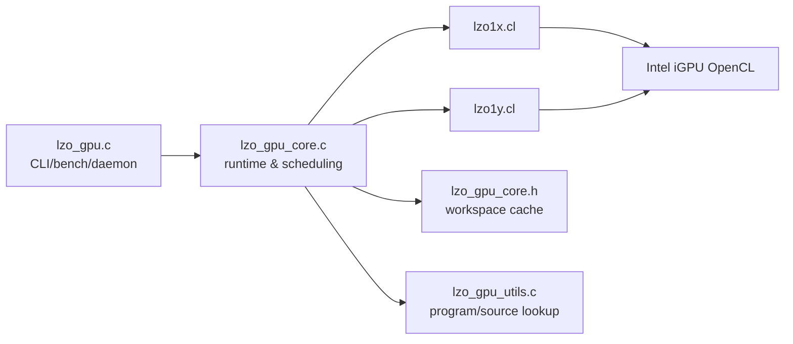
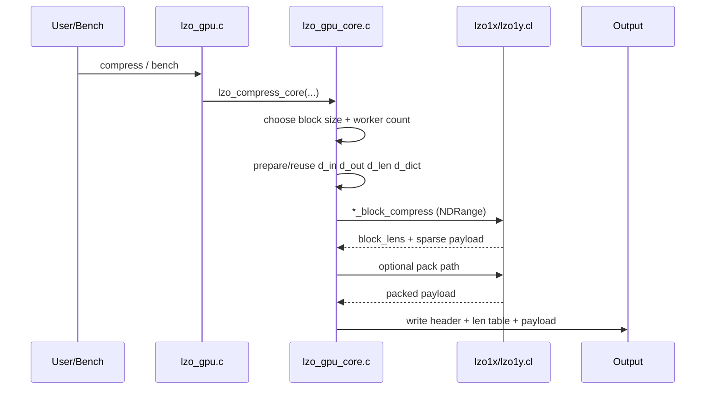
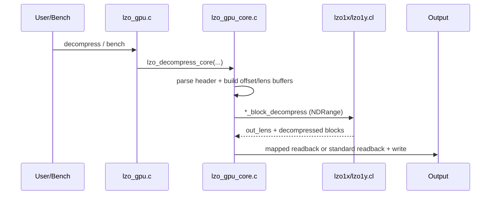

# LZO GPU 性能总结（Intel + Nvidia）

> 更新时间：2026-04-20
> 代码路径：`/root/lzo-2.10/lzo_gpu`
> 当前二进制：`/root/lzo-2.10/lzo_gpu/lzo_gpu`
> 当前哈希：`sha256=899e009c799516400bf8d89331f0abf2f25b6b4f08efef644a13d36b2773f4b3`
> 基线二进制：`/root/lzo-2.10/lzo_gpu/variant_validation/intel/variants/kernel_dec/intel_lzo_gpu_lzo1x_d14_baseline_lock/artifacts/lzo_gpu`
> 基线哈希：`sha256=899e009c799516400bf8d89331f0abf2f25b6b4f08efef644a13d36b2773f4b3`

---

## Intel 平台（五章重构版）

### 1. 设计动机

当前 LZO Intel 路线的重点已经不是“继续堆候选”，而是把实现、验证和结论统一到同一套 formal baseline 语义下。

这一轮的目标是：

- 让 `lzo_gpu` 具备与 `lz4_gpu` 同级的 Intel variant-validation 体系；
- 只保留有 formal 证据的 kernel/host 结论；
- 用 latest baseline / mainline / CPU 的同口径 fullset 数据更新性能总结；
- 把功率分析从“只看 GPU 芯片功率”提升到“端到端 CPU+GPU 总功率”口径。

当前基线锚点已经明确：

- Intel locked baseline：`intel_lzo_gpu_lzo1x_d14_baseline_lock`
- `lzo_gpu` SHA256：`899e009c799516400bf8d89331f0abf2f25b6b4f08efef644a13d36b2773f4b3`
- `lzo1x.cl` SHA256：`e685faba359b1a9271b655fcb90ee8d8b135cdc2b7d06147902814859c5f3cdc`

更关键的是：**当前 mainline 与 locked baseline 的二进制和 `lzo1x.cl` 哈希完全一致**。所以本轮的“latest baseline vs mainline”不是性能层面的模糊比较，而是代码身份已经收敛为同一实现。

### 2. 系统架构

#### 2.1 组件清单

| 组件 | 文件 | 职责 | 关键实现 |
| --- | --- | --- | --- |
| 入口与模式管理 | `lzo_gpu.c` | standalone / daemon / client / bench | `run_lzo_standalone`, `run_lzo_bench`, `ocl_init` |
| 核心运行时 | `lzo_gpu_core.c` | 缓冲复用、调度、压缩/解压执行 | `lzo_compress_core`, `lzo_decompress_core` |
| 共享状态 | `lzo_gpu_core.h` | workspace 与缓存状态 | `lzo_gpu_workspace_t` |
| 工具层 | `lzo_gpu_utils.c/.h` | 文件定位、程序加载、block 选择 | `lzo_find_file_path`, `lzo_load_program_with_dbits` |
| 压缩/解压内核（1x） | `lzo1x.cl` | 1x 压缩、解压、pack | `lzo1x_block_compress`, `lzo1x_block_decompress` |
| 压缩/解压内核（1y） | `lzo1y.cl` | 1y 压缩、解压、pack | `lzo1y_block_compress`, `lzo1y_block_decompress` |
| formal validation | `variant_validation/intel/**` | baseline/候选锁定与 gate 验证 | manifest、record、stable runner |

#### 2.2 组件图解

#### 2.3 压缩过程图解

#### 2.4 解压过程图解

### 3. 核心设计和优化

#### 3.1 压缩内核

- **32-bit packed dictionary**
  - 动机：压缩侧字典条目必须尽量小，否则 iGPU 全局内存压力会快速放大。
  - 设计：统一采用 `epoch_12 | offset_20` 的 32-bit entry。
  - 实现：`dict_store32`, `dict_load32`（`lzo1x.cl`, `lzo1y.cl`）。
  - 结果：条目足够轻，且能支撑跨 block epoch 复用。

- **单 primary hash + 四位置批量 probe/writeback**
  - 动机：在不引入更重共享表/指纹结构的前提下，把吞吐先做高。
  - 设计：一次生成 4 个相邻位置候选，先读旧 entry，再集中写回。
  - 实现：`lzo1x_compress_core`, `lzo1y_compress_core` 的 vector probe 路径。
  - 结果：当前 mainline 的压缩 kernel 吞吐已经明显高于 CPU-only。

- **match-extension 宽比较展开**
  - 动机：长匹配扩展是压缩热点。
  - 设计：优先做宽比较，再定位首失配位置，避免朴素逐字节循环。
  - 实现：`LZO_USE_UNROLL2` 相关路径。
  - 结果：长匹配场景的控制流更短，kernel 更稳。

- **pack 路径分层向量化**
  - 动机：压缩尾段如果长期停留在串行打包，会直接吞噬 total 收益。
  - 设计：按 block 做分层向量 copy，小块与大块分别走不同 fast-path。
  - 实现：`lzo_pack_compressed_blocks` 相关实现。
  - 结果：压缩 total 更可控，尾段波动更小。

#### 3.2 解压内核

- **非重叠 match 快路径**
  - 动机：`offset >= len` 的场景不需要走复杂 overlap 复制。
  - 设计：满足条件时直接按向量宽度拷贝。
  - 实现：`COPY_MATCH()` 首分支。
  - 结果：解压 kernel 吞吐显著受益。

- **小 offset 专分支**
  - 动机：`offset=1/2/4` 在重复数据上高频。
  - 设计：用广播/模式复制替代逐字节回放。
  - 实现：`COPY_MATCH()` 中的小 offset 路径。
  - 结果：低熵数据解压更平稳。

- **formal 候选结论**
  - `copy_match_prune_o4_r1`：gate-10 结论为 `watch`
  - `standard_copy_r1`：gate-10 结论为 `reject`

这两个结论的意义很清楚：

- `COPY_MATCH()` 仍是高价值方向，但不能粗暴删分支；
- Intel 上 `mapped/zero-copy` 仍然是默认 host 路径，`standard copy` 已被正式排除。

#### 3.3 主机端

- **workspace grow-only 复用**
  - 动机：减少频繁 create/release 带来的 host 抖动。
  - 设计：容量足够时直接复用，不足时才扩容。
  - 实现：`lzo_gpu_workspace_t` 与相关 buffer helper。
  - 结果：steady-state total 更稳定。

- **Intel 默认 mapped/zero-copy**
  - 动机：统一内存设备上，mapped 路径通常比 standard-copy 更自然。
  - 设计：默认按设备能力选择，也允许环境变量覆盖。
  - 实现：`lzo_resolve_standard_copy()`。
  - 结果：本轮 formal host gate-10 已经把 `standard_copy_r1` 判为 `reject`。

- **bench 路径 metadata 复用**
  - 动机：解压 bench 循环里重复上传 offset/len 元数据会拖慢 total。
  - 设计：元数据未变化时跳过上传。
  - 实现：`run_lzo_bench()` 中的 `bench_prev_lens/bench_prev_off` 缓存。
  - 结果：这一类优化属于“host/runtime 降本”，正是当前最值得继续深挖的方向。

- **artifact baseline bench cwd 修复**
  - 动机：外部 artifact baseline 二进制跑 `bench_lzo.py` 时，若盲目用二进制父目录当 `cwd`，`lzo1x.cl` 虽可见，但 `lzo_gpu.h` 的 include 根目录会丢失。
  - 设计：为 GPU 路径增加 `resolve_gpu_run_cwd()`，优先选择同时满足源码与头文件可见的运行目录。
  - 实现：`tools/bench_lzo.py`。
  - 结果：修复前会出现 `bench error: failed to load compression kernel` 进而上层退化成 `stable bench parse failed` 全 0；修复后，artifact baseline 单样本验证已恢复正常。

### 4. 测试结果和分析

#### 4.1 测试方法与基线有效性

本轮 Intel 正式对比口径如下：

- GPU fullset 默认频点：
  - `/root/lzo-2.10/exp_results/runs/intel_gpu_mainline_fullset_defaultfreq/runs/20260420_225859/`
- CPU fullset 默认频点：
  - `/root/lzo-2.10/exp_results/runs/intel_cpu_fullset_defaultfreq/runs/20260420_230535/`
- artifact baseline 修复后单样本验证：
  - `/root/lzo-2.10/exp_results/runs/intel_gpu_baseline_single_after_cwdfix/runs/20260420_231950/`

formal validation 结论：

- latest baseline：`intel_lzo_gpu_lzo1x_d14_baseline_lock`
- current mainline：与 latest baseline 同 SHA
- 已验证候选：
  - `copy_match_prune_o4_r1` → `watch`
  - `standard_copy_r1` → `reject`

因此，本轮“latest baseline vs mainline”的正式结论是：**代码身份 0 差异**。后续 GPU fullset 数据同时代表 latest baseline 与 current mainline。

#### 4.2 按频率分解：CPU 引擎

本轮 CPU-only 默认频点 sweep（25 文件）结果如下：

| 频点 | Ratio mean | CompKernel MB/s | DecKernel MB/s | CompTotal MB/s | DecTotal MB/s | 总功率 W | CompEff | DecEff |
| --- | ---: | ---: | ---: | ---: | ---: | ---: | ---: | ---: |
| 1900MHz | 40.7112% | 1219.03 | 1206.68 | 516.12 | 544.38 | 25.25 | 21.44 | 21.96 |
| 3000MHz | 40.7112% | 1228.57 | 1215.20 | 517.02 | 534.32 | 29.06 | 17.96 | 18.30 |
| 5000MHz | 40.7112% | 1036.17 | 949.83 | 477.06 | 476.15 | 27.72 | 16.64 | 16.93 |

观察：

- `1900/3000MHz` 的 total 已经基本打平；
- `5000MHz` 反而在 kernel 和 total 上一起回落；
- 当前 CPU-only 最稳的功率/性能平衡点仍是 `1900MHz`。

#### 4.3 按频率分解：GPU 引擎

由于 latest baseline 与 mainline 同 SHA，本节 GPU 数据同时代表二者。

| 频点 | Ratio mean | CompKernel MB/s | DecKernel MB/s | CompTotal MB/s | DecTotal MB/s | Host CPU W | GPU W | 总功率 W | CompEff | DecEff |
| --- | ---: | ---: | ---: | ---: | ---: | ---: | ---: | ---: | ---: | ---: |
| 1000MHz | 39.7920% | 1088.40 | 1972.99 | 399.83 | 538.98 | 33.80 | 1.10 | 34.90 | 11.52 | 15.52 |
| 1500MHz | 39.7920% | 1478.06 | 2727.66 | 500.18 | 619.84 | 35.81 | 1.96 | 37.76 | 13.43 | 16.56 |

观察：

- `1000 -> 1500MHz` 时，压缩/解压 kernel 吞吐分别提升约 `35.8% / 38.3%`；
- total 也上升，但幅度只有 `25.1% / 15.0%`，说明高频收益被 host/runtime 折损；
- GPU 芯片功率只增加 `0.86W`，但端到端总功率增加 `2.86W`，增量中更大部分来自 host CPU 协同而不是 GPU 本体。

#### 4.4 按频率分解：HYBRID 引擎

本轮没有新增 HYBRID fullset sweep。

当前 2026-04-20 Intel 收口重点是：

- 完成 `lzo_gpu` formal Intel baseline 锁定；
- 完成 kernel/host gate-10 候选验证；
- 用 latest baseline(mainline) 与 CPU-only 的 fullset 默认频点结果更新总结。

因此，本轮 Intel 结论主轴是：**GPU-only latest baseline(mainline) vs CPU-only**，而不是新一轮 HYBRID 参数搜索。

#### 4.5 最新基线 vs 主线 vs CPU（2026-04-20 fullset）

先给一句话版本：**latest baseline 与 current mainline 已经是同一实现**。

证据：

- `lzo_gpu` SHA 相同：`899e009c799516400bf8d89331f0abf2f25b6b4f08efef644a13d36b2773f4b3`
- `lzo1x.cl` SHA 相同：`e685faba359b1a9271b655fcb90ee8d8b135cdc2b7d06147902814859c5f3cdc`

所以，GPU fullset 结果可以直接视作“latest baseline vs mainline”的共同结果。

用 `GF=1500MHz` 的 latest baseline/mainline GPU，对比 CPU-only 三个默认频点：

- 相对 CPU 1900MHz：
  - `CompKernel`：`+21.25%`
  - `DecKernel`：`+126.05%`
  - `CompTotal`：`-3.09%`
  - `DecTotal`：`+13.86%`
  - `Ratio`：`-0.9192 pctpt`
- 相对 CPU 3000MHz：
  - `CompKernel`：`+20.31%`
  - `DecKernel`：`+124.46%`
  - `CompTotal`：`-3.26%`
  - `DecTotal`：`+16.01%`
  - `Ratio`：`-0.9192 pctpt`
- 相对 CPU 5000MHz：
  - `CompKernel`：`+42.65%`
  - `DecKernel`：`+187.17%`
  - `CompTotal`：`+4.85%`
  - `DecTotal`：`+30.18%`
  - `Ratio`：`-0.9192 pctpt`

这一组数字说明：

- 当前 `lzo_gpu` 在 **kernel** 维度已经显著强于 CPU-only；
- 当前 `lzo_gpu` 在 **total** 维度，压缩仍只是与 CPU 持平附近，解压已经稳定领先；
- 当前结构性短板不再是 kernel 本身，而是 `kernel -> total` 的兑现效率与 ratio 差距。

#### 4.6 GPU/CPU 不同频率下的功率差异

这一节专门回答“不同频率下 CPU 实现和 GPU 实现的功率差异”。

**CPU-only 路径**：

- `1900 -> 3000MHz`：总功率 `+3.80W`（`25.25W -> 29.06W`）
- `3000 -> 5000MHz`：总功率 `-1.34W`（`29.06W -> 27.72W`）

也就是说，在当前 fullset 数据里，CPU-only 功率并不是严格单调上升；`3000MHz` 反而是峰值点。

**GPU 路径（端到端）**：

- `1000 -> 1500MHz`：端到端总功率 `+2.86W`（`34.90W -> 37.76W`）
- 其中 GPU 设备自身功率只增加 `+0.86W`（`1.10W -> 1.96W`）
- 同期 host CPU 协同功率增加 `+2.01W`（`33.80W -> 35.81W`）

**跨实现对位（端到端总功率）**：

- `GPU 1000MHz` 相对 `CPU 1900MHz`：`+9.65W`
- `GPU 1500MHz` 相对 `CPU 3000MHz`：`+8.71W`

**设备局部视角**：

- 即使在 `GF=1500MHz`，GPU 芯片自身也只消耗 `1.96W`；
- 真正把端到端总功率抬起来的是 host CPU 协同，而不是 GPU 核心本身。

所以当前关于功率的正确结论是：

- **不能只看 GPU 设备功率；**
- 必须看 `host CPU + GPU` 的端到端合并功率；
- 下一轮若要同时改善 total 与能效，优先级应放在 host/runtime 降本，而不是继续单独追逐 kernel 峰值。

#### 4.7 历史 strict 文件级结论（保留为参考）

基于历史 `lzo_engine_vs_cpu_file_summary.csv` 的 strict 口径（50 文件）结果：

- GPU vs CPU：
  - 压缩：`5` 升 / `45` 降，均值 `-46.37%`
  - 解压：`32` 升 / `18` 降，均值 `+42.03%`
  - 压缩率：均值 `-0.7931 pctpt`
- HYBRID vs CPU：
  - 压缩：`35` 升 / `15` 降，均值 `+1.97%`
  - 解压：`43` 升 / `7` 降，均值 `+26.22%`
  - 压缩率：均值 `-0.4357 pctpt`

这个历史结论与本轮 fullset 的方向一致：LZO 纯 GPU 路径在 Intel 上依旧更偏向“解压强项”，压缩 total 则仍需要 host/runtime 继续减重。

### 5. 当前结论和未来方向

#### 5.1 当前结论

- `intel_lzo_gpu_lzo1x_d14_baseline_lock` 已成为当前 Intel 正式 latest baseline；
- 当前 mainline 与 latest baseline 的 `lzo_gpu` / `lzo1x.cl` 哈希完全一致；
- `copy_match_prune_o4_r1` 当前状态为 `watch`，`standard_copy_r1` 当前状态为 `reject`；
- `kernel` 维度 GPU 明显领先 CPU-only，但 `CompTotal` 仍在 CPU 持平附近；
- `DecTotal` 已经稳定领先 CPU-only；
- 端到端总功率的主要负担来自 host CPU 协同，而不是 GPU 芯片本身；
- `tools/bench_lzo.py` 已补上 artifact baseline 的运行目录修复，formal baseline 工件现在能被 bench 正常消费。

#### 5.2 未来方向

- 有效方向一：继续优先压缩 host/runtime 路径，把当前 `kernel` 优势真正兑现到 `CompTotal/DecTotal`；
- 有效方向二：围绕 `copy_match_prune_o4_r1` 这类 `watch` 候选做更细粒度拆分，而不是直接默认化；
- 有效方向三：保持 formal 路线，所有新候选继续走 `10 子集 gate -> 是否采纳 -> 必要时 fullset` 的验证闭环。

#### 5.3 明确不再走的无效方向

- 只追 `kernel` 指标、忽略 `total/ratio/power` 的优化；
- 在 Intel 上把 `standard_copy` 再当作默认 host 路径推进；
- 假设“外部 artifact 二进制 + 二进制父目录 cwd”天然总能成功加载源码与头文件。

---

## Nvidia 平台（2026-04 Windows 基线重写）

### 1. NVIDIA GPU 差异描述

- NVIDIA dGPU 是离散显存模型，`H2D/D2H` 与主机组装开销会直接影响 total 指标；
- Windows + MinGW 场景已完成 LZO GPU 稳定构建与全样本基线；
- 当前文档继续保留 Nvidia 章节，不因 Intel 收口而删除。

### 2. NVIDIA 优化实现（当前占位）

| 方向 | 状态 | 说明 |
| --- | --- | --- |
| dGPU 回读链路专项优化 | 待实现 | 重点缓解解压 total 受主机回读影响的问题 |
| NVIDIA 参数自动调谐 | 待实现 | 当前仍沿用通用并发与阈值策略 |
| NVIDIA 专项 kernel 分支 | 待实现 | 暂无仅 NVIDIA 的独立实现分支 |

### 3. 测试结果与分析

#### 3.1 工件与口径

- LZO GPU 基线：`lzo-2.10/exp_results/baseline/gpu_only_default/runs/20260405_055830/lzo_param_sweep.csv`
- 对位迭代（LZ4 GPU）：`lz4/exp_results/baseline/gpu_only_default/runs/20260406_044539/lz4_param_sweep.csv`
- 聚合结果：`lz4/exp_results/baseline/cross_compare_lzo_lz4_20260406.json`
- 文件级差异：`lz4/exp_results/baseline/cross_compare_lzo_lz4_filelevel_20260406.json`

#### 3.2 均值/中位数统计（LZO GPU vs LZ4 GPU）

| 指标 | LZO GPU (mean / median) | LZ4 GPU (mean / median) | Δ(LZ4 vs LZO) |
| --- | ---: | ---: | ---: |
| 压缩总吞吐 `CompTotalMBs` | 3396.82 / 3454.65 | 6453.26 / 4950.95 | +89.98% |
| 解压总吞吐 `DecTotalMBs` | 17736.27 / 13840.47 | 14950.40 / 11368.58 | -15.71% |
| 压缩率 `Ratio%` | 27.48 / 21.60 | 28.62 / 22.82 | +4.13% |
| 压缩功率 `CompPower(W)` | 36.35 / 36.35 | 68.98 / 69.12 | +89.79%（LZ4 劣化） |
| 压缩能效 `CompEff` | 93.71 / 95.03 | 93.83 / 70.76 | +0.13% |
| 解压能效 `DecEff` | 489.96 / 374.44 | 217.29 / 167.43 | -55.65% |

### 4. 总结与未来方向

- LZO 当前优势：解压 total 与解压能效在 dGPU 对位中仍领先，且功率更低；
- LZO 当前短板：压缩 total 与压缩率弱于对位 LZ4，需要继续提升压缩路径兑现率；
- 后续方向：围绕 NVIDIA 回读/组装链路与压缩并发策略做专项优化，在维持功率优势前提下补齐压缩侧短板。
