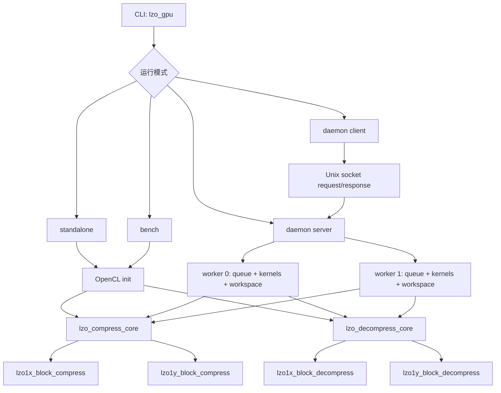

# LZO GPU 当前基线实现完整分析

更新时间：2026-04-20

## 分析范围与基线锚点

这份文档分析的是 `lzo_gpu` 当前用于继续优化讨论的**实现基线**，不是已经被拒绝的实验候选。

本次分析直接基于以下源码与锁定记录：

- `lzo_gpu/lzo_gpu.c`
- `lzo_gpu/lzo_gpu_core.c`
- `lzo_gpu/lzo_gpu_core.h`
- `lzo_gpu/lzo_gpu_utils.c`
- `lzo_gpu/lzo_gpu_utils.h`
- `lzo_gpu/lzo1x.cl`
- `lzo_gpu/lzo1y.cl`
- `lzo_gpu/lzo_gpu_daemon.c`
- `lzo_gpu/lzo_gpu_client.c`
- `lzo_gpu/lzo_gpu_protocol.h`
- `lzo_gpu/variant_validation/intel/variants/kernel_comp/intel_lzo_gpu_lzo1x_d14_baseline_lock/variant.json`
- `lzo_gpu/variant_validation/intel/variants/kernel_dec/intel_lzo_gpu_lzo1x_d14_baseline_lock/variant.json`
- `lzo_gpu/variant_validation/intel/variants/host/intel_lzo_gpu_lzo1x_d14_baseline_lock/variant.json`

本次文档默认采用的基线语义是：

- Intel 锁定基线：`intel_lzo_gpu_lzo1x_d14_baseline_lock`
- 当前 mainline **已经并入 D2 short-match helper**，因此不再与 `baseline_lock` 完全同码
- 当前核心字典条目设计：`12-bit epoch + 20-bit offset`
- 当前压缩主路径：单 primary hash + 四位置批量 probe/writeback
- 当前解压主路径：`COPY_MATCH()` 分层专分支 + D2 的 `<=18B` 非重叠 short-match direct helper
- 当前 host 主路径：Intel 默认 `mapped/zero-copy`，`standard_copy` 已被 formal gate-10 判定为 `reject`

本轮确认的哈希锚点如下：

- `lzo_gpu/lzo_gpu`
  - `sha256=380f2105ce965d656fe013ee3868d623666c14febf168a47160d6a8504ef9e7c`
- `lzo_gpu/lzo1x.cl`
  - `sha256=8fca0865716800f32c13cebb15af6711b53e9f971f99395b9861760345e8776a`
- `variant_validation/intel/.../baseline_lock/artifacts/lzo_gpu`
  - `sha256=899e009c799516400bf8d89331f0abf2f25b6b4f08efef644a13d36b2773f4b3`
- `variant_validation/intel/.../baseline_lock/artifacts/lzo1x.cl`
  - `sha256=e685faba359b1a9271b655fcb90ee8d8b135cdc2b7d06147902814859c5f3cdc`
- `variant_validation/intel/.../short_match_helper_r1/artifacts/lzo1x.cl`
  - `sha256=eaf515cc911e0a7faa1722908b8ea007e80a552f2702329d5025da662d83737b`

这意味着：**当前主线已经从 `baseline_lock` 前进到“baseline_lock + D2 decode helper”**。当前仓库内还没有重新生成新的 locked variant id，但运行中的主线实现已经切换到 D2 采纳版；`short_match_helper_r1` 变体目录中的 `lzo1x.cl` 是 overlay 形式，所以与主线 `lzo1x.cl` 哈希不同，但核心解压逻辑已经合并到主线源码。

## 整体结构图



## 零、并行度模型与术语（先导）

### 0.1 术语定义

- `WI (work-item)`：OpenCL 执行粒度。
- `target_items`：压缩侧期望的逻辑活跃 work-item 数。
- `occ_cap`：按 CU 和默认占用因子推导出的 occupancy 上限。
- `mem_cap`：按全局显存/最大 alloc 限制推导出的内存上限。
- `global_size`：实际发射的 global NDRange 大小。
- `pool_size`：字典池 owner 数；当前主线中与 `global_size` 对齐。
- `epoch`：12-bit 代际标记，用于在复用字典切片时逻辑淘汰旧条目。
- `dict slice`：按 WI 从 `dict_pool` 中切出的私有字典区域。
- `mapped/zero-copy`：统一内存设备上优先使用的 host-device 映射路径。

### 0.2 压缩主线的调度顺序

当前主线不是“先按 CU 硬凑 global_size”，而是：

$$
\begin{aligned}
&nblk = \left\lceil \frac{in\_sz}{blk} \right\rceil \\
&target\_items = \max(1, nblk) \\
&occ\_cap = \max(1024, CU \times LZO\_OCC\_FACTOR\_DEFAULT) \\
&mem\_cap = \frac{\min(global\_mem / 6,\ 0.9 \times max\_alloc)}{dict\_per\_block} \\
&target\_items = \min(target\_items, occ\_cap, mem\_cap) \\
&global\_size = \left\lceil \frac{target\_items}{local\_size} \right\rceil \times local\_size \\
&pool\_size = global\_size
\end{aligned}
$$

关键点：

1. 第一驱动量是 `nblk`，不是固定的 `CU * 常数`。
2. `CU * LZO_OCC_FACTOR_DEFAULT` 只是 host 侧 occupancy ceiling。
3. `pool_size` 是“逻辑 owner 数”，不是“物理上真的有这么多同时驻留的执行实体”。

### 0.3 当前基线下的 owner 语义

标准压缩 kernel 入口都会做同一件事：

- `wi = get_global_id(0)`
- `dict = dict_pool + wi * dict_elems`
- `for (b = wi; b < total_blocks; b += total_wi)` 轮转处理 block

因此当前主线是：

- **每个 active WI 独占一段物理 dict slice**；
- **同一 WI 可以串行处理多个 block**；
- **block 之间不清零物理字典，而是靠 epoch 逻辑清空**。

这也是为什么当前基线并不是“每个 block 一张新表”，而是“每个 WI 一张表，多个 block 复用”。

## 一、压缩内核当前实现

### 1.1 核心入口与职责

当前标准压缩入口分别是：

- `lzo1x_block_compress`
- `lzo1y_block_compress`

它们的职责一致：

1. 以 `wi` 为 owner 绑定自己的 dict slice；
2. 以 `b = wi; b < total_blocks; b += total_wi` 轮转处理块；
3. 对每个 block 调 `lzo1x_compress_core()` 或 `lzo1y_compress_core()`；
4. 把 block 压缩结果写回稀疏输出槽位；
5. 最后由 host 侧或 `pack` kernel 组装为连续 payload。

因此当前压缩 kernel 的逻辑结构不是“一个 work-group 一个 block”，而是：

- **一个 WI 维护一张私有字典；**
- **一个 WI 可能处理多个 block；**
- **同一张物理字典用 epoch 来隔离不同 block 的逻辑状态。**

### 1.2 当前字典条目设计

当前主线采用 32-bit packed entry：

```text
 31      20 19              0
+----------+----------------+
|  epoch   |    offset      |
| (12 bit) |   (20 bit)     |
+----------+----------------+
```

动机非常直接：

1. 字典条目必须尽量小，否则 iGPU 上全局内存压力会直线上升；
2. 仍要支持多 block steady-state 复用，而不是每次 block 切换都清零整张表；
3. 12-bit epoch 足够支撑大量 block 切换，20-bit offset 足够覆盖当前 block 内部位置恢复。

当前主线实现里：

- `dict_store32()` 负责写入 `(epoch << 20) | offset`
- `dict_load32()` 负责取回并验证当前 epoch
- host 侧通过 `comp_epoch_base` 管理代际推进，并在接近回卷时整体清零 `d_dict`

### 1.3 候选生成：四位置批量 probe/writeback

当前主线的压缩热点不是“单位置 hash -> 单位置 compare”，而是：

1. 一次读取一段连续视图；
2. 生成 4 个相邻位置的 hash；
3. 批量读取 4 个旧 entry；
4. 先判断，再集中写回 dict。

这条路径的意义是：

- 减少读写交替导致的访存抖动；
- 利用 GPU 对顺序/向量访问更友好；
- 在不引入多候选链表结构的前提下，把单槽 hash 的吞吐做高。

当前仍然是**单 primary hash**，没有进入两路 hash、指纹过滤、共享表冲突统计等更重的实验分支；这些都不属于当前正式基线。

### 1.4 hash 与命中判定

当前 `lzo1x` / `lzo1y` 都采用较强的混洗 hash：

1. `xor/shift`
2. `multiply`
3. `xor` 再收敛高位

这一步的目标不是追求“最复杂的 hash”，而是降低单槽字典下的伪命中与碰撞密度。

但需要强调：

- hash 只负责产生候选位置；
- 真正的命中仍靠原始字节比较确认；
- 所以当前主线依旧是“轻量候选 + 严格确认”的结构，而不是概率型近似命中。

### 1.5 match 扩展与 token 发射

当前压缩主线的后半段可拆成五段：

1. 候选确认
2. 向后回退修整 literal 起点
3. 向前扩展 match 长度
4. 发射 literal / match token / offset / extra length
5. 处理 last literals 和 block terminate

`match extension` 使用多级展开比较，而不是朴素逐字节循环：

- 优先宽比较；
- 失配时快速定位首个不同字节；
- 再收尾写 token。

这也是为什么当前主线在 kernel 吞吐上已经明显强于 CPU-only：真正的热点都已被压缩在相对紧凑的向量路径里。

### 1.6 当前压缩 kernel 的优点与代价

优点：

1. 路径简单，易于验证；
2. 每个 WI 独占 dict slice，无需锁和跨 WI 协调；
3. epoch 复用让 steady-state 不需要每块清零；
4. 四位置 probe/writeback 对吞吐友好。

代价：

1. owner 粒度仍然偏细，`pool_size` 增大时显存与 cache 压力线性上升；
2. 单槽 hash 结构限制了更深的匹配搜索；
3. `kernel` 已经很强，但 `total` 仍会被 host/runtime 链路折损。

## 二、解压内核当前实现

### 2.1 核心入口与职责

当前标准解压入口分别是：

- `lzo1x_block_decompress`
- `lzo1y_block_decompress`

解压与压缩最大的结构差异是：

- **不需要大字典池**；
- **基本按 block 一块一个 WI 处理**；
- 主瓶颈更多落在 `COPY_MATCH()` 与 host 输出回收链路上。

### 2.2 token / literal / match 状态机

当前解压主线仍然是标准 LZO token 状态机 GPU 化版本：

1. 读 token；
2. 展开 literal length；
3. literal copy；
4. 读 offset；
5. 展开 match length；
6. 回放 match；
7. 检查尾部 literal 或 EOF marker。

因此当前解压优化并不是“改协议”，而是在 **保持语义不变** 的前提下，把 copy hot path 尽量变成向量化、少分支的版本。

### 2.3 `COPY_MATCH()` + D2 short-match helper 当前主线形态

当前解压主线不是纯 baseline `COPY_MATCH()`，而是先走一层 D2 short-match helper，再回落到原始 `COPY_MATCH()`：

1. 若 `offset >= len && len <= 18`，直接走 `lzo1x_fast_direct_match_copy_18()`；
2. 其余场景继续落回 `COPY_MATCH()`；
3. `COPY_MATCH()` 内部再按重叠关系与 offset 大小选择不同 fast path。

其中 `COPY_MATCH()` 仍然是解压侧最重要的热点承载点，它对多类常见场景做了专门特化：

1. `offset >= len`：无重叠，直接走向量 copy；
2. `offset == 1 / 2 / 4`：用广播或模式复制替代逐字节循环；
3. 更大 offset：按 `64 / 32 / 16 / 8 / 4` 不同区间分层拷贝；
4. 极短尾巴：回退到标量补齐。

本轮 D2 之所以能最终并入主线，本质上是因为它没有推翻这套结构，而是在其前面加了一个**非常窄、非常明确**的非重叠短匹配 fast path：

- gate-10 `bench1/manual5`：`bench_dec_kernel_mbs avg=+8.7595%`，`dec_kernel_tp_mbs avg=+7.8498%`，`dec_total_no_oci_tp_mbs avg=+3.6027%`
- fullset `bench1/manual5`：`bench_dec_kernel_mbs avg=+10.1537%`，`dec_kernel_tp_mbs avg=+9.5475%`，`dec_total_no_oci_tp_mbs avg=+4.9429%`
- ratio：两轮都 `0.0000%`

也正因此，之前的 `D2.1`（把 helper 缩窄到 `8..18B`）会显著退化：它误删了 D2 对 `3..7B` 高频短匹配的有效覆盖，而不是去掉无效工作。

### 2.4 正确性与错误检测

当前解压主线会在 kernel 内对以下情况直接报错：

- token 展开越界；
- literal copy 越界；
- `offset` 非法；
- 输出超出 block 范围。

主线还保留了解压 debug counter 路径，用于在需要时输出：

- tokens
- literal bytes
- match bytes
- small offsets
- output errors

默认 benchmark 与正式 fullset 不会依赖 debug counter；它是诊断路径，不是默认性能路径。

## 三、主机端当前实现

### 3.1 CLI、standalone、bench、daemon 四条路径

`lzo_gpu.c` 同时承载了：

- standalone
- bench
- daemon server
- daemon client

四条路径最后都会汇聚到：

- `lzo_compress_core()`
- `lzo_decompress_core()`

差异主要在：

1. OpenCL context 是否常驻；
2. workspace 是否跨请求复用；
3. 是否启用 bench 专用的预读、验证、metadata 缓存。

### 3.2 程序加载与源码/二进制查找

当前主线的 kernel 加载由：

- `lzo_load_program_with_dbits()`
- `lzo_load_comp_kernel()`

共同完成。

查找优先级由 `lzo_find_file_path()` 定义：

1. `LZO_GPU_DIR`
2. 可执行文件所在目录
3. `exe_dir/../lzo_gpu`
4. `OUT_DIR`
5. `cwd`
6. 原始文件名

这一层对 formal validation 特别重要，因为 baseline/candidate 很多时候都不是直接运行仓库根目录下的主二进制，而是运行独立 artifact 或 runtime overlay。

### 3.3 workspace 与 grow-only 复用

`lzo_gpu_core.c` 的主机端基线已经完成了 grow-only 复用：

- 只在容量不够时重分配；
- 否则复用现有 `cl_mem`；
- bench 循环内避免重复 create/release。

这个设计本身不一定能抬高 kernel 峰值，但对 total 稳定性很关键，因为它减少了 host 端的驱动调用抖动。

### 3.4 mapped/zero-copy 是 Intel 当前默认 host 路径

本轮 formal Intel host gate-10 已经验证：

- `mapped/zero-copy` 仍是当前默认 host 路径；
- `standard_copy_r1` 在 Intel 上被明确判为 `reject`。

因此当前 host baseline 的语义已经很清晰：

1. Intel 上优先保留 `mapped`；
2. `standard copy` 不是默认候选，只保留为兼容路径与对照手段；
3. 后续 host 优化更应该盯住 runtime 协同与输出回收，而不是重新开启 `standard copy` 默认化。

### 3.5 bench 路径的主线特化

`run_lzo_bench()` 不是简单重复 standalone，而是一个“稳态复用路径”：

1. 输入预读；
2. workspace 复用；
3. bench 内部自解压验证；
4. metadata 缓存；
5. warmup 之后再统计 median/mean。

本轮还补上了一个工具级修复：`tools/bench_lzo.py` 在外部 artifact baseline 二进制场景下，不能再盲目把二进制父目录当作 `cwd`。因为这样虽然能找到 `lzo1x.cl`，但会把 `lzo_gpu.h` 的 include 搜索根目录弄丢，进而导致：

- 底层：`bench error: failed to load compression kernel`
- 上层：`stable bench parse failed`

现在 `resolve_gpu_run_cwd()` 会优先寻找能同时满足源码与头文件可见的运行目录，避免 formal baseline 工件再次被错误判成“全 0 退化”。

## 四、bench、standalone、daemon 三条 host 路径的差异

### 4.1 standalone

standalone 更接近“单次真实作业成本”：

- 每次进程启动都做 OpenCL init；
- 每次都重新装载 program/kernel；
- 一次压缩或解压后退出。

因此 standalone 更适合回答“单次调用 latency 是多少”。

### 4.2 bench

bench 更接近“steady-state 吞吐”：

- context / queue / kernel / workspace 都会复用；
- 压缩后立刻做解压验证；
- 可以跳过不变的 metadata 上传；
- 统计口径更适合横向比较候选实现。

因此：

- bench 不是 standalone latency 的简单重复；
- 任何 bench 优化都必须注意不能误导 formal total 结论。

### 4.3 daemon

daemon 路径的核心价值是：

- 摊销 OpenCL init；
- 通过常驻 worker 复用 queue 与 workspace；
- 用 socket 协议承接 client 请求。

当前 daemon 并不是“真正的数据流服务”，而更接近“路径请求转发器”：

- client 只传参数与输入/输出路径；
- server 仍自己读文件、写文件；
- socket 传的是控制消息和 timing，而不是大块 payload。

## 五、当前基线风险点（仅保留与主线直接相关项）

1. owner 粒度仍然绑定到 active WI，显存与 cache 压力随 `pool_size` 增长；
2. 12-bit epoch 需要 host 侧严密管理回卷清零；
3. GPU 路径的 total 与总功率仍明显受 host CPU 协同影响；
4. 外部 artifact baseline 工件若运行目录选择错误，会在源码存在的情况下依旧编译失败——这一点已经在 `bench_lzo.py` 中被工具级修复。

## 六、本文件结论

本文件锚定的是当前已经被并入主线、并继续作为后续优化基线的实现：

- 锁定基线：`intel_lzo_gpu_lzo1x_d14_baseline_lock`
- 当前主线：`baseline_lock + D2 short-match helper`
- 压缩主线：单 primary hash + 32-bit packed dict + 四位置 batch probe/writeback
- 解压主线：保留 `COPY_MATCH()` 分层专分支，并在其前增加 `<=18B` 非重叠 short-match direct helper
- host 主线：Intel 默认 `mapped`，`standard_copy` 已被 reject

后续若出现新的已采纳项，或我们为当前主线重新生成新的 locked variant id，再推进这份文档中的“锁定基线”锚点；在那之前，本文描述的就是**当前主线真实实现**，而不是旧的 `baseline_lock` 历史快照。
