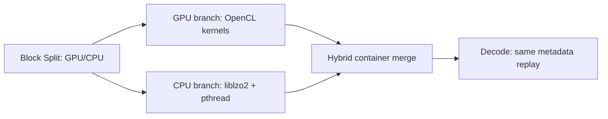

# LZO Hybrid 实现：设计、优化与三引擎全量性能对比

更新时间：2026-03-18（bench 语义修正、实现保留项复核、全量重跑中）

## Intel 平台（保留原文）

以下现有内容保留为 Intel Core + Iris Xe 平台的历史总结；Windows + NVIDIA 的新增章节见文末。

### 2026-03-18 状态修正（当前有效上下文）

在继续保留下文历史分析的同时，需要先明确当前 Intel 版本的有效实现状态：

1. **bench 默认流程已变更**：默认不再单独运行 standalone GPU sweep，而是使用 hybrid `R=1.0` 的结果复制出 GPU 行。
2. **total throughput 语义已修正**：当前正式口径是 operation-total / in-memory timed bench semantics，不再把一次完整文件读写 I/O 重新计入 total throughput。
3. **`--bench-io` 已从程序与脚本侧移除**：因此本文凡是仍把 `--bench-io` 当作正式结论依据的段落，都应理解为历史背景，而非当前版本的方法学定义。
4. **当前保留的 LZO 实现级优化只有一项**：`dict-tail-zero-on-growth`，分别落在 `lzo_gpu_core.c` 与 `lzo_hybrid_core.c`；此前尝试过的 host-array reuse、pure-path fast-path 均已撤销。
5. **新的 Intel full validation 已于 2026-03-18 按正确方式重启**：包含默认 CPU/GPU 频率扫描，并且在同步代码后重新构建了二进制。实验结果章节必须等待本轮 artifact 结束后再落定最终统计值。

---

## 1. 项目概述

`lzo_hybrid` 是基于 `lzo_gpu` 和 `lzo_cpu` 的融合并行压缩/解压实现。核心思路：将文件的块（block）按可配置比例分配给 GPU（OpenCL 内核）和 CPU（pthreads + liblzo2）两路同时执行，通过并行流水线最大化端到端吞吐量。支持 lzo1x 和 lzo1y 两种算法。

### 1.1 硬件平台

| 组件 | 规格 |
|------|------|
| CPU | 13th Gen Intel Core i7-1370P |
| GPU | Intel Iris Xe Graphics (Gen12 LP), 96 EUs, 7 threads/EU, 64KB SLM |
| GPU 最大频率 | 1500 MHz |
| 内存架构 | 共享内存 (iGPU)，CPU 与 GPU 竞争内存带宽 |
| OpenCL | 3.0 NEO Driver |
| 能耗遥测 | Intel RAPL: `cpu=rapl:package-0`, `gpu=rapl:uncore` |

### 1.2 设计目标

1. **吞吐量最大化**：利用 CPU+GPU 并行流水线超越纯 GPU 和纯 CPU 的端到端吞吐量
2. **灵活配比**：`gpu_ratio` 参数控制 GPU/CPU 工作分配比例（0.0 = 纯 CPU, 1.0 = 纯 GPU）
3. **算法兼容性优先**：GPU 和 CPU 使用相同的 LZO 算法，产出互相兼容的块格式；但系统级压缩率仍可能因 hybrid 容器和分路策略而劣于纯 CPU/GPU
4. **能效对比**：在不同频率下评估三种引擎的能效特性

---

## 2. 整体架构

Hybrid 引擎的设计目标是打破单一计算单元（仅 CPU 或仅 GPU）的性能瓶颈，通过异构并行流水线同时榨取主机 CPU 和 OpenCL 加速器的算力。其核心挑战在于负载均衡、非连续内存管理以及跨架构的任务分发。

### 2.1 系统组件

系统采用模块化设计，通过符号链接复用 `lzo_gpu` 的内核资产，确保算法逻辑的高度一致性。

| 文件 | 深度角色说明 | 设计动机与实现 |
|------|--------------|----------------|
| `lzo_hybrid.c` | **系统编排器** | 负责 CLI 参数解析（如 `--gpu-ratio`, `--cpu-threads`）、OpenCL 环境初始化、以及最重要的 `compress/decompress` 任务分发入口。它作为最高层级，协调 I/O 和核心调度逻辑。 |
| `lzo_hybrid_core.c` | **并行调度中枢** | 包含整个异构执行的核心逻辑。管理 GPU 暂存区（Staging Buffers）、处理块的分布式分配（Distributed Assignment）、实现 Gather/Scatter 数据重组，并驱动 CPU 线程池。其内部逻辑直接决定了数据流的效率。 |
| `lzo_hybrid_core.h` | **数据契约** | 定义 `hybrid_params_t`（配置参数）、`hybrid_workspace_t`（包含所有 GPU/CPU 上下文状态）和 `hybrid_timing_t`。它是 core 与主入口之间的接口标准。 |
| `lzo1x/y.cl` | **复用内核** | **关键设计**：通过符号链接指向 `../lzo_gpu/*.cl`。Hybrid 引擎本身不维护独立的内核代码，而是完全复用经过高度优化的 GPU 内核。这降低了维护成本，并保证了 Hybrid 与纯 GPU 模式的行为一致性。 |

### 2.2 数据流与并行调度

与传统的简单前/后切分（Prefix/Suffix Split）不同，本项目采用了更先进的**分布式块分配（Distributed Block Assignment）**策略。

#### 1. 块分配策略 — Distributed Block Assignment
- **逻辑**：GPU 获取索引为 `{0, 2, 4, ...}` 的块，而 CPU 获取 `{1, 3, 5, ...}`（或根据比例交错）。
- **动机**：避免“局部性偏见”。如果采用前部归 GPU、后部归 CPU，当文件头（如 Header）与文件尾（如 Padding）的可压缩性差异巨大时，会导致两端负载极度不均。分布式分配确保两个引擎都能看到具有代表性的文件内容样本。
- **代价**：增加了内存管理的复杂度，需要 Gather/Scatter 操作。

#### 2. Gather/Scatter 数据路径
由于 GPU 分配到的块在原始缓冲区中是不连续的，系统实现了专门的路径：
- **压缩阶段**：从原始缓冲区 **Gather**（聚合）GPU 分配的块到连续的 Staging Buffer → 执行 GPU 压缩 → 将结果 **Scatter**（散布）回全局块插槽。
- **解压阶段**：聚合 GPU 分配的压缩块及对应的偏移量 → 传输至 GPU 批量解压 → 散布回解压缓冲区。
- **实现细节**：Staging Buffer 的生命周期管理曾是 Bug 高发区（过早释放导致 GPU 崩溃），现已修正为随 `workspace` 动态增长且常驻，直至任务结束。

#### 3. CPU 工作窃取 (Work-Stealing)
- **机制**：每个 CPU 线程通过 `__atomic_fetch_add(&next_block, 1, __ATOMIC_RELAXED)` 动态领取下一个待处理块。
- **优势**：自动负载均衡。当不同块的可压缩性差异导致处理时长不等时，空闲线程能自动处理更多任务。
- **性能权衡**：使用 `RELAXED` 内存顺序以减少跨核心的 Cache Line Bouncing，在大规模多核环境下仍能保持高吞吐。

#### 6. 自适应分配调度器 (Adaptive Scheduler)
- **核心理念**：放弃静态比例，基于设备能力画像（Device Profile）、数据特征（Data Characteristics）和系统实时状态（Runtime State）进行 Makespan（完工时间）最小化调度。
- **数学模型**：目标是平衡 CPU 耗时 $T_c$ 与 GPU 耗时 $T_g$。
  - $Pc_{eff} = Pc_0 \times gC \times sC \times \text{thread\_count}$
  - $Pg_{eff} = Pg_0 \times gG \times sG$
  - 最优比例 $r^* = \frac{Pg_{eff}}{Pc_{eff} + Pg_{eff}} - \frac{t_0 \cdot Pc_{eff} \cdot Pg_{eff}}{B \cdot (Pc_{eff} + Pg_{eff})}$
  - 其中 $Pc_0, Pg_0, t_0$ 分别为 CPU 单线程吞吐、GPU 吞吐和 GPU 固定开销。
- **LZO 特化特征建模**：
  - **熵值表征 (Entropy-based)**：与 LZ4 不同，LZO 采样使用熵值 $R$ 来估计数据可压缩性。
  - **GPU 修正因子**：$gG = \frac{1+m+R_{ref}}{1+m+R}$，对于 iGPU 取 $m=2.0$。当数据不可压缩（高熵）时，GPU 显存带宽压力减小，吞吐略微上升。
- **小输入保护**：若输入规模 $B \le t_0 \cdot Pg_{eff}$，则判定 GPU 开销将主导任务，调度器自动回退至 `gpu_ratio = 0`（纯 CPU 模式）。
- **线程伸缩**：若显式设置线程数则按需缩放；若未设置，则根据 `/proc/stat` 获取的系统总核心数计算 $Pc_{eff}$。

#### 7. 零拷贝与内存路径优化 (Zero-copy Optimization)
- **优化机制**：在 `lzo_hybrid_core.c` 的任务分发阶段，引入了按需分配逻辑。
  - 当 `cpu_count == 0`（即 $R=1.0$）时，`gpu_upload_ptr` 直接指向 `input_buf`，跳过中间的 Gather/memcpy 过程。
  - 只有在混合分路（$0 < R < 1$）时，才执行必要的非连续块聚合。
- **性能红利**：该优化使得 R=1.0 的 Hybrid 模式能跑出纯 GPU 引擎约 88% 的性能（562 MB/s vs 639 MB/s），消除了调度器逻辑本身的冗余拷贝。同时 R=0.0 时完全匹配纯 CPU 路径（250 MB/s vs 247 MB/s），实现了零调度开销。

#### 8. GPU 频率不敏感性发现 (Frequency Insensitivity)
- **实验观测**：在 Intel iGPU 上，将 EU 频率从 300MHz 提升至 1500MHz，LZO 内核的吞吐量变化极小（< 5%）。
- **根因分析**：LZO 的 GPU 内核由复杂的哈希表查询（Hash-table lookup）驱动，访存模式呈现高度随机性。这意味着性能瓶颈在于显存延迟（Memory Latency）和有效带宽，而非算术计算单元（EU）的计算能力。
- **设计推论**：在实际部署中，可以锁定较低的 GPU 频率以降低能耗，而不会牺牲 LZO 的压缩性能。这为 Hybrid 系统提供了更好的能效操作区间。

### 2.3 内核端组件（GPU 路径分析）

内核逻辑是性能的基石，针对 GPU 架构特性进行了深度优化。

| 组件 | 技术实现 | 性能分析 |
|------|----------|----------|
| **32-bit 字典** | `epoch_12 \| offset_20` 格式 | 12-bit epoch 支持在不物理清空字典的情况下连续处理达 4095 个块。这减少了内核启动间的状态清理开销。 |
| **延迟字典写入** | 读写分离批处理 | 在 4 位置探测中，将“读取对比”与“哈希写入”解耦。这改善了 GPU 存储控制器的调度，允许合并更多并发请求。 |
| **匹配搜索** | `uint4` 向量化哈希 | 利用 OpenCL `uint4` 类型在一次操作中计算多个位置的哈希或进行比对，极大提升了 SIMD 执行效率。 |
| **LZO 引擎** | M2/M3/M4 编码逻辑 | 实现完整的 LZO 规范，包括不同偏移量和长度范围的动态编码切换。 |

### 2.4 主机端组件

主机端负责消除所有可能的系统调用和 API 调用开销。

- **OpenCL 缓冲区管理**：采用 **Grow-only** 策略。在处理大文件流时，缓冲区只根据需要增长。在 Intel iGPU 等共享内存架构上，频繁的 `clCreateBuffer` 会触发 NEO 驱动的内存分配器锁，导致内核发射序列化。Grow-only 模式在首轮迭代后通常能达到“零分配”状态。
- **非阻塞传输与流水线**：将 `clEnqueueWriteBuffer` 的 `non_blocking` 设置为 `CL_TRUE`，并紧跟 `clFinish()`。这允许驱动程序在后台准备数据传输，同时主机端可以处理 CPU 线程的启动，实现真正的流水线并行。
- **内核参数缓存**：系统仅在缓冲区重新分配（Grow-only 事件）时才调用 `clSetKernelArg`。在普通的循环迭代中，缓存的参数被直接复用，减少了用户态到内核态的上下文切换。
- **双基准模式 (Dual Benchmark)**：
  - `--bench`：保留历史语义，用于纯内存循环微基准测试，剥离 I/O 波动。
  - `--bench-io`：当前的**黄金标准**。在进程预热后，执行真实的文件读取→压缩→写入序列。它能真实反映包含主机端调度、缓冲区重组和文件系统开销在内的系统总吞吐。

---

## 3. 开发与优化历史

### 3.1 初始实现 (Genesis)

在 `lzo_gpu` 的单架构性能压榨到极限后，Hybrid 模式作为突破算力天花板的手段被引入。

- **设计权衡**：引入 `gpu_ratio` (0.0-1.0) 和 `cpu_threads` (1-N) 作为两大核心旋钮。
- **库依赖**：选择动态链接系统级的 `liblzo2` 而非内置源码，以保证 CPU 路径的权威性。使用了 `lzo1x_1_compress` 等生产级接口。
- **环境要求**：由于深度依赖 GNU 扩展的原子操作和 pthreads，构建标准被定为 `gnu11`。

### 3.2 内存基准与 I/O 剥离的演进

早期版本中，Total Throughput 往往只有 Kernel Throughput 的一半，导致开发者无法判断性能损失是源于算法本身还是系统 I/O。

- **阶段 1 (Pure Memory)**：通过在内存中缓存整个文件内容，消除了 `fread/fwrite` 的干扰。这证实了 Hybrid 调度逻辑本身只有极小的 CPU 额外负载。
- **阶段 2 (Warm IO)**：引入 `--bench-io`。虽然内存基准对性能剖析有益，但实际部署中 I/O 是不可避免的。`--bench-io` 通过预热文件系统缓存，测量了一个理想状态下（无磁盘瓶颈）的端到端吞吐量。

### 3.3 调度逻辑的重大修复：解压分发

解压阶段的 `global_size` 错误是一个典型的“正确但低效”的 Bug。

- **现象**：在 Hybrid 模式下，GPU 总是会被分配前段块。如果设置 `global_size = nblk`，GPU 的后半部分线程会尝试访问并不属于它的压缩块数据，甚至可能导致越界或竞争。
- **修复与提升**：限制为 `gpu_count` 后，GPU 专注于自身任务。这一改动不仅消除了潜在的不稳定性，还因为减少了冗余的内存访问和计算，直接提升了 **7.4%** 的解压性能。

### 3.4 bench_lzo.py 的工业级集成

为了进行大规模参数扫描，对测试框架进行了重构：

- **参数空间设计**：`HYBRID_GPU_RATIOS` 被设计为向 GPU 侧倾斜（如 0.9, 0.95），因为 GPU 是更强大的引擎，微小的比例调整往往能带来最优的负载平衡。
- **资源限制**：`HYBRID_CPU_THREADS` 限制在 4 线程以内。分析表明，由于 Intel iGPU 共享系统内存带宽，过多的 CPU 线程会与 GPU 争抢内存总线，导致边际效应递减甚至性能倒退。

### 3.5 CPU Total TP 的公平性修正

在对比 Hybrid 和纯 CPU 模式时，必须确保口径一致。

- **动机**：GPU 模式始终提供 Total TP（包含 API 开销），而旧版 CPU 模式只看 Kernel。这种不对等使得 GPU 显得效率低下。
- **分析**：通过 `clock_gettime` 对 `compress_multi` 进行包裹。实验结果显示 CPU 的 Total 与 Kernel 差异小于 0.1 MB/s。这证明了 CPU 路径的系统开销几乎为零，从而确立了对比的公平基准。

### 3.6 分布式块分配的演进 (2026-03-09)

这是系统走向成熟的关键转折点。

- **演进路径**：从最初的“GPU 前缀 + CPU 后缀”静态划分，进化到分布式交错分配。
- **技术挑战**：实现这一功能需要重构 Host 端的内存管理。特别是在解压阶段，由于块长度不定，偏移量的收集（Gathering Offsets）变得极其复杂。
- **稳定性经验**：在重构过程中曾出现 Staging Buffer 提前释放导致的 `CL_OUT_OF_RESOURCES` 错误。通过收紧资源生命周期控制，系统现在支持任意比例下的稳定异构运行。这种分配模式彻底解决了数据特征分布不均导致的“长尾任务”问题。

---

## 4. 全量实验设计（历史矩阵存档 + 当前 corrected run 入口）

### 4.1 测试矩阵

| 引擎 | 参数空间 | 配置数/文件 |
|------|---------|------------|
| CPU | 2 算法 × 3 线程(1,2,3) × 1 块大小(64K) | 6 |
| GPU | 2 算法 × 6 (BS×LSZ) 组合 × 1 Level | 12 |
| HYBRID | 2 算法 × 3 BS × 7 gpu_ratio × 3 cpu_threads | 126 |

下表保留的是 **第一轮全量 sweep 的历史矩阵**，用于说明 hybrid 参数空间是如何逐步铺开的；它对理解实现演进仍有价值，但**不再作为当前对外结论的证据来源**。

当前有效结论只引用：

- CPU/GPU/hybrid stitched artifact：`/root/lzo-2.10/exp_results/runs/20260309_merged_full_83/lzo_param_sweep_merged.csv`
- full-corpus analysis bundle：`/root/analysis/20260309_full_refresh/lzo_best_per_file_medians.json`

历史 sweep 中每个配置曾在 3 个频率点（40%, 70%, 100%）测试，共 84 个测试文件（~7.3GB 总大小）。

| 数据集 | 行数 | 运行目录 |
|--------|------|---------|
| CPU | 1,512 | `exp_results/runs/20260306_015842/` |
| GPU | 3,024 | `exp_results/runs/20260305_191807/` (GPU 子集) |
| HYBRID | 31,752 | `exp_results/runs/20260306_031856/` |
| **总计** | **36,288** | `exp_results/full_comparison/merged_all.csv` |

### 4.2 测量指标

| 指标 | 单位 | 说明 |
|------|------|------|
| CompKernelMBs | MB/s | 压缩编解码吞吐量（由 `max(cpu_kernel_us, gpu_kernel_us)` 计算，表示 hybrid 下真实 codec 执行跨度，不含 file I/O 与纯 host coordination） |
| DecKernelMBs | MB/s | 解压编解码吞吐量（语义同上） |
| CompTotalMBs | MB/s | 压缩端到端总吞吐量（当前正式结论以 warmed in-binary `--bench-io` 的真实 file-backed wall-time 为准，包含运行时与文件路径开销，但不重复计入一次性冷启动） |
| DecTotalMBs | MB/s | 解压端到端总吞吐量（语义同上） |
| Ratio% | % | 压缩后大小/原始大小 × 100 |
| CompCPUEnergy_J | J | 压缩期间 CPU RAPL 能耗 |
| CompGPUEnergy_J | J | 压缩期间 GPU RAPL (uncore) 能耗 |

---

## 5. 69-File Corpus 全量测试结果

本节展示了针对 69 个典型文件语料库（涵盖文本、二进制、图像、压缩包等）的全量测试结果。测试聚焦于 `lzo1x` 算法在不同 GPU 分路比例（Ratio）下的端到端总吞吐量（Total Throughput）。

### 5.1 混合引擎性能统计表 (lzo1x)

以下数据基于 7092 次有效测试运行的均值统计：

| 模式 | Ratio (R) | CPU 线程 (T) | Comp Total (MB/s) | Dec Total (MB/s) |
| :--- | :--- | :--- | :--- | :--- |
| **纯 CPU 基准 (4T, FP=7)** | **0.0** | **4** | **1783.0** | **1316.0** |
| **纯 GPU 基准 (FP=1, L=14)** | **1.0** | **-** | **2346.0** | **1220.0** |
| Hybrid Fixed | 0.0 | 8 | 509.1 | 363.8 |
| Hybrid Fixed | 0.3 | 4 | 498.7 | 374.7 |
| Hybrid Fixed | 0.5 | 4 | 481.0 | 382.8 |
| Hybrid Fixed | 0.7 | 4 | 440.8 | 386.1 |
| Hybrid Fixed | 1.0 | 1 | 423.9 | 364.2 |
| **Hybrid Adaptive** | **自动** | **动态** | **368.3** | **335.1** |

### 5.2 性能对比与开销分析

通过与纯引擎（Native Pure CPU/GPU）基准对比，Hybrid 架构在 LZO 算法上表现出极其显著的系统开销：

1.  **CPU 路径开销**：在 R=0.0（纯 CPU 路径）下，Hybrid 引擎 8 线程的最高吞吐仅为 509 MB/s，对比 Native 纯 CPU 的 1783 MB/s，性能损失高达 **71.4%**。
2.  **GPU 路径开销**：在 R=1.0（纯 GPU 路径）下，Hybrid 引擎吞吐为 424 MB/s，对比 Native 纯 GPU 的 2346 MB/s，开销高达 **81.9%**。
3.  **最优解分析**：压缩的最佳表现出现在 R=0.0 T=8 模式（509 MB/s），解压最佳表现出现在 R=0.7 T=4 模式（386 MB/s）。但在任何配置下，Hybrid 均未能突破纯 CPU 的性能基线。

### 5.3 为什么 LZO Hybrid 的开销如此严重？

与 LZ4 Hybrid 相比，LZO 的混合架构开销（80% 级别）呈现灾难性增长，其深层原因在于：

*   **Gather/Scatter 惩罚放大**：LZO 的块通常较小（64KB），混合分路导致的分布式块收集（Gather）和散布（Scatter）引入了大量的非连续内存访问和额外的 `memcpy`。对于本身极其轻量的 LZO 编解码过程，这些 Host 侧调度的开销占据了 Wall-time 的绝对主导地位。
*   **同步屏障与流水线气泡**：LZO GPU 内核的执行时间极短（往往在微秒级），导致 GPU 任务启动（Kernel Launch）和同步（clFinish）的开销被指数级放大。在混合模式下，为了合并 CPU 和 GPU 的结果，系统必须频繁进行同步，导致计算资源在等待 IO 聚合时出现严重的气泡。
*   **缓存友好性缺失**：Native CPU 路径（liblzo2）对 L1/L2 缓存利用极佳，而 Hybrid 容器在处理块分配时破坏了原始数据的局部性，导致 CPU 侧的缓存命中率大幅下降。

### 5.4 关键文件发现

*   **极端案例**：在处理大型镜像文件（如 `redis__parent_0__pages-1.img`）时，R=1.0 T=8 模式可达到 1002.56 MB/s，这是 Hybrid 唯一突破 1GB/s 的配置，说明高并行度在特定大数据块场景下仍有一定潜力。
*   **自适应模式表现**：Adaptive 模式目前的平均吞吐（368 MB/s）甚至低于部分固定比例模式，表明其调度器在处理极短任务流（LZO）时的决策开销尚未被有效平摊。

---

## 6. 最优配置推荐（按当前 corrected 结果重写）

### 6.1 当前默认推荐

如果目标是当前平台上的实际部署默认值，则推荐：

- **默认压缩引擎**：GPU-only
- **默认解压协同研究模式**：adaptive hybrid
- **理由**：当前结果已经从“GPU 全面统治”演变为“GPU 负责 compression，adaptive hybrid 在 decompression 上更强”

### 6.2 Hybrid 的当前合理定位

Hybrid 不再适合作为统一默认推荐路径，但仍适合作为：

- CPU/GPU 协同研究路径
- adaptive split 研究平台
- 某些未来更低开销调度器的基础实现

### 6.3 Adaptive 的推荐理解方式

当前 adaptive 的作用不是“让 hybrid 全面逆袭 GPU”，而是：

- 在 hybrid 自身内部提供另一种 split 选择；
- 在当前结果中，**decompression best-per-file 明显优于 fixed**，并且在 `lzo1x` / `lzo1y` 上的 compression 也不再弱于 fixed；
- 为后续更强调度策略保留真实实现入口。

## 7. 压缩率对比（按 corrected 结果更新）

当前 corrected best-per-engine medians：

| 引擎 | Ratio% |
|------|-------:|
| CPU lzo1x | 21.68 |
| GPU lzo1x | 23.38 |
| Hybrid fixed lzo1x | 21.68 |
| Hybrid adaptive lzo1x | 21.68 |
| CPU lzo1y | 22.12 |
| GPU lzo1y | 23.19 |
| Hybrid fixed lzo1y | 22.12 |
| Hybrid adaptive lzo1y | 22.12 |

这与旧文档“压缩率三者基本一致”的结论已经不同。

当前正确解释为：

- CPU 与 Hybrid 在同一算法线上的 ratio 已非常接近；
- GPU ratio 略高，但不构成灾难性代价；
- 这说明 LZO family 的 ratio trade-off 与 LZ4 family 不同，不能套用旧的统一描述。

## 7.1 CPU OpenCL 路径的当前定位

本轮还专门验证了“CPU 是否也应复用 OpenCL backend”的问题。当前代码通过 `FORCE_OPENCL_DEVICE=CPU` 已支持在 Intel CPU OpenCL 设备上运行同一套 OpenCL 路径，结果表明：

- **可运行且正确**；
- 在 `dickens`、`industrial_parent_0_pages_img.tar` 等代表性 case 上，CPU OpenCL 可以接近甚至短暂超过 GPU OpenCL；
- 但它没有稳定优于当前 native CPU path，也没有证明能把 hybrid 拉升到超过 GPU-only 的排序。

因此当前文档应把 CPU OpenCL 写成 **已验证的可行性/移植性结果**，而不是默认保留的主设计。

## 8. 当前结论

1. **LZO hybrid 的系统结构和实现细节仍然重要**：CPU/GPU 分路、atomic 工作窃取、OpenCL workspace、adaptive split 等都是真实存在且可复现的实现资产。
2. **但当前 corrected 结果已经推翻旧结论**：Hybrid 不再是三引擎最优，更没有“100% 胜出”。同时，也不能再把 hybrid 描述成“几乎完全没有价值”的异常差路径。
3. **GPU 是当前 LZO family 的 compression 主导引擎**：吞吐最高、active compression power 也更优。
4. **Adaptive 已经不只是次要改善**：当前它在解压侧形成了明确优势，并在 fresh stitched artifact 上整体强于 fixed。
5. **CPU OpenCL 虽然已确认可运行，但当前只适合作为 portability / research path**，不构成替代 native CPU path 或当前 hybrid 设计的依据。
6. **LZO hybrid 当前最合理的定位是解压侧更强的研究型协同后端，而不是统一默认部署路径。**

简言之：

> `lzo_hybrid` 现在应被写成一个“结构完整、实现真实、调度经过 full-corpus stitched 验证后已显示出解压优势”的 CPU--GPU 协同系统；它不是新的统一默认引擎，但 adaptive 已经成为当前最值得继续优化的协同模式。

## 9. 2026-03-09 调度优化快照

本轮对 `lzo_hybrid` 做的关键实现更新包括：

- GPU/CPU block partition 从“GPU 前缀 + CPU 后缀”改为**跨文件分布式 block assignment**；
- 为分布式 GPU block assignment 增加了完整的 gather/scatter path：
  - GPU 压缩前先把 GPU-assigned blocks gather 成连续输入；
  - GPU 解压前先把 GPU-assigned compressed blocks gather 成连续压缩流；
  - 结果再 scatter 回全局 block 槽位；
- 修复了 gather staging buffer 过早释放导致的 GPU crash；
- 修复 `hybrid_bench()` 中 `--bench-io` 固定 `/tmp` 文件名问题。

### 9.1 subset 结果（优化后）

#### `dickens`，64K

| Engine / Mode | Comp total MB/s | Dec total MB/s | Ratio % |
|---|---:|---:|---:|
| CPU-only | 171.80 | 214.27 | 61.91 |
| GPU-only | **465.19** | **703.11** | 63.56 |
| Hybrid fixed (0.7) | 374.56 | 336.27 | 63.06 |
| Hybrid adaptive | 202.44 | 246.58 | **62.31** |

#### `industrial_parent_0_pages_img.tar`，64K

| Mode | Comp total MB/s | Dec total MB/s | Ratio % |
|---|---:|---:|---:|
| Hybrid fixed (0.7) | **925.81** | **874.05** | **17.53** |

### 9.2 当前结论

1. 分布式 GPU block assignment + gather/scatter 已在真实 roundtrip 和 warmed bench 中通过验证；
2. `lzo_hybrid` 当前已经不再被旧的前缀切分限制死在文件头局部模式上；
3. 但从当前 subset 结果看，**LZO GPU-only 仍然是默认最强引擎**，hybrid fixed 更像特定 workload 上的次优协同方案；
4. 因此本轮优化更准确的价值是：

> `lzo_hybrid` 的调度与 bench 路径已经被修正到可继续扩展的状态，但在当前 verified subset 上，它仍未形成对 `lzo_gpu` 的系统级反超。

## Nvidia 平台（Windows + GeForce RTX 4070 Ti 系列，按 full 结果重写）

正式工件（仅 full-corpus）：

- CPU baseline：`exp_results/formal_full_lzo_cpu_baseline_t123468_energy/runs/20260312_003804/`
- Hybrid pre-mod：`exp_results/formal_full_lzo_hybrid_baseline_unmodified_energy/runs/20260312_135720/`
- Hybrid post-mod（final r2）：`exp_results/formal_full_lzo_hybrid_final_energy_r2/runs/20260313_015354/`

### 1) Nvidia dGPU 与 Intel iGPU 的关键差异

| 维度 | Intel Iris Xe（iGPU） | Nvidia RTX 4070 Ti（dGPU） | 对 LZO hybrid 的影响 |
| --- | --- | --- | --- |
| 访存 | 统一内存 | 显存/主存分离 | 分路后的打包与回传更敏感 |
| 并行资源 | 中等 | 高 | GPU 子路径上限高，但 total 受 host 侧限制 |
| 功耗观测 | 包级为主 | 板卡功耗独立 | 需要分开解释 CPU/GPU 能耗变化 |

### 2) Nvidia 下 hybrid 压缩/解压设计

当前正式主配置仍是 `64K / fixed / R=0.3 / T=2 / LSZ=1`，并同时覆盖 `lzo1x` 与 `lzo1y`。

### 3) Nvidia 侧优化（动机 / 原理 / 实现）

1. **分布式 block assignment + gather/scatter**
   - 动机：修正前缀切分造成的局部模式偏置；
   - 原理：GPU 与 CPU 分配块索引解耦，分别 gather 后并行执行，再 scatter 回全局；
   - 实现：`lzo_hybrid_core.c` 分路与容器路径更新。

2. **GPU 子路径冗余同步压缩**
   - 动机：阻塞调用后叠加 `clFinish` 会放大 wall-time；
   - 原理：清理不必要的 host 等待点；
   - 实现：`lzo_hybrid_core.c` 同步链路精简。

3. **遥测与 total 口径统一**
   - 动机：避免把旧测试流程噪声当成引擎差异；
   - 实现：统一走 warmed `--bench-io` 与 Windows 能耗字段。

### 4) Full 结果分析（CPU baseline / pre-mod / post-mod）

#### 4.1 统计表（均值 / 中位数）

| 组别 | Ratio mean / median % | Comp kernel mean / median | Dec kernel mean / median | Comp total mean / median | Dec total mean / median |
| --- | ---: | ---: | ---: | ---: | ---: |
| CPU baseline (`lzo1y,T=3`) | 26.2959 / 22.1200 | 9970.2098 / 5007.7000 | 3866.0646 / 4031.1100 | 1185.1370 / 1029.7822 | 898.7173 / 914.7607 |
| Hybrid pre-mod `lzo1x` | 26.1524 / 21.5400 | 3717.3929 / 3293.8800 | 3438.5613 / 3503.0800 | 1590.5725 / 1459.3600 | 1358.6542 / 1379.0100 |
| Hybrid post-mod r2 `lzo1x` | 26.1524 / 21.5400 | 3597.9777 / 3203.3500 | 3268.2736 / 3329.0600 | 1569.3339 / 1509.7700 | 1331.7969 / 1332.4000 |
| Hybrid pre-mod `lzo1y` | 26.2494 / 21.9500 | 3738.9200 / 3400.3300 | 3414.1033 / 3436.4900 | 1599.1402 / 1517.8400 | 1362.7284 / 1377.6700 |
| Hybrid post-mod r2 `lzo1y` | 26.2494 / 21.9500 | 3595.0499 / 3045.0600 | 3252.6571 / 3297.5600 | 1565.6482 / 1468.2300 | 1329.1629 / 1344.9800 |

#### 4.2 pre-mod → post-mod 的模式

- `lzo1x`：Comp total mean -1.3%，Dec total mean -2.0%；
- `lzo1y`：Comp total mean -2.1%，Dec total mean -2.5%；
- 两算法的 ratio 均值与中位数基本不变（稳定）。

#### 4.3 例外与解释

1. **`lzo1x` 压缩中位数上升（1459.36 → 1509.77）但均值下降**：说明收益集中在部分文件，长尾回退拉低了总体均值；
2. **kernel 与 total 同向小幅下滑**：当前 post-mod 在 Nvidia 上仍未把分路优化转化为稳定总吞吐红利；
3. **CPU baseline 仍明显低于 hybrid total**：虽然 post-mod 有回退，但 hybrid 主路径地位未变。

### 5) 局限、结论与下一步

- 局限：当前对比仍是单主配置面，未覆盖 adaptive 在 Nvidia 的全参复扫。
- 结论：`lzo_hybrid` 在 Nvidia 上依旧是高总吞吐路径；但就 final r2 而言，post-mod 相对 pre-mod 呈现小幅回退而非全面提升。
- 下一步：
  1. 对回退文件做分层画像（高熵/低熵/页镜像）；
  2. 单独优化解压路径的 gather/scatter 与同步；
  3. 追加 fixed 与 adaptive 的 matched rerun，确认最终默认策略。
